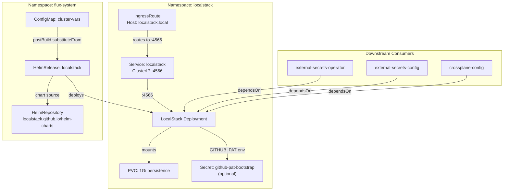
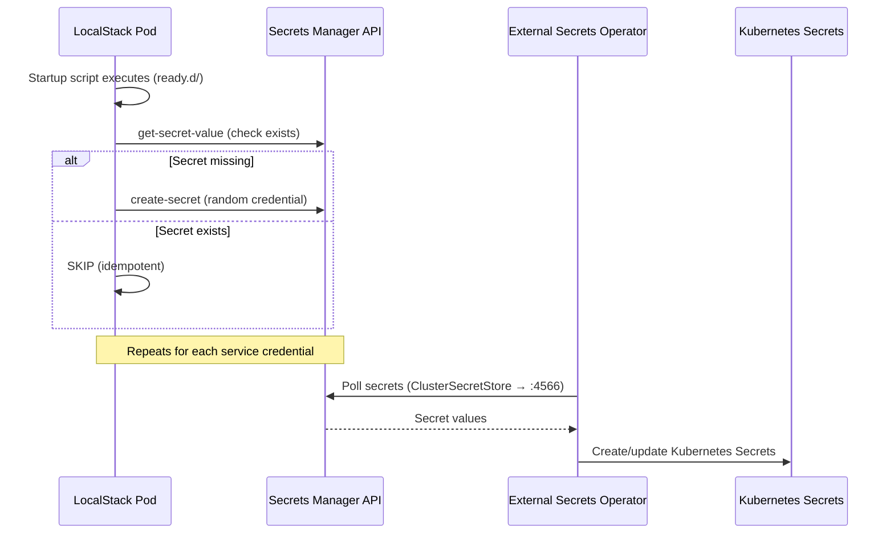

# LocalStack

[LocalStack](https://localstack.cloud) ([GitHub](https://github.com/localstack/localstack)) is a fully functional local cloud stack that emulates AWS services on a single container. Unlike mocking libraries that stub individual SDK calls, LocalStack implements the actual AWS API surface — including request validation, state management, and inter-service interactions — allowing infrastructure code to run unmodified against a local endpoint. This means the same Terraform, CDK, or raw API calls that target real AWS work identically against `localhost:4566`.

What distinguishes LocalStack from alternatives like [moto](https://github.com/getmoto/moto) or custom mocks: it runs as a standalone service with persistent state, supports cross-service interactions (e.g., S3 event notifications triggering Lambda), and exposes the same endpoint topology as AWS — a single gateway port that routes to the correct service based on request headers. The community edition covers the core services (S3, Secrets Manager, DynamoDB, SQS, SNS, Lambda) without requiring a Pro license.

## Overview

| Property | Value |
|---|---|
| **Namespace** | `localstack` |
| **Type** | HelmRelease (chart: `localstack` v0.6.15) |
| **Layer** | Foundation services |
| **Chart** | [`localstack`](https://localstack.github.io/helm-charts) v0.6.15 |
| **Status** | Enabled |
| **Source** | [`apps/base/localstack/`](https://github.com/JiwooL0920/fleet-infra/tree/develop/apps/base/localstack/) |

## Dependencies

### Upstream — required before LocalStack starts

_No upstream Flux dependencies — starts immediately._

### Downstream — services that depend on LocalStack

| Service | Dependency type | Reason |
|---|---|---|
| `external-secrets-operator` | Flux `dependsOn` | Requires LocalStack |
| `external-secrets-config` | Flux `dependsOn` | Requires LocalStack |
| `crossplane-config` | Flux `dependsOn` | Requires LocalStack |

## Purpose

LocalStack is the platform's **secrets origin** — the foundational data store that seeds all application credentials at cluster startup. It emulates AWS Secrets Manager so that `ExternalSecret` manifests written for production AWS work identically in the local development cluster by simply swapping the `ClusterSecretStore` endpoint.

On pod startup, an init script idempotently generates random credentials for every downstream service (Redis, pgAdmin4, Grafana, Traefik, Crossplane AWS keys, kagent tokens) and writes them to LocalStack's Secrets Manager. The External Secrets Operator then continuously syncs these into native Kubernetes Secrets. This eliminates manual secret creation, keeps plaintext out of Git, and ensures a fresh cluster reaches a fully-configured state without human intervention.

**Why LocalStack over SOPS-encrypted secrets or Sealed Secrets:** The goal is production portability — the same `ExternalSecret` CRs ship to production unchanged, with only the `ClusterSecretStore` target swapped from LocalStack's endpoint to real AWS Secrets Manager. SOPS and Sealed Secrets are Git-native but require per-environment decryption keys and don't exercise the External Secrets Operator code path that runs in production. LocalStack also provides additional utility beyond secrets: it backs Crossplane's AWS provider for local resource provisioning and offers S3-compatible storage for backups.

## Features

| Feature | Detail |
|---|---|
| **AWS service emulation** | Runs s3, secretsmanager, dynamodb, sqs, sns, and lambda behind a single gateway on port 4566 using the community edition image pinned to v3.8.1. |
| **Persistent state across restarts** | Combines LocalStack's runtime persistence mode (PERSISTENCE=1) with a PVC-backed volume, so secrets and S3 objects survive pod rescheduling without re-initialization. |
| **Idempotent secret seeding** | A startup script runs on every pod boot, creating secrets only if they don't already exist — safe to re-run after restarts, upgrades, or cluster rebuilds. |
| **Optional GitHub PAT injection** | Reads GITHUB_PAT from an optional Kubernetes Secret (github-pat-bootstrap) and stores it in Secrets Manager for the gitops-agent's GitHub MCP server; gracefully skips when unset. |
| **Liveness and readiness probes** | Both probes configured with 30s initial delay, 10s period, and 3 failure threshold — giving LocalStack time to load services while still detecting genuine hangs. |
| **IngressRoute for debugging** | Exposes the LocalStack API externally via Traefik at Host(`localstack.local`) on the web entrypoint for ad-hoc awscli debugging without port-forwarding. |

## Architecture

### Deployment Topology

### Secret Initialization Flow

## Configuration

All values sourced from [`base/services/environment.env`](https://github.com/JiwooL0920/fleet-infra/blob/develop/base/services/environment.env)
(base); per-environment overrides in [`clusters/stages/dev/.../environment.env`](https://github.com/JiwooL0920/fleet-infra/blob/develop/clusters/stages/dev/clusters/services-amer/environment.env).

| Parameter | Dev | Prod |
|---|---|---|
| `LOCALSTACK_CHART_VERSION` | `0.6.15` | `0.6.15` |
| `LOCALSTACK_CPU_LIMIT` | `500m` | `2000m` |
| `LOCALSTACK_CPU_REQUEST` | `500m` | `500m` |
| `LOCALSTACK_MEMORY_LIMIT` | `512Mi` | `2Gi` |
| `LOCALSTACK_MEMORY_REQUEST` | `512Mi` | `1Gi` |
| `LOCALSTACK_STORAGE_SIZE` | `2Gi` | `10Gi` |

## Operations

<!-- TODO: Add operations in service-insights/localstack.yaml → operations field -->

## Related

- [`apps/base/localstack/`](https://github.com/JiwooL0920/fleet-infra/tree/develop/apps/base/localstack/) — Kubernetes manifests
- [`base/services/localstack.yaml`](https://github.com/JiwooL0920/fleet-infra/blob/develop/base/services/localstack.yaml) — Flux Kustomization
- [`base/services/environment.env`](https://github.com/JiwooL0920/fleet-infra/blob/develop/base/services/environment.env) — environment variables

---
*Generated from [service-catalog.json](https://github.com/JiwooL0920/fleet-infra/blob/develop/service-catalog.json) at commit `09eeed6` · catalog sha `4d088b0b3a67b4c4`*