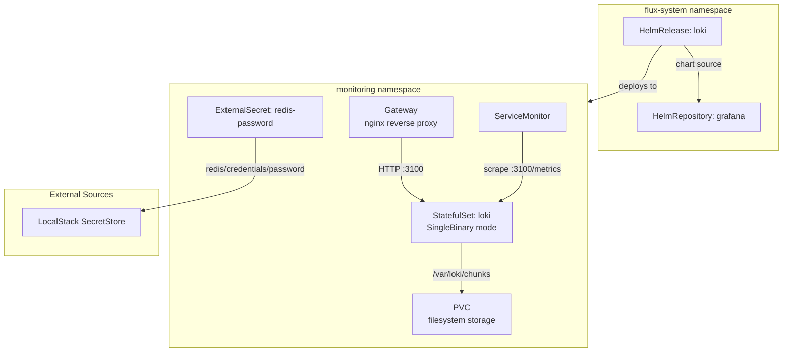
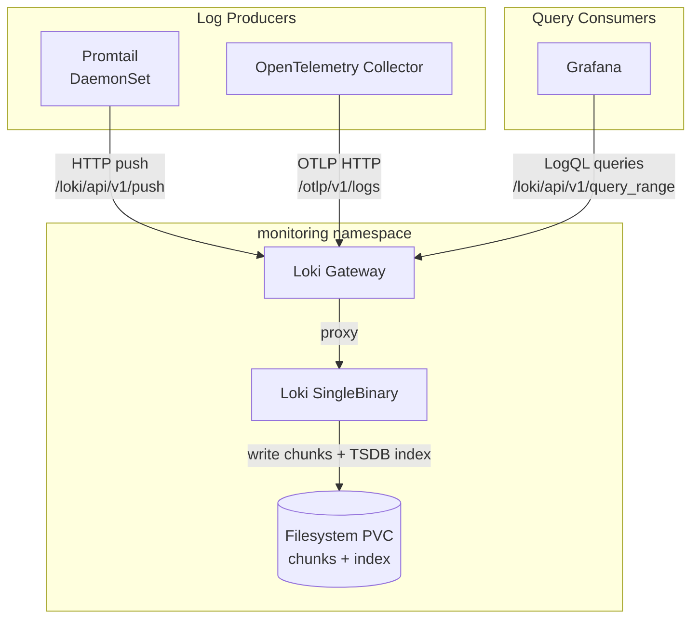

# Loki

[Loki](https://grafana.io/oss/loki/) ([GitHub](https://github.com/grafana/loki)) is Grafana's horizontally-scalable, multi-tenant log aggregation system. Unlike Elasticsearch-based stacks that index the full content of every log line, Loki indexes only metadata labels (pod, namespace, container, stream) and stores compressed log chunks — making it dramatically cheaper to operate at scale while maintaining fast grep-style queries through its LogQL query language.

What distinguishes Loki from traditional log systems (ELK, Splunk, Graylog): it was designed from the ground up to share the same label model as Prometheus. Logs and metrics share identical `{namespace="X", pod="Y"}` selectors, enabling seamless correlation in Grafana dashboards without maintaining separate taxonomies. The TSDB index format (v13) replaces the older BoltDB-shipper with a more efficient time-series-native index that reduces compaction overhead and improves query latency on high-cardinality label sets.

Loki supports multiple deployment modes — from a single-binary suitable for development clusters to a fully disaggregated microservices architecture with independent scaling of ingesters, queriers, compactors, and distributors. The storage backend is pluggable: filesystem for single-node, S3/GCS/Azure for production-scale object storage with infinite retention.

## Overview

| Property | Value |
|---|---|
| **Namespace** | `monitoring` |
| **Type** | HelmRelease (chart: `loki` v6.37.0) |
| **Layer** | Logging stack services |
| **Chart** | [`loki`](https://grafana.github.io/helm-charts) v6.37.0 |
| **Status** | Enabled |
| **Source** | [`apps/base/loki/`](https://github.com/JiwooL0920/fleet-infra/tree/develop/apps/base/loki/) |

## Dependencies

### Upstream — required before Loki starts

| Service | Reason | Status |
|---|---|---|
| `external-secrets-config` | Flux `dependsOn` | Active |
| `kube-prometheus-stack` | Flux `dependsOn` | Active |

### Downstream — services that depend on Loki

| Service | Dependency type | Reason |
|---|---|---|
| `promtail` | Flux `dependsOn` | Requires Loki |
| `opentelemetry-collector` | Flux `dependsOn` | Requires Loki |

## Purpose

Loki is the platform's centralized log aggregation backend. All container logs flow into it via two ingestion paths: Promtail (DaemonSet scraping node-level container logs) and the OpenTelemetry Collector (application-emitted OTLP log signals). Grafana queries Loki directly using LogQL, providing unified log exploration alongside Prometheus metrics and Jaeger traces in the same dashboards.

In this cluster, Loki runs in SingleBinary mode with filesystem-backed storage — appropriate for a development/homelab environment where operational simplicity outweighs the scaling benefits of disaggregated mode. Retention is policy-driven via `limits_config.retention_period`, and the TSDB index with 24-hour periods keeps compaction lightweight.

**Why Loki over ELK (Elasticsearch + Logstash + Kibana):** ELK full-text indexes every log line, consuming 10-50× more storage and requiring significant heap memory for Elasticsearch JVM. For a homelab running 25+ services, the resource overhead is prohibitive. Loki's label-only indexing means storage costs scale with log volume, not log content complexity — and the Grafana integration is native rather than bolted on.

**Why SingleBinary over microservices mode:** The cluster runs a single node with bounded log volume. Disaggregated mode (separate ingester, querier, compactor, distributor pods) adds 6+ additional deployments with no benefit at this scale. SingleBinary collapses all components into one StatefulSet with a single PVC, reducing memory footprint from ~2-4Gi (distributed) to ~512Mi-2Gi (single binary).

## Features

| Feature | Detail |
|---|---|
| **SingleBinary deployment mode** | All Loki components (ingester, querier, compactor, distributor) run in a single StatefulSet process, eliminating inter-component networking and simplifying operations at low-to-moderate log volumes. |
| **TSDB index with v13 schema** | Uses the time-series database index format with 24-hour index periods, replacing the older BoltDB-shipper with more efficient range queries and reduced compaction overhead. |
| **Filesystem storage backend** | Chunks and index stored on a persistent volume (`/var/loki/chunks`, `/var/loki/rules`) — no object store dependency, suitable for single-node deployments with bounded retention. |
| **Policy-driven retention** | Configurable retention period with `reject_old_samples` enforcement (168h max age for incoming data), preventing backfill of stale logs that would inflate storage. |
| **Generous ingestion limits** | Per-stream rate limit set to 512MB/s with 1024MB burst, ingestion rate at 512MB/s, and 10000 max streams per user — tuned to avoid dropping logs from bursty workloads rather than protecting a multi-tenant boundary. |
| **Gateway reverse proxy** | Nginx-based gateway fronts the Loki API, providing a stable service endpoint for consumers regardless of backend pod restarts or scaling changes. |
| **ServiceMonitor integration** | Prometheus scrapes Loki's internal metrics endpoint at 30-second intervals, enabling alerting on ingestion lag, query latency, and storage utilization via kube-prometheus-stack. |
| **ExternalSecret for Redis credentials** | Redis password provisioned from LocalStack via ExternalSecrets Operator — pre-positioned for enabling multi-layer caching (results, chunks, index, write deduplication) when workload demands it. |
| **Disabled distributed components** | All scalable-mode components (write, read, backend, ingester, querier, queryFrontend, queryScheduler, distributor, compactor, indexGateway, bloom*) explicitly set to 0 replicas, preventing Helm chart defaults from spawning unnecessary pods. |

## Architecture

### Loki SingleBinary Deployment Topology

### Log Ingestion Flow

## Configuration

All values sourced from [`base/services/environment.env`](https://github.com/JiwooL0920/fleet-infra/blob/develop/base/services/environment.env)
(base); per-environment overrides in [`clusters/stages/dev/.../environment.env`](https://github.com/JiwooL0920/fleet-infra/blob/develop/clusters/stages/dev/clusters/services-amer/environment.env).

| Parameter | Dev | Prod |
|---|---|---|
| `LOKI_CACHE_EXPIRATION` | `1h` | `1h` |
| `LOKI_CACHE_TIMEOUT` | `500ms` | `500ms` |
| `LOKI_CHART_VERSION` | `6.37.0` | `6.37.0` |
| `LOKI_CPU_LIMIT` | `250m` | `2000m` |
| `LOKI_CPU_REQUEST` | `250m` | `500m` |
| `LOKI_MEMORY_LIMIT` | `512Mi` | `2Gi` |
| `LOKI_MEMORY_REQUEST` | `512Mi` | `1Gi` |
| `LOKI_REDIS_POOL_SIZE` | `5` | `20` |
| `LOKI_REPLICA_COUNT` | `1` | `2` |
| `LOKI_RETENTION_PERIOD` | `168h  # 7 days` | `720h  # 30 days` |
| `LOKI_STORAGE_SIZE` | `5Gi` | `50Gi` |
| `LOKI_WRITE_POOL_SIZE` | `3` | `10` |

## Operations

## Related

- [`apps/base/loki/`](https://github.com/JiwooL0920/fleet-infra/tree/develop/apps/base/loki/) — Kubernetes manifests
- [`base/services/loki.yaml`](https://github.com/JiwooL0920/fleet-infra/blob/develop/base/services/loki.yaml) — Flux Kustomization
- [`base/services/environment.env`](https://github.com/JiwooL0920/fleet-infra/blob/develop/base/services/environment.env) — environment variables

---
*Generated from [service-catalog.json](https://github.com/JiwooL0920/fleet-infra/blob/develop/service-catalog.json) at commit `09eeed6` · catalog sha `4d088b0b3a67b4c4`*