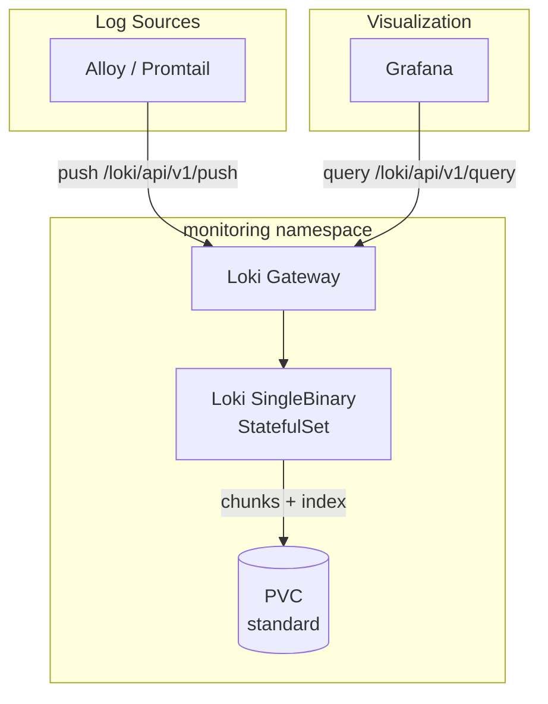

I detect **implementation** intent — writing documentation per the spec in the prompt file. The manifests provide all source-of-truth data needed. Proceeding directly.

# Loki

Log aggregation system for Kubernetes using Grafana Loki in SingleBinary mode.

## Overview

| Property | Value |
|----------|-------|
| **Namespace** | `monitoring` |
| **Type** | HelmRelease |
| **Layer** | Logging (Layer 2) |
| **Dependencies** | External Secrets Config, Kube-Prometheus-Stack |
| **Access** | Port 3100 (Loki), Gateway via `loki-gateway.monitoring` |

## Purpose

Grafana Loki is a log aggregation system that indexes metadata (labels) rather than full log content, making it cost-effective for high-volume environments. It provides LogQL for querying and integrates natively with Grafana as a datasource.

## Features

- **SingleBinary Mode** — All components in one process for local dev simplicity
- **LogQL** — Prometheus-like query language for logs
- **TSDB Index** — Modern index store (schema v13) with 24h period
- **Filesystem Storage** — Local chunks and rules directories
- **ServiceMonitor** — Prometheus scraping at 30s intervals
- **Rate Limiting** — 512MB/s per-stream, 512MB ingestion rate
- **Retention** — Configurable via `LOKI_RETENTION_PERIOD` cluster variable

## Architecture



## Connection

### Port Forward

```bash
# Loki API (direct)
kubectl port-forward -n monitoring svc/loki 3100:3100

# Gateway
kubectl port-forward -n monitoring svc/loki-gateway 80:80
```

### Application Configuration

```yaml
# Push endpoint (for log collectors)
LOKI_URL: "http://loki-gateway.monitoring.svc.cluster.local/loki/api/v1/push"

# Query endpoint (for Grafana datasource)
LOKI_QUERY_URL: "http://loki-gateway.monitoring.svc.cluster.local"
```

### Via Grafana

1. Open Grafana at `http://grafana.local`
2. Go to Explore
3. Select Loki datasource
4. Use LogQL to query

### LogQL Examples

```logql
# All logs from a namespace
{namespace="n8n"}

# Logs containing error
{namespace="monitoring"} |= "error"

# Logs with regex
{app="traefik"} |~ "status=[45].."

# Rate of errors
rate({namespace="default"} |= "error" [5m])

# Top 10 logging pods
topk(10, sum(rate({namespace=~".+"} [5m])) by (pod))
```

## Environment Configuration

| Setting | Dev | Prod |
|---------|-----|------|
| Deployment Mode | SingleBinary | SingleBinary |
| Replicas | 1 | 1 |
| Storage | `${LOKI_STORAGE_SIZE}` | `${LOKI_STORAGE_SIZE}` |
| CPU (request/limit) | 500m / 1000m | 500m / 1000m |
| Memory (request/limit) | 1Gi / 2Gi | 1Gi / 2Gi |
| Retention | `${LOKI_RETENTION_PERIOD}` | `${LOKI_RETENTION_PERIOD}` |
| Gateway Replicas | 1 | 1 |
| Cache | Disabled | Disabled |

Values are substituted from `cluster-vars` ConfigMap at reconciliation time via Flux `postBuild`.

## Verification

```bash
# Check StatefulSet (health check target)
kubectl get statefulset loki -n monitoring

# Check all Loki pods
kubectl get pods -n monitoring -l app.kubernetes.io/name=loki

# Check gateway
kubectl get pods -n monitoring -l app.kubernetes.io/component=gateway

# Verify Loki is ready
kubectl exec -n monitoring loki-0 -- wget -qO- http://localhost:3100/ready

# Check Loki ingestion via API
kubectl exec -n monitoring loki-0 -- wget -qO- http://localhost:3100/loki/api/v1/labels
```

## Troubleshooting

### Logs not appearing in Grafana

```bash
# Verify Loki is healthy
kubectl get pods -n monitoring -l app.kubernetes.io/name=loki

# Check Loki logs for ingestion errors
kubectl logs -n monitoring loki-0 --tail=50

# Verify the push endpoint is reachable from collector
kubectl exec -n monitoring <collector-pod> -- wget -qO- http://loki-gateway.monitoring/ready
```

### High memory / OOMKilled

1. Check ingestion rate — may exceed `ingestion_rate_mb: 512`
2. Reduce `max_streams_per_user` (currently 10000)
3. Increase memory limits in HelmRelease values
4. Add label filters to reduce cardinality

```bash
# Check current resource usage
kubectl top pod -n monitoring -l app.kubernetes.io/name=loki
```

### ExternalSecret not syncing

```bash
# Check ExternalSecret status
kubectl get externalsecret redis-password -n monitoring

# Verify ClusterSecretStore is available
kubectl get clustersecretstore localstack-secretstore

# Check the secret exists in LocalStack
kubectl get secret redis-password -n monitoring
```

### Query timeout

- Reduce time range in LogQL query
- Add more specific label selectors (`{namespace="...", app="..."}`)
- Check Loki resource utilization — SingleBinary mode has all components sharing resources

```bash
# Check Loki metrics for slow queries
kubectl exec -n monitoring loki-0 -- wget -qO- http://localhost:3100/metrics | grep loki_request_duration
```

## Related

- [Kube-Prometheus-Stack](kube-prometheus-stack.md) — Grafana for visualization, dependency
- [External Secrets](external-secrets.md) — Secret management (redis-password)
- [Alloy](alloy.md) — Log collection agent
