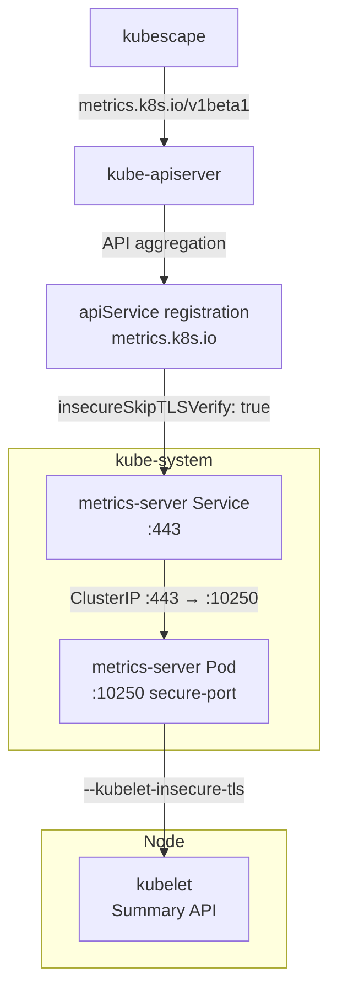

# Metrics Server

[Metrics Server](https://github.com/kubernetes-sigs/metrics-server) is the canonical implementation of the Kubernetes [Resource Metrics API](https://kubernetes.io/docs/tasks/debug/debug-cluster/resource-metrics-pipeline/) (`metrics.k8s.io/v1beta1`). It collects CPU and memory utilization from every kubelet's Summary API, stores the latest data point in memory, and exposes it through the aggregated API server — enabling `kubectl top`, Horizontal Pod Autoscaler decisions, and any tooling that queries pod/node resource consumption.

What distinguishes metrics-server from full observability stacks (Prometheus, Datadog, etc.) is its narrow scope: it holds only the most recent metric sample per resource, uses no persistent storage, and is designed to be lightweight enough to run as a system-critical service with minimal resource footprint. It is not a monitoring solution — it is the metrics *plumbing* that other components build upon.

Metrics Server is a CNCF-maintained project originally extracted from Heapster, and is the only supported implementation of the Resource Metrics API for production Kubernetes clusters.

## Overview

| Property | Value |
|---|---|
| **Namespace** | `kube-system` |
| **Type** | HelmRelease (chart: `metrics-server` v3.12.2) |
| **Layer** | Foundation services |
| **Chart** | [`metrics-server`](https://kubernetes-sigs.github.io/metrics-server/) v3.12.2 |
| **Status** | Enabled |
| **Source** | [`apps/base/metrics-server/`](https://github.com/JiwooL0920/flux-infra/tree/develop/apps/base/metrics-server/) |

## Dependencies

### Upstream — required before Metrics Server starts

_No upstream Flux dependencies — starts immediately._

### Downstream — services that depend on Metrics Server

| Service | Dependency type | Reason |
|---|---|---|
| `kubescape` | Flux `dependsOn` | Requires Metrics Server |

## Purpose

Metrics Server provides the foundational resource metrics layer for the platform. It enables `kubectl top pods/nodes` during development, feeds resource data to kubescape for security and compliance posture scoring, and exposes the `metrics.k8s.io` API that HPA and KEDA reference for resource-based scaling decisions.

As a foundation-tier service with no dependencies, it starts immediately at cluster bootstrap (T+0:00) alongside other infrastructure components, ensuring the Metrics API is available before any downstream workload attempts autoscaling or resource analysis.


## Features

| Feature | Detail |
|---|---|
| **Local-cluster kubelet TLS bypass** | Configured with `--kubelet-insecure-tls` and `insecureSkipTLSVerify` on the apiService to operate in kind/colima environments where kubelet serving certificates are self-signed. |
| **system-cluster-critical priority** | Runs at `system-cluster-critical` priority class, ensuring it is never preempted by application workloads — HPA and VPA depend on continuous metric availability. |
| **Hardened security context** | Non-root execution (UID 1000), read-only root filesystem, all Linux capabilities dropped, and RuntimeDefault seccomp profile applied at both pod and container level. |
| **Zero-downtime rolling updates** | RollingUpdate strategy with `maxUnavailable: 0` ensures at least one replica serves the Metrics API throughout upgrades. |
| **15-second metric resolution** | Scrapes kubelet Summary API every 15 seconds (`--metric-resolution=15s`), balancing freshness against kubelet load in a single-node local cluster. |
| **InternalIP-preferred kubelet addressing** | Uses `--kubelet-preferred-address-types=InternalIP,ExternalIP,Hostname` to reliably reach kubelets in environments where DNS-based node names may not resolve. |

## Architecture

### Metrics Server Deployment Topology




## Configuration

All values sourced from [`base/services/environment.env`](https://github.com/JiwooL0920/flux-infra/blob/develop/base/services/environment.env)
(base); per-environment overrides in [`clusters/stages/dev/.../environment.env`](https://github.com/JiwooL0920/flux-infra/blob/develop/clusters/stages/dev/clusters/services-amer/environment.env).

| Parameter | Dev | Prod |
|---|---|---|
| `METRICS_SERVER_CHART_VERSION` | `3.12.2` | `3.12.2` |
| `METRICS_SERVER_CPU_LIMIT` | `100m` | `500m` |
| `METRICS_SERVER_CPU_REQUEST` | `100m` | `100m` |
| `METRICS_SERVER_MEMORY_LIMIT` | `64Mi` | `256Mi` |
| `METRICS_SERVER_MEMORY_REQUEST` | `64Mi` | `128Mi` |


## Operations

### Metrics API returns NotFound or ServiceUnavailable

**Symptoms:** `kubectl top nodes` returns `error: Metrics API not available` or `the server is currently unable to handle the request`. HPA conditions show `ScalingActive: False` with message `failed to get cpu utilization: unable to get metrics`.

```bash
kubectl get apiservice v1beta1.metrics.k8s.io -o yaml | grep -A5 conditions
kubectl get deployment metrics-server -n kube-system -o wide
kubectl get endpoints metrics-server -n kube-system
kubectl logs -n kube-system deployment/metrics-server --tail=50
kubectl get helmrelease metrics-server -n flux-system -o yaml | grep -A3 conditions
```

---

### Metrics Server CrashLoopBackOff due to TLS errors

**Symptoms:** Pod restarts repeatedly. Logs show `x509: cannot validate certificate` or `tls: failed to verify certificate` when scraping kubelets. `kubectl get pods -n kube-system -l app.kubernetes.io/name=metrics-server` shows CrashLoopBackOff.

```bash
kubectl logs -n kube-system deployment/metrics-server --previous --tail=30
kubectl get helmrelease metrics-server -n flux-system -o jsonpath='{.spec.values.args}'
kubectl get deployment metrics-server -n kube-system -o jsonpath='{.spec.template.spec.containers[0].args}' | tr ',' '\n'
# Verify --kubelet-insecure-tls is present in the rendered args
kubectl get helmrelease metrics-server -n flux-system -o yaml | grep kubelet-insecure-tls
```

---

### Partial node metrics — some nodes return empty

**Symptoms:** `kubectl top nodes` shows metrics for some nodes but `<unknown>` for others. Metrics Server logs show `Failed to scrape node` with connection timeouts for specific node IPs.

```bash
kubectl logs -n kube-system deployment/metrics-server | grep 'Failed to scrape'
kubectl get nodes -o wide  # compare InternalIP against failed scrape targets
kubectl exec -n kube-system deployment/metrics-server -- wget -qO- --no-check-certificate https://<node-internal-ip>:10250/metrics/resource 2>&1 | head -5
# Check if kubelet is listening on the expected port
kubectl get nodes -o jsonpath='{range .items[*]}{.metadata.name} {.status.addresses[?(@.type=="InternalIP")].address}{"\n"}{end}'
```

---

### HPA not scaling — metrics delayed or stale

**Symptoms:** HPA shows `AbleToScale: True` but `ScalingActive: False` with message `missing request for cpu/memory`. `kubectl top pods` returns data but HPA events show `unable to get metrics for resource cpu`.

```bash
kubectl get hpa -A -o wide  # check TARGETS column for <unknown>
kubectl describe hpa <name> -n <ns> | grep -A10 Conditions
kubectl get --raw /apis/metrics.k8s.io/v1beta1/pods | jq '.items | length'
kubectl get --raw /apis/metrics.k8s.io/v1beta1/namespaces/kube-system/pods | jq '.items[0].containers[0].usage'
# Verify metric-resolution timing vs HPA sync period
kubectl logs -n kube-system deployment/metrics-server | grep -c 'successfully scraped'
```
**See also:** docs/adr/011-keda-autoscaling.md

---

### Metrics Server OOMKilled on large cluster

**Symptoms:** Pod terminated with reason `OOMKilled`. `kubectl describe pod -n kube-system -l app.kubernetes.io/name=metrics-server` shows last state terminated with exit code 137. Metrics API becomes unavailable after pod restart cycle.

```bash
kubectl get pod -n kube-system -l app.kubernetes.io/name=metrics-server -o jsonpath='{.items[0].status.containerStatuses[0].lastState}'
kubectl top pod -n kube-system -l app.kubernetes.io/name=metrics-server  # check current usage vs limit
kubectl get nodes --no-headers | wc -l  # memory scales with node+pod count
kubectl get configmap cluster-vars -n flux-system -o yaml | grep METRICS_SERVER_MEMORY
# If limit is too low for cluster size, update METRICS_SERVER_MEMORY_LIMIT in cluster-vars
```

---


## Related


- [`apps/base/metrics-server/`](https://github.com/JiwooL0920/flux-infra/tree/develop/apps/base/metrics-server/) — Kubernetes manifests
- [`base/services/metrics-server.yaml`](https://github.com/JiwooL0920/flux-infra/blob/develop/base/services/metrics-server.yaml) — Flux Kustomization
- [`base/services/environment.env`](https://github.com/JiwooL0920/flux-infra/blob/develop/base/services/environment.env) — environment variables

---
*Generated from [service-catalog.json](https://github.com/JiwooL0920/flux-infra/blob/develop/service-catalog.json) at commit `de245e8` · catalog sha `7281dbc0340b7559`*