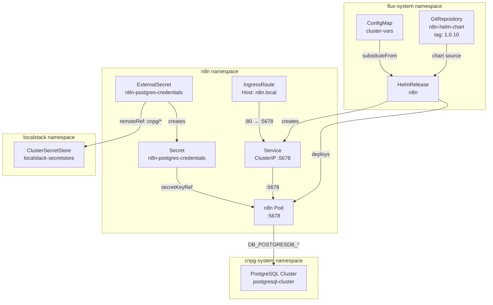

# N8N

[n8n](https://n8n.io) ([GitHub](https://github.com/n8n-io/n8n)) is a source-available workflow automation platform that connects arbitrary services through a visual node-based editor. Unlike fully managed alternatives (Zapier, Make), n8n runs self-hosted with full data sovereignty and supports custom JavaScript/Python code nodes, webhooks, and complex branching logic — making it suitable for infrastructure automation, not just SaaS integrations.

What distinguishes n8n from other open-source alternatives (Apache Airflow, Temporal): it targets citizen-developer and ops workflows with a low-code UI, while still exposing a full programmable API. It handles both scheduled and event-triggered executions, stores workflow state and execution history in a relational database, and provides a built-in credential vault for third-party service authentication.

## Overview

| Property | Value |
|---|---|
| **Namespace** | `n8n` |
| **Type** | HelmRelease (chart: `./charts/n8n` v2.31.0) |
| **Layer** | Application services |
| **Status** | Enabled |
| **Source** | [`apps/base/n8n/`](https://github.com/JiwooL0920/flux-infra/tree/develop/apps/base/n8n/) |

## Dependencies

### Upstream — required before N8N starts

| Service | Reason | Status |
|---|---|---|
| `external-secrets-config` | Flux `dependsOn` | Active |
| `postgresql-cluster` | Flux `dependsOn` | Active |

### Downstream — services that depend on N8N

_No known downstream Flux dependencies._

## Purpose

n8n serves as the platform's general-purpose workflow automation engine — orchestrating integrations, scheduled tasks, and event-driven processes that don't warrant a full Temporal workflow definition. It connects to the shared PostgreSQL cluster for execution history and workflow persistence, and is exposed internally via Traefik for webhook-triggered automations.

Persistence is explicitly disabled at the filesystem level; all state lives in PostgreSQL, making the n8n pod stateless and horizontally scalable without shared volume concerns.


## Features

| Feature | Detail |
|---|---|
| **PostgreSQL-backed stateless deployment** | Filesystem persistence is disabled (`persistence.enabled: false`); all workflow definitions and execution history are stored in the shared CNPG PostgreSQL cluster, making the pod fully stateless and replaceable. |
| **ExternalSecret credential injection** | Database credentials are pulled from LocalStack via `ClusterSecretStore` into a Kubernetes Secret (`n8n-postgres-credentials`), with the `cnpg.io/reload: "true"` label enabling automatic credential rotation without pod restart. |
| **Traefik IngressRoute with direct service routing** | An IngressRoute CRD routes `Host(n8n.local)` through the `web` entrypoint directly to the n8n service on port 80, bypassing the Kubernetes Ingress controller abstraction for Traefik-native routing control. |
| **Health probes with staggered timing** | Liveness probe starts at 60s with 10s interval (tolerates slow JIT startup); readiness probe starts at 30s with 5s interval (faster traffic admission once healthy). Both hit `/healthz` on the HTTP port. |
| **Install and upgrade remediation** | HelmRelease configures 3 retries with 10-minute timeouts for both install and upgrade operations, preventing transient failures (image pull, resource quota) from leaving the release in a failed state. |
| **Environment-differentiated resource allocation** | Resource limits and requests are injected via `postBuild.substituteFrom` from the `cluster-vars` ConfigMap, allowing dev and prod clusters to apply different CPU/memory profiles without manifest duplication. |

## Architecture

### N8N Deployment Topology




## Configuration

All values sourced from [`base/services/environment.env`](https://github.com/JiwooL0920/flux-infra/blob/develop/base/services/environment.env)
(base); per-environment overrides in [`clusters/stages/dev/.../environment.env`](https://github.com/JiwooL0920/flux-infra/blob/develop/clusters/stages/dev/clusters/services-amer/environment.env).

| Parameter | Dev | Prod |
|---|---|---|
| `N8N_CHART_VERSION` | `2.31.0` | `2.31.0` |
| `N8N_CPU_LIMIT` | `500m` | `2000m` |
| `N8N_CPU_REQUEST` | `500m` | `500m` |
| `N8N_DB_NAME` | `n8n` | `n8n` |
| `N8N_MEMORY_LIMIT` | `512Mi` | `2Gi` |
| `N8N_MEMORY_REQUEST` | `512Mi` | `1Gi` |
| `N8N_REPLICA_COUNT` | `1` | `2` |
| `N8N_STORAGE_SIZE` | `2Gi` | `10Gi` |


## Operations

### ExternalSecret stuck in SecretSyncedError

**Symptoms:** `kubectl get externalsecret -n n8n` shows `SecretSyncedError` status. n8n pod is in `CreateContainerConfigError` because the `n8n-postgres-credentials` Secret does not exist. Alert: `ExternalSecretNotReady`.

```bash
kubectl describe externalsecret n8n-postgres-credentials -n n8n
kubectl get clustersecretstore localstack-secretstore -o yaml | grep -A5 status
kubectl logs -n external-secrets -l app.kubernetes.io/name=external-secrets --tail=50
kubectl get secret -n n8n n8n-postgres-credentials -o json | jq '.data | keys'
aws --endpoint-url=http://localstack.localstack.svc:4566 secretsmanager get-secret-value --secret-id cnpg/postgresql-cluster-app/host
```
**See also:** docs/adr/004-single-shared-postgresql-cluster.md

---

### Pod CrashLoopBackOff — database connection refused

**Symptoms:** n8n pod logs show `ECONNREFUSED 10.x.x.x:5432` or `connection to server at ... failed: Connection refused`. Pod restarts with increasing backoff. Liveness probe fails after 60s initial delay.

```bash
kubectl logs -n n8n deployment/n8n --previous --tail=30
kubectl get secret n8n-postgres-credentials -n n8n -o jsonpath='{.data.POSTGRES_HOST}' | base64 -d
kubectl get cluster -n cnpg-system postgresql-cluster -o jsonpath='{.status.phase}'
kubectl get pods -n cnpg-system -l cnpg.io/cluster=postgresql-cluster
kubectl exec -n n8n deployment/n8n -- nc -zv $(kubectl get secret n8n-postgres-credentials -n n8n -o jsonpath='{.data.POSTGRES_HOST}' | base64 -d) 5432
```
**See also:** docs/adr/004-single-shared-postgresql-cluster.md

---

### HelmRelease reconciliation failure — chart fetch error

**Symptoms:** `kubectl get helmrelease n8n -n flux-system` shows `False` ready condition with message containing `failed to fetch chart`. GitRepository `n8n-helm-chart` may show `GitOperationFailed`.

```bash
kubectl get gitrepository n8n-helm-chart -n flux-system -o yaml | grep -A10 status
kubectl describe helmrelease n8n -n flux-system | tail -20
flux reconcile source git n8n-helm-chart
flux reconcile helmrelease n8n
kubectl get events -n flux-system --field-selector involvedObject.name=n8n --sort-by=.lastTimestamp
```

---

### n8n unreachable via ingress — IngressRoute misconfiguration

**Symptoms:** Browser returns 404 or connection reset when accessing `http://n8n.local`. Pod is running and healthy. `curl -H 'Host: n8n.local' http://localhost` from inside the cluster also fails.

```bash
kubectl get ingressroute n8n -n n8n -o yaml
kubectl get svc n8n -n n8n -o wide
kubectl get endpoints n8n -n n8n
kubectl exec -n traefik deployment/traefik -- wget -qO- http://localhost:8080/api/http/routers | grep n8n
kubectl port-forward -n n8n svc/n8n 5678:5678 & curl -s http://localhost:5678/healthz
```

---

### n8n readiness probe failing after PostgreSQL failover

**Symptoms:** After a CNPG failover event, n8n pods show `0/1 Ready`. Logs contain `terminating connection due to administrator command` or `could not translate host name`. Readiness probe returns non-200 on `/healthz`.

```bash
kubectl get cluster -n cnpg-system postgresql-cluster -o jsonpath='{.status.currentPrimary}'
kubectl get secret n8n-postgres-credentials -n n8n -o jsonpath='{.data.POSTGRES_HOST}' | base64 -d
kubectl logs -n n8n deployment/n8n --tail=20 | grep -i 'connection\|postgres\|ECONNR'
kubectl rollout restart deployment/n8n -n n8n
kubectl get pods -n n8n -w
```
**See also:** docs/adr/004-single-shared-postgresql-cluster.md

---

### Flux Kustomization suspended or dependency not satisfied

**Symptoms:** `flux get kustomization n8n` shows `Suspended` or `dependency 'flux-system/postgresql-cluster' is not ready`. No HelmRelease activity. Other services that depend on n8n are also blocked.

```bash
flux get kustomization n8n
flux get kustomization postgresql-cluster
flux get kustomization external-secrets-config
kubectl get configmap cluster-vars -n flux-system -o yaml | grep N8N
flux resume kustomization n8n
flux reconcile kustomization n8n --with-source
```
**See also:** docs/adr/001-fine-grained-service-dependencies.md

---


## Related


- [`apps/base/n8n/`](https://github.com/JiwooL0920/flux-infra/tree/develop/apps/base/n8n/) — Kubernetes manifests
- [`base/services/n8n.yaml`](https://github.com/JiwooL0920/flux-infra/blob/develop/base/services/n8n.yaml) — Flux Kustomization
- [`base/services/environment.env`](https://github.com/JiwooL0920/flux-infra/blob/develop/base/services/environment.env) — environment variables

---
*Generated from [service-catalog.json](https://github.com/JiwooL0920/flux-infra/blob/develop/service-catalog.json) at commit `ba85b93` · catalog sha `71f0757401278c36`*