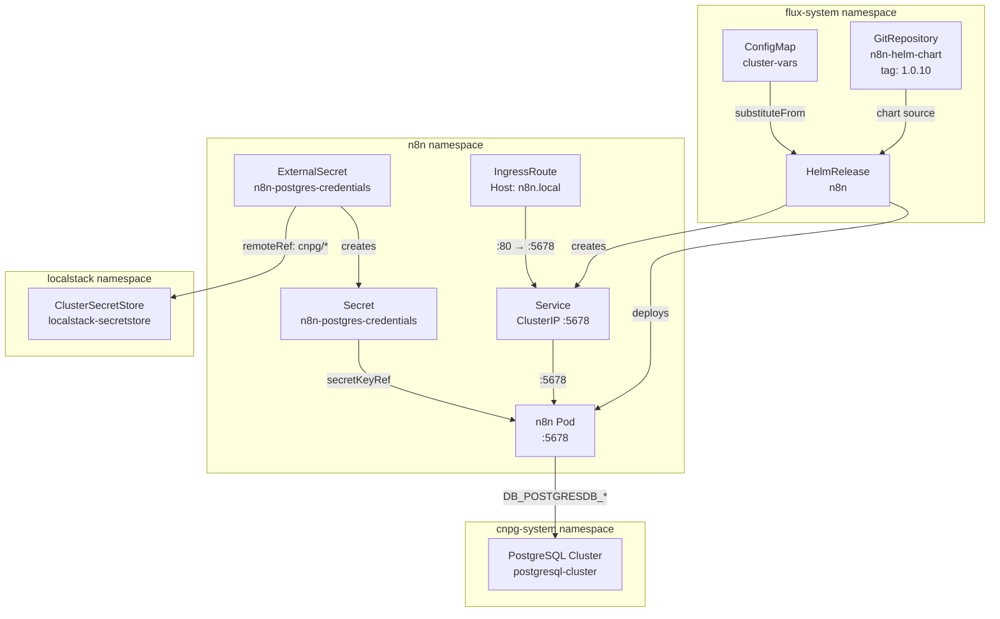

# N8N

[n8n](https://n8n.io) ([GitHub](https://github.com/n8n-io/n8n)) is a source-available workflow automation platform that connects arbitrary services through a visual node-based editor. Unlike fully managed alternatives (Zapier, Make), n8n runs self-hosted with full data sovereignty and supports custom JavaScript/Python code nodes, webhooks, and complex branching logic — making it suitable for infrastructure automation, not just SaaS integrations.

What distinguishes n8n from other open-source alternatives (Apache Airflow, Temporal): it targets citizen-developer and ops workflows with a low-code UI, while still exposing a full programmable API. It handles both scheduled and event-triggered executions, stores workflow state and execution history in a relational database, and provides a built-in credential vault for third-party service authentication.

## Overview

| Property | Value |
|---|---|
| **Namespace** | `n8n` |
| **Type** | HelmRelease (chart: `./charts/n8n` v2.31.0) |
| **Layer** | Application services |
| **Status** | Enabled |
| **Source** | [`apps/base/n8n/`](https://github.com/JiwooL0920/flux-infra/tree/develop/apps/base/n8n/) |

## Dependencies

### Upstream — required before N8N starts

| Service | Reason | Status |
|---|---|---|
| `external-secrets-config` | Flux `dependsOn` | Active |
| `postgresql-cluster` | Flux `dependsOn` | Active |

### Downstream — services that depend on N8N

_No known downstream Flux dependencies._

## Purpose

n8n serves as the platform's general-purpose workflow automation engine — orchestrating integrations, scheduled tasks, and event-driven processes that don't warrant a full Temporal workflow definition. It connects to the shared PostgreSQL cluster for execution history and workflow persistence, and is exposed internally via Traefik for webhook-triggered automations.

Persistence is explicitly disabled at the filesystem level; all state lives in PostgreSQL, making the n8n pod stateless and horizontally scalable without shared volume concerns.

## Features

| Feature | Detail |
|---|---|
| **PostgreSQL-backed stateless deployment** | Filesystem persistence is disabled (`persistence.enabled: false`); all workflow definitions and execution history are stored in the shared CNPG PostgreSQL cluster, making the pod fully stateless and replaceable. |
| **ExternalSecret credential injection** | Database credentials are pulled from LocalStack via `ClusterSecretStore` into a Kubernetes Secret (`n8n-postgres-credentials`), with the `cnpg.io/reload: "true"` label enabling automatic credential rotation without pod restart. |
| **Traefik IngressRoute with direct service routing** | An IngressRoute CRD routes `Host(n8n.local)` through the `web` entrypoint directly to the n8n service on port 80, bypassing the Kubernetes Ingress controller abstraction for Traefik-native routing control. |
| **Health probes with staggered timing** | Liveness probe starts at 60s with 10s interval (tolerates slow JIT startup); readiness probe starts at 30s with 5s interval (faster traffic admission once healthy). Both hit `/healthz` on the HTTP port. |
| **Install and upgrade remediation** | HelmRelease configures 3 retries with 10-minute timeouts for both install and upgrade operations, preventing transient failures (image pull, resource quota) from leaving the release in a failed state. |
| **Environment-differentiated resource allocation** | Resource limits and requests are injected via `postBuild.substituteFrom` from the `cluster-vars` ConfigMap, allowing dev and prod clusters to apply different CPU/memory profiles without manifest duplication. |

## Architecture

### N8N Deployment Topology

## Configuration

All values sourced from [`base/services/environment.env`](https://github.com/JiwooL0920/flux-infra/blob/develop/base/services/environment.env)
(base); per-environment overrides in [`clusters/stages/dev/.../environment.env`](https://github.com/JiwooL0920/flux-infra/blob/develop/clusters/stages/dev/clusters/services-amer/environment.env).

| Parameter | Dev | Prod |
|---|---|---|
| `N8N_CHART_VERSION` | `2.31.0` | `2.31.0` |
| `N8N_CPU_LIMIT` | `500m` | `2000m` |
| `N8N_CPU_REQUEST` | `500m` | `500m` |
| `N8N_DB_NAME` | `n8n` | `n8n` |
| `N8N_MEMORY_LIMIT` | `512Mi` | `2Gi` |
| `N8N_MEMORY_REQUEST` | `512Mi` | `1Gi` |
| `N8N_REPLICA_COUNT` | `1` | `2` |
| `N8N_STORAGE_SIZE` | `2Gi` | `10Gi` |

## Operations

<!-- TODO: Add operations in service-insights/n8n.yaml → operations field -->

## Related

- [`apps/base/n8n/`](https://github.com/JiwooL0920/flux-infra/tree/develop/apps/base/n8n/) — Kubernetes manifests
- [`base/services/n8n.yaml`](https://github.com/JiwooL0920/flux-infra/blob/develop/base/services/n8n.yaml) — Flux Kustomization
- [`base/services/environment.env`](https://github.com/JiwooL0920/flux-infra/blob/develop/base/services/environment.env) — environment variables

---
*Generated from [service-catalog.json](https://github.com/JiwooL0920/flux-infra/blob/develop/service-catalog.json) at commit `2d36e22` · catalog sha `4d088b0b3a67b4c4`*