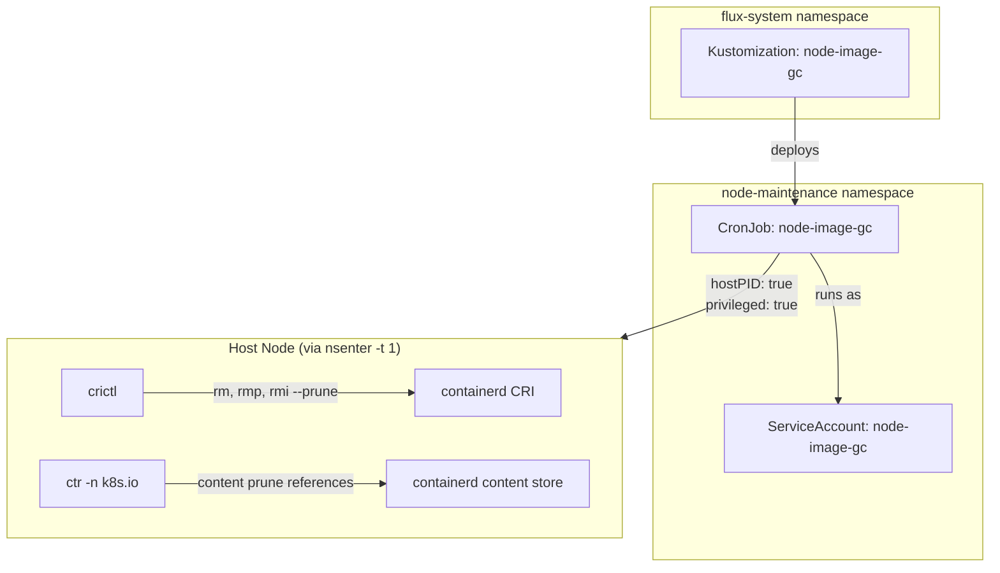

# Node Image GC

Node image garbage collection is the practice of proactively reclaiming disk space on Kubernetes worker nodes by removing unused container images, stopped containers, and stale pod sandboxes. While kubelet provides built-in image GC via `imageGCHighThresholdPercent` / `imageGCLowThresholdPercent`, that mechanism is purely reactive — it only fires when disk pressure is already detected — and it does not touch stopped containers or orphaned sandboxes that accumulate over time.

This service implements a scheduled, multi-step cleanup directly against the node's CRI runtime (containerd via `crictl` and `ctr`). It uses `nsenter` from a privileged pod to enter the host's PID and mount namespaces, giving it full access to the node's container runtime without requiring a DaemonSet or a custom node agent. The approach is lightweight (a single Alpine shell script), deterministic (same steps every run), and observable (structured stdout logging of before/after disk state).

## Overview

| Property | Value |
|---|---|
| **Namespace** | `node-maintenance` |
| **Type** | CronJob |
| **Layer** | Node maintenance |
| **Status** | Enabled |
| **Source** | [`apps/base/node-image-gc/`](https://github.com/JiwooL0920/fleet-infra/tree/develop/apps/base/node-image-gc/) |

## Dependencies

### Upstream — required before Node Image GC starts

_No upstream Flux dependencies — starts immediately._

### Downstream — services that depend on Node Image GC

_No known downstream Flux dependencies._

## Purpose

Node Image GC prevents disk pressure evictions in this cluster by proactively reclaiming space every 6 hours. In a homelab environment with limited node disk (typically 50–100 GB), frequent deployments and Helm chart upgrades leave behind a long tail of unused images and dead containers that kubelet's reactive GC may not clean aggressively enough. This CronJob ensures nodes stay well below the eviction threshold without requiring manual intervention or node restarts.

**Why a CronJob over a DaemonSet or kubelet tuning:** A DaemonSet would keep a pod running permanently on every node for a task that takes seconds every few hours — wasteful for a resource-constrained homelab. Tuning kubelet's GC thresholds only addresses images and is reactive; it cannot remove stopped containers or stale sandboxes. A CronJob with `hostPID` + `nsenter` provides the same node-level access as a DaemonSet but only consumes resources during the brief cleanup window.

**Why not `kube-image-keeper` (kuik) or `eraser`:** Both are more complex (custom controllers, CRDs, webhook admission) and optimized for large multi-tenant clusters. For a single-owner homelab, a shell script run via CronJob achieves the same outcome with zero operational overhead and no additional failure surfaces.

## Features

| Feature | Detail |
|---|---|
| **Four-phase cleanup pipeline** | Executes sequentially: stopped container removal (`crictl rm`), stale sandbox eviction with 10-minute age threshold (`crictl rmp`), unused image pruning (`crictl rmi --prune`), and containerd content store pruning (`ctr content prune references`). Each phase is independent and failure-tolerant. |
| **Host namespace access via nsenter** | Uses `hostPID: true` and `privileged: true` to run `nsenter -t 1 -m -u -i -n -p` against PID 1, entering all host namespaces. This gives direct access to the node's crictl and ctr binaries without mounting the container runtime socket. |
| **Stale sandbox age filtering** | Pod sandboxes in `NotReady` state are only removed if their `createdAt` timestamp is older than 10 minutes (600 seconds), preventing removal of sandboxes that are still being set up or torn down by kubelet. |
| **Universal node scheduling** | Tolerates all taints (`operator: Exists`) and requires only `kubernetes.io/os: linux`, ensuring cleanup runs on every Linux node in the cluster including control-plane nodes that often accumulate the most stale images. |
| **Non-overlapping execution** | `concurrencyPolicy: Forbid` ensures a new Job is never created if a previous run is still active, preventing resource contention on nodes where cleanup might run long due to large image stores. |
| **Automatic job cleanup** | `ttlSecondsAfterFinished: 3600` removes completed Job objects after one hour, preventing accumulation of finished Job resources in the API server while preserving enough history for debugging recent runs. |

## Architecture

### Node-level execution topology

## Configuration

All values sourced from [`base/services/environment.env`](https://github.com/JiwooL0920/fleet-infra/blob/develop/base/services/environment.env)
(base); per-environment overrides in [`clusters/stages/dev/.../environment.env`](https://github.com/JiwooL0920/fleet-infra/blob/develop/clusters/stages/dev/clusters/services-amer/environment.env).

_No environment-specific configuration variables for this service._

## Operations

<!-- TODO: Add operations in service-insights/node-image-gc.yaml → operations field -->

## Related

- [`apps/base/node-image-gc/`](https://github.com/JiwooL0920/fleet-infra/tree/develop/apps/base/node-image-gc/) — Kubernetes manifests
- [`base/services/node-image-gc.yaml`](https://github.com/JiwooL0920/fleet-infra/blob/develop/base/services/node-image-gc.yaml) — Flux Kustomization
- [`base/services/environment.env`](https://github.com/JiwooL0920/fleet-infra/blob/develop/base/services/environment.env) — environment variables

---
*Generated from [service-catalog.json](https://github.com/JiwooL0920/fleet-infra/blob/develop/service-catalog.json) at commit `2d36e22` · catalog sha `4d088b0b3a67b4c4`*