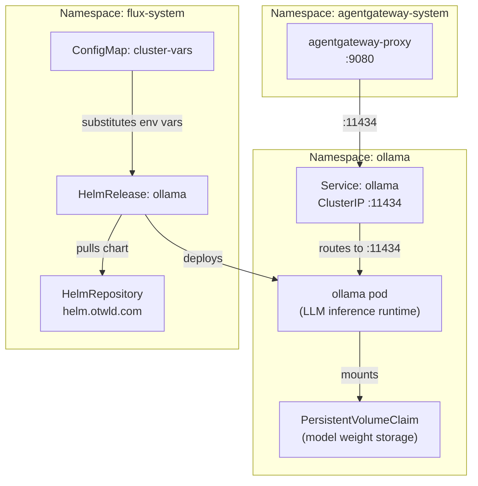
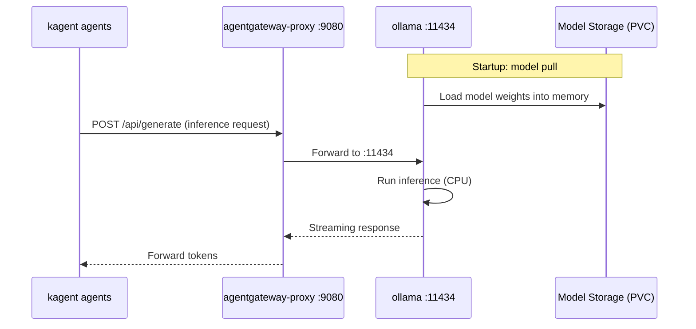

# Ollama

[Ollama](https://ollama.com) ([GitHub](https://github.com/ollama/ollama)) is a local LLM inference runtime that packages model weights, quantization configs, and a serving layer into a single deployable unit. Unlike cloud-hosted inference APIs (OpenAI, Anthropic, Google), Ollama runs entirely within the cluster — no data leaves the network boundary, latency is bounded by local compute rather than internet round-trips, and there are no per-token costs after initial deployment.

What distinguishes Ollama from other self-hosted inference runtimes (vLLM, llama.cpp server, TGI): it provides an OpenAI-compatible API out of the box, handles model lifecycle (pull, cache, swap) automatically, supports quantized model formats (GGUF) for running large models on constrained hardware, and exposes a simple REST interface on a single port. The trade-off is less fine-grained control over batching, scheduling, and GPU memory management compared to production-grade serving frameworks — acceptable for a platform where inference volume is moderate and operational simplicity is valued over throughput optimization.

## Overview

| Property | Value |
|---|---|
| **Namespace** | `ollama` |
| **Type** | HelmRelease (chart: `ollama` v1.53.0) |
| **Layer** | AI agent platform |
| **Chart** | [`ollama`](https://helm.otwld.com/) v1.53.0 |
| **Status** | Enabled |
| **Source** | [`apps/base/ollama/`](https://github.com/JiwooL0920/fleet-infra/tree/develop/apps/base/ollama/) |

## Dependencies

### Upstream — required before Ollama starts

_No upstream Flux dependencies — starts immediately._

### Downstream — services that depend on Ollama

| Service | Dependency type | Reason |
|---|---|---|
| `kagent` | Flux `dependsOn` | Requires Ollama |

## Purpose

Ollama is the platform's local LLM inference backend, serving as the model execution layer for the kagent multi-agent system. The coordinator-agent and its seven specialized subagents (k8s-agent, observability-agent, gitops-agent, flux-agent, helm-agent, security-agent, finops-agent) route all inference requests through Ollama to run planning, tool-use, and response generation workloads against locally-hosted models.

Traffic from kagent reaches Ollama through the Agent Gateway proxy rather than direct service-to-service calls, allowing centralized request routing, observability, and potential model-level traffic shaping without modifying individual agent configurations.

**Why local Ollama over cloud inference APIs:** The kagent orchestrator-worker architecture generates high volumes of inter-agent inference calls — the coordinator decomposes tasks and spawns multiple subagents in parallel, each making its own LLM calls. At cloud API pricing, this multi-hop pattern would produce unpredictable and potentially significant per-query costs. Running inference locally caps cost at fixed compute resources regardless of call volume. Additionally, the platform manages Kubernetes clusters containing potentially sensitive workload metadata — keeping all inference data within the cluster boundary eliminates data exfiltration concerns entirely.

**Why Ollama over vLLM or TGI:** This platform runs on CPU-only nodes without GPU acceleration. Ollama's GGUF quantization support and single-binary deployment model make it the simplest path to running large models (72B parameter) on CPU hardware with acceptable latency for an operations-focused agent system where response time tolerances are seconds, not milliseconds.

## Features

| Feature | Detail |
|---|---|
| **Automatic model pull at startup** | Container entrypoint pulls the configured model on first boot, ensuring the pod is ready to serve inference immediately after scheduling without manual operator intervention or init containers. |
| **Persistent model storage** | A PersistentVolumeClaim retains downloaded model weights across pod restarts and rescheduling, avoiding multi-gigabyte re-downloads that would otherwise block readiness for several minutes on each pod lifecycle event. |
| **ClusterIP-only exposure** | The inference endpoint is accessible only within the cluster via ClusterIP on port 11434 — no ingress, no external exposure — limiting the attack surface to intra-cluster traffic routed through the agent gateway. |
| **Install and upgrade remediation** | HelmRelease configures 3 retries for both install and upgrade operations with extended timeouts, accommodating the slow startup inherent in pulling and loading multi-gigabyte model weights into memory. |

## Architecture

### Ollama Deployment Topology

### Inference Request Flow

## Configuration

All values sourced from [`base/services/environment.env`](https://github.com/JiwooL0920/fleet-infra/blob/develop/base/services/environment.env)
(base); per-environment overrides in [`clusters/stages/dev/.../environment.env`](https://github.com/JiwooL0920/fleet-infra/blob/develop/clusters/stages/dev/clusters/services-amer/environment.env).

| Parameter | Dev | Prod |
|---|---|---|
| `OLLAMA_CHART_VERSION` | `1.53.0` | `1.53.0` |
| `OLLAMA_CPU_LIMIT` | `1000m` | `2000m` |
| `OLLAMA_CPU_REQUEST` | `500m` | `500m` |
| `OLLAMA_HOST` | `http://agentgateway-proxy.agentgateway-system.svc.cluster.local:9080` | `http://agentgateway-proxy.agentgateway-system.svc.cluster.local:9080` |
| `OLLAMA_MEMORY_LIMIT` | `3Gi` | `4Gi` |
| `OLLAMA_MEMORY_REQUEST` | `2Gi` | `2Gi` |
| `OLLAMA_MODEL` | `qwen2.5:72b` | `qwen2.5:72b` |
| `OLLAMA_STORAGE_SIZE` | `5Gi` | `10Gi` |

## Operations

<!-- TODO: Add operations in service-insights/ollama.yaml → operations field -->

## Related

- [`apps/base/ollama/`](https://github.com/JiwooL0920/fleet-infra/tree/develop/apps/base/ollama/) — Kubernetes manifests
- [`base/services/ollama.yaml`](https://github.com/JiwooL0920/fleet-infra/blob/develop/base/services/ollama.yaml) — Flux Kustomization
- [`base/services/environment.env`](https://github.com/JiwooL0920/fleet-infra/blob/develop/base/services/environment.env) — environment variables

---
*Generated from [service-catalog.json](https://github.com/JiwooL0920/fleet-infra/blob/develop/service-catalog.json) at commit `09eeed6` · catalog sha `4d088b0b3a67b4c4`*