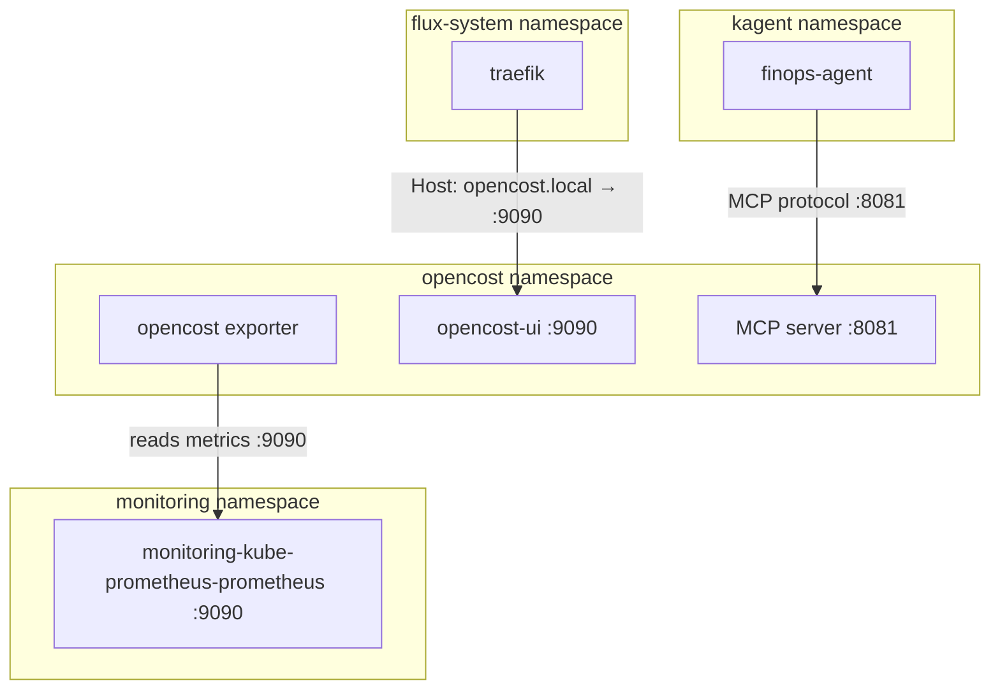

# OpenCost

[OpenCost](https://www.opencost.io) ([GitHub](https://github.com/opencost/opencost)) is a CNCF graduated project for real-time Kubernetes cost monitoring and allocation. Unlike cloud-provider billing dashboards that report costs days after the fact with coarse granularity, OpenCost operates at the pod and namespace level by combining live resource consumption metrics from Prometheus with configurable pricing models — producing cost allocation data in near-real-time without requiring any cloud billing API integration.

What distinguishes OpenCost from commercial alternatives (Kubecost Enterprise, CloudHealth, Spot.io): it is fully open-source with no proprietary data lock-in, runs entirely in-cluster with no external SaaS dependency, and exposes its data through a simple HTTP API. The architecture is deliberately minimal — a single exporter binary reads Prometheus metrics, applies pricing, and serves allocation data. The optional UI provides visual exploration, but the primary integration surface is the API (and in newer versions, a built-in MCP server for LLM agent consumption).

## Overview

| Property | Value |
|---|---|
| **Namespace** | `opencost` |
| **Type** | HelmRelease (chart: `opencost` v2.5.12) |
| **Layer** | Security and cost observability |
| **Chart** | [`opencost`](https://opencost.github.io/opencost-helm-chart) v2.5.12 |
| **Status** | Enabled |
| **Source** | [`apps/base/opencost/`](https://github.com/JiwooL0920/flux-infra/tree/develop/apps/base/opencost/) |

## Dependencies

### Upstream — required before OpenCost starts

| Service | Reason | Status |
|---|---|---|
| `kube-prometheus-stack` | Flux `dependsOn` | Active |

### Downstream — services that depend on OpenCost

_No known downstream Flux dependencies._

## Purpose

OpenCost serves as the platform's cost observability layer, providing namespace-level and pod-level cost allocation data derived from Prometheus CPU and memory metrics. Its primary consumer is the kagent `finops-agent`, which queries cost data programmatically through OpenCost's built-in MCP server to answer cost-related questions, identify expensive workloads, and inform capacity planning decisions within the multi-agent orchestration system.

Secondarily, the UI exposed at `opencost.local` provides human-readable cost dashboards for ad-hoc investigation — useful when validating finops-agent findings or exploring cost trends manually.

**Why OpenCost over Kubecost or custom Prometheus queries:** Kubecost's free tier restricts data retention and multi-cluster features, and its enterprise tier adds licensing overhead inappropriate for a homelab. Raw PromQL cost queries are fragile and require maintaining complex recording rules. OpenCost sits in the middle — it handles the pricing model application and allocation math cleanly, exposes a structured API, and critically ships with a built-in MCP server that the kagent finops-agent can consume directly without building a custom tool wrapper. The CNCF graduation status also signals long-term maintenance stability.

## Features

| Feature | Detail |
|---|---|
| **Prometheus-backed cost allocation** | Reads CPU and memory usage from kube-prometheus-stack's Prometheus instance at monitoring-kube-prometheus-prometheus:9090, applying configurable pricing to generate per-pod and per-namespace cost data |
| **Built-in MCP server** | Exposes cost allocation and asset data on port 8081 via MCP protocol, providing get_allocation_costs and get_asset_costs tools consumable by LLM agents without additional middleware |
| **Web UI** | Optional dashboard component served on port 9090 with dedicated resource limits, exposed externally via Traefik IngressRoute at opencost.local |
| **Namespace-scoped deployment** | Runs in dedicated opencost namespace with Flux-managed lifecycle, isolated from monitoring stack while depending on it for metric ingestion |

## Architecture

### OpenCost Deployment Topology

## Configuration

All values sourced from [`base/services/environment.env`](https://github.com/JiwooL0920/flux-infra/blob/develop/base/services/environment.env)
(base); per-environment overrides in [`clusters/stages/dev/.../environment.env`](https://github.com/JiwooL0920/flux-infra/blob/develop/clusters/stages/dev/clusters/services-amer/environment.env).

| Parameter | Dev | Prod |
|---|---|---|
| `OPENCOST_CHART_VERSION` | `2.5.12` | `2.5.12` |
| `OPENCOST_CPU_LIMIT` | `200m` | `200m` |
| `OPENCOST_CPU_REQUEST` | `10m` | `10m` |
| `OPENCOST_MEMORY_LIMIT` | `256Mi` | `256Mi` |
| `OPENCOST_MEMORY_REQUEST` | `55Mi` | `55Mi` |

## Operations

<!-- TODO: Add operations in service-insights/opencost.yaml → operations field -->

## Related

- [`apps/base/opencost/`](https://github.com/JiwooL0920/flux-infra/tree/develop/apps/base/opencost/) — Kubernetes manifests
- [`base/services/opencost.yaml`](https://github.com/JiwooL0920/flux-infra/blob/develop/base/services/opencost.yaml) — Flux Kustomization
- [`base/services/environment.env`](https://github.com/JiwooL0920/flux-infra/blob/develop/base/services/environment.env) — environment variables

---
*Generated from [service-catalog.json](https://github.com/JiwooL0920/flux-infra/blob/develop/service-catalog.json) at commit `165b485` · catalog sha `4d088b0b3a67b4c4`*