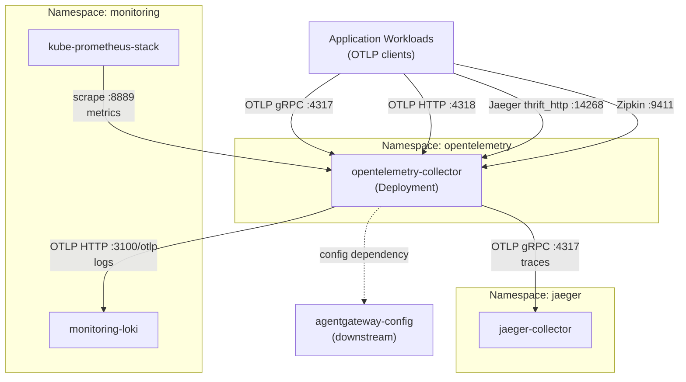
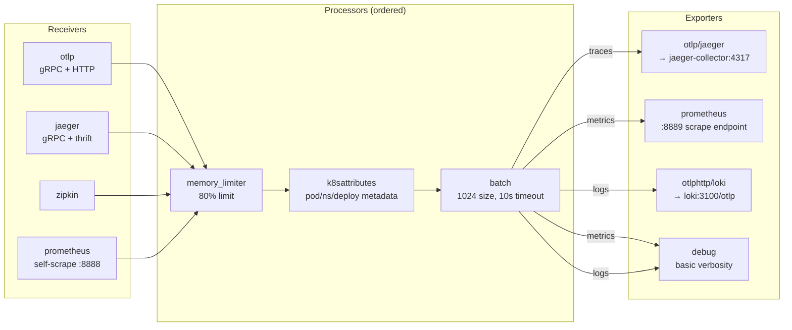

# OpenTelemetry Collector

[OpenTelemetry Collector](https://opentelemetry.io/docs/collector/) ([GitHub](https://github.com/open-telemetry/opentelemetry-collector)) is a vendor-agnostic telemetry pipeline that receives, processes, and exports observability signals — traces, metrics, and logs — through a configurable receiver → processor → exporter architecture. Unlike application-embedded exporters that couple services to specific backends, the Collector acts as a protocol-normalizing intermediary: applications emit OTLP once, and the Collector handles fan-out, enrichment, and format translation.

The **contrib distribution** is deployed here, which bundles the full ecosystem of community receivers and exporters (Jaeger, Zipkin, Prometheus, Loki OTLP) in a single binary. This is heavier than a custom-built distribution but eliminates the need to maintain a custom builder pipeline for a homelab where binary size is not a constraint.

What distinguishes the OTel Collector from similar pipeline tools (Grafana Agent/Alloy, Fluentd, Vector): it implements the OTLP standard natively, supports all three signal types in a single process with shared processor chains, and has first-class Kubernetes metadata enrichment via the `k8sattributes` processor — automatically decorating every span, metric, and log line with pod, namespace, and deployment context without application-level instrumentation changes.

## Overview

| Property | Value |
|---|---|
| **Namespace** | `opentelemetry` |
| **Type** | HelmRelease (chart: `opentelemetry-collector` v0.108.0) |
| **Layer** | Distributed tracing services |
| **Chart** | [`opentelemetry-collector`](https://open-telemetry.github.io/opentelemetry-helm-charts) v0.108.0 |
| **Status** | Enabled |
| **Source** | [`apps/base/opentelemetry-collector/`](https://github.com/JiwooL0920/fleet-infra/tree/develop/apps/base/opentelemetry-collector/) |

## Dependencies

### Upstream — required before OpenTelemetry Collector starts

| Service | Reason | Status |
|---|---|---|
| `jaeger` | Flux `dependsOn` | Active |
| `loki` | Flux `dependsOn` | Active |
| `kube-prometheus-stack` | Flux `dependsOn` | Active |

### Downstream — services that depend on OpenTelemetry Collector

| Service | Dependency type | Reason |
|---|---|---|
| `agentgateway-config` | Flux `dependsOn` | Requires OpenTelemetry Collector |

## Purpose

The OpenTelemetry Collector serves as the platform's single telemetry ingestion point. All application workloads — including the kagent multi-agent system and supporting services — emit telemetry to one endpoint (`opentelemetry-collector:4317`) using OTLP. The Collector then routes traces to Jaeger, metrics to Prometheus (via a scrape-compatible exporter endpoint), and logs to Loki using native OTLP HTTP ingestion.

This decouples every application from backend knowledge: services never import Jaeger or Loki client libraries, never hardcode backend endpoints, and remain unaffected when backends are swapped or reconfigured. The Collector also enriches all signals with Kubernetes metadata (pod name, namespace, deployment, node) through the `k8sattributes` processor, providing consistent correlation dimensions across traces, metrics, and logs without per-service instrumentation effort.

**Why OTel Collector over direct-to-backend or Grafana Agent:** Direct emission (apps → Jaeger for traces, Promtail → Loki for logs) was the initial approach but created tight coupling — every service needed backend-specific client libraries and endpoint configuration. Migrating a single backend meant touching every service.

Grafana Agent (now Alloy) was considered as a unified pipeline. It integrates well with the Grafana stack already deployed here, but it implements a proprietary configuration language (River) and its OTLP support trails the reference implementation. The OTel Collector uses the OTLP standard natively, has broader community momentum, and avoids deeper lock-in to the Grafana ecosystem — important given that trace and metric backends may change independently of the visualization layer.

## Features

| Feature | Detail |
|---|---|
| **Multi-protocol ingestion** | Accepts OTLP (gRPC :4317, HTTP :4318), Jaeger (gRPC :14250, thrift_http :14268, thrift_compact :6831, thrift_binary :6832), Zipkin (:9411), and Prometheus self-scrape — enabling incremental migration from legacy instrumentation without application changes. |
| **Kubernetes metadata enrichment** | The k8sattributes processor uses serviceAccount auth to extract pod, deployment, statefulset, daemonset, cronjob, job, node, and namespace metadata plus app.kubernetes.io labels, attaching them to all telemetry signals automatically. |
| **Memory-bounded processing** | The memory_limiter processor (80% limit, 25% spike allowance, 5s check interval) prevents OOM under burst load by applying backpressure to receivers before the process exceeds its cgroup memory allocation. |
| **Batched export with retry** | The batch processor (1024 batch size, 2048 max, 10s timeout) amortizes export overhead; the Jaeger exporter adds a 1000-item sending queue with exponential backoff retry (1s→10s, 60s max elapsed) to absorb transient backend unavailability. |
| **Three-signal pipeline routing** | Traces route to Jaeger via OTLP gRPC, metrics expose a Prometheus-scrapable endpoint on :8889 with resource-to-telemetry conversion, and logs push to Loki via native OTLP HTTP — each pipeline shares the same processor chain. |
| **Kubernetes presets enabled** | kubernetesAttributes, clusterMetrics, and kubeletMetrics presets are active, providing cluster-level resource metrics and kubelet stats without manual receiver configuration. |
| **ServiceMonitor integration** | A ServiceMonitor resource exposes the Prometheus exporter port (:8889) with 30s scrape interval, enabling kube-prometheus-stack to discover and scrape collector-processed metrics automatically. |
| **Diagnostic extensions** | health_check (:13133), pprof (:1777), and zpages (:55679) extensions are enabled for liveness probing, CPU/memory profiling, and pipeline-level debug visualization respectively. |

## Architecture

### Telemetry Pipeline Topology

### Signal Processing Flow

## Configuration

All values sourced from [`base/services/environment.env`](https://github.com/JiwooL0920/fleet-infra/blob/develop/base/services/environment.env)
(base); per-environment overrides in [`clusters/stages/dev/.../environment.env`](https://github.com/JiwooL0920/fleet-infra/blob/develop/clusters/stages/dev/clusters/services-amer/environment.env).

| Parameter | Dev | Prod |
|---|---|---|
| `OTEL_COLLECTOR_CHART_VERSION` | `0.108.0` | `0.108.0` |
| `OTEL_COLLECTOR_CPU_LIMIT` | `500m` | `500m` |
| `OTEL_COLLECTOR_CPU_REQUEST` | `100m` | `100m` |
| `OTEL_COLLECTOR_MEMORY_LIMIT` | `512Mi` | `512Mi` |
| `OTEL_COLLECTOR_MEMORY_REQUEST` | `256Mi` | `256Mi` |
| `OTEL_COLLECTOR_REPLICAS` | `1` | `1` |

## Operations

<!-- TODO: Add operations in service-insights/opentelemetry-collector.yaml → operations field -->

## Related

- [`apps/base/opentelemetry-collector/`](https://github.com/JiwooL0920/fleet-infra/tree/develop/apps/base/opentelemetry-collector/) — Kubernetes manifests
- [`base/services/opentelemetry-collector.yaml`](https://github.com/JiwooL0920/fleet-infra/blob/develop/base/services/opentelemetry-collector.yaml) — Flux Kustomization
- [`base/services/environment.env`](https://github.com/JiwooL0920/fleet-infra/blob/develop/base/services/environment.env) — environment variables

---
*Generated from [service-catalog.json](https://github.com/JiwooL0920/fleet-infra/blob/develop/service-catalog.json) at commit `2d36e22` · catalog sha `4d088b0b3a67b4c4`*