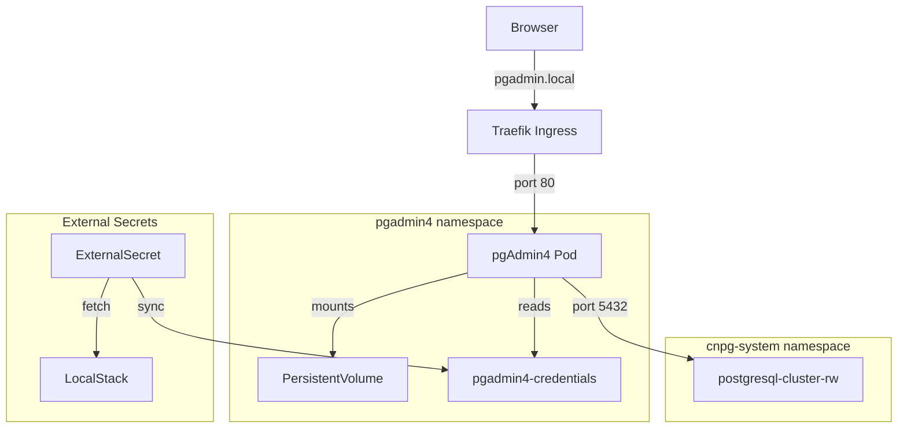

I detect **implementation** intent — explicit "write the documentation" request with full context provided in the prompt file. My approach: write directly since all source material is in hand.

# pgAdmin4

Web-based PostgreSQL administration interface.

## Overview

| Property | Value |
|----------|-------|
| **Namespace** | `pgadmin4` |
| **Type** | HelmRelease |
| **Layer** | Database UI (Layer 6) |
| **Dependencies** | External Secrets Config, PostgreSQL Cluster |
| **Access** | `http://pgadmin.local` |

## Purpose

pgAdmin4 provides a graphical interface for managing PostgreSQL databases deployed via CloudNativePG. It supports query execution, schema browsing, server monitoring, and backup management against the fleet-infra PostgreSQL cluster.

## Features

- **Query Tool** — Execute SQL with syntax highlighting and auto-complete
- **Object Browser** — Navigate schemas, tables, views, functions
- **Dashboard** — Server metrics, session activity, lock monitoring
- **Backup/Restore** — Database backup and point-in-time recovery management
- **ERD Designer** — Visual schema design and DDL generation
- **Query History** — Track and re-run previously executed queries

## Architecture



## Connection

### Local DNS (Recommended)

```
http://pgadmin.local
```

### Port Forwarding

```bash
kubectl port-forward -n pgadmin4 svc/pgadmin4 8080:80
```

Then visit `http://localhost:8080`

### Credentials

Login email: `admin@fleet-infra.dev`

Password is stored in External Secrets, synced from LocalStack:

```bash
# Get password
kubectl get secret pgadmin4-credentials -n pgadmin4 \
  -o jsonpath='{.data.password}' | base64 -d
```

### Connecting to PostgreSQL

Register a server in pgAdmin:

| Field | Value |
|-------|-------|
| Name | `postgresql-cluster` |
| Host | `postgresql-cluster-rw.cnpg-system` |
| Port | `5432` |
| Username | From CNPG secret |
| Password | From CNPG secret |

Connection string format:

```
postgresql://<user>:<password>@postgresql-cluster-rw.cnpg-system:5432/<database>
```

## Environment Configuration

| Setting | Dev | Prod |
|---------|-----|------|
| Storage | `${PGADMIN4_STORAGE_SIZE}` | `${PGADMIN4_STORAGE_SIZE}` |
| CPU Request | `${PGADMIN4_CPU_REQUEST}` | `${PGADMIN4_CPU_REQUEST}` |
| CPU Limit | `${PGADMIN4_CPU_LIMIT}` | `${PGADMIN4_CPU_LIMIT}` |
| Memory Request | `${PGADMIN4_MEMORY_REQUEST}` | `${PGADMIN4_MEMORY_REQUEST}` |
| Memory Limit | `${PGADMIN4_MEMORY_LIMIT}` | `${PGADMIN4_MEMORY_LIMIT}` |

Values are substituted from the `cluster-vars` ConfigMap at deploy time.

## Verification

```bash
# Check pod status
kubectl get pods -n pgadmin4

# Check deployment
kubectl get deploy pgadmin4 -n pgadmin4

# Check service
kubectl get svc -n pgadmin4

# Check ingress route
kubectl get ingressroute -n pgadmin4

# Check external secret sync
kubectl get externalsecret -n pgadmin4
```

## Troubleshooting

### Cannot login

1. Verify email is `admin@fleet-infra.dev`
2. Check password in secret matches LocalStack
3. Confirm ExternalSecret is synced

```bash
kubectl get externalsecret pgadmin4-credentials -n pgadmin4
kubectl get secret pgadmin4-credentials -n pgadmin4 -o jsonpath='{.data.password}' | base64 -d
```

### Cannot connect to PostgreSQL

1. Verify PostgreSQL cluster is healthy
2. Check DNS resolution from pgAdmin pod
3. Verify CNPG credentials

```bash
# Check PostgreSQL cluster status
kubectl get cluster -n cnpg-system

# Test connectivity from pgAdmin pod
kubectl exec -it -n pgadmin4 deploy/pgadmin4 -- \
  pg_isready -h postgresql-cluster-rw.cnpg-system -p 5432
```

### Pod stuck in CrashLoopBackOff

1. Check filesystem permissions (must be 5050:5050)
2. Verify PVC is bound
3. Check logs for startup errors

```bash
# Check PVC
kubectl get pvc -n pgadmin4

# Check logs
kubectl logs -n pgadmin4 deploy/pgadmin4

# Check events
kubectl get events -n pgadmin4 --sort-by='.lastTimestamp'
```

## Related

- [PostgreSQL](postgresql.md) — Database cluster
- [External Secrets](external-secrets.md) — Credential management
- [Traefik](traefik.md) — Ingress routing
