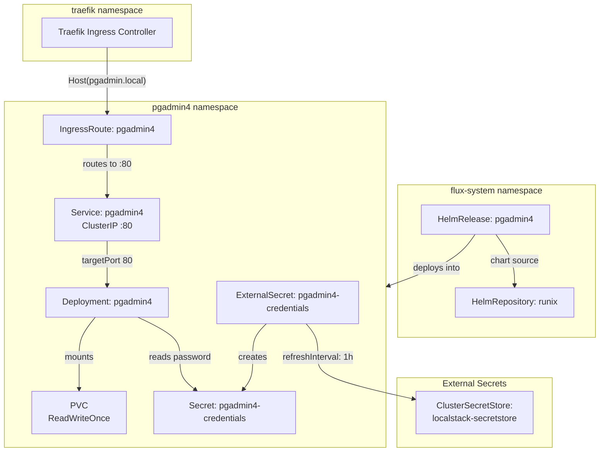

# pgAdmin4

[pgAdmin](https://www.pgadmin.org/) ([GitHub](https://github.com/pgadmin-org/pgadmin4)) is the open-source administration and development platform for PostgreSQL. Written in Python (Flask backend) with a JavaScript frontend, it provides a full-featured web interface for database management — query execution, schema visualization, server monitoring, backup/restore orchestration, and user/role administration. What distinguishes it from lighter alternatives (Adminer, phpPgAdmin): pgAdmin4 is the official PostgreSQL community tool, supporting every PostgreSQL feature including advanced types, extensions, logical replication configuration, and explain-plan visualization.

pgAdmin4 operates as a stateful web application. It maintains its own SQLite metadata database and session state on a persistent volume, storing saved server connections, query history, and user preferences. The application runs as a non-root process (UID 5050) and exposes a standard HTTP interface suitable for reverse-proxy deployment.

## Overview

| Property | Value |
|---|---|
| **Namespace** | `pgadmin4` |
| **Type** | HelmRelease (chart: `pgadmin4` v1.30.0) |
| **Layer** | Database UI services |
| **Chart** | [`pgadmin4`](https://helm.runix.net) v1.30.0 |
| **Status** | Enabled |
| **Source** | [`apps/base/pgadmin4/`](https://github.com/JiwooL0920/flux-infra/tree/develop/apps/base/pgadmin4/) |

## Dependencies

### Upstream — required before pgAdmin4 starts

| Service | Reason | Status |
|---|---|---|
| `external-secrets-config` | Flux `dependsOn` | Active |
| `postgresql-cluster` | Flux `dependsOn` | Active |

### Downstream — services that depend on pgAdmin4

_No known downstream Flux dependencies._

## Purpose

pgAdmin4 serves as the visual administration interface for the platform's CNPG-managed PostgreSQL cluster. It provides operators with direct SQL access, schema inspection, and monitoring without requiring `kubectl exec` or port-forwarding — accessible via browser at `pgadmin.local` through the Traefik ingress layer.

In this deployment, pgAdmin4 is pre-configured with admin credentials sourced from the external secrets pipeline. Operators connect to the CNPG PostgreSQL cluster post-deployment through pgAdmin's server registration UI, which persists connection details across pod restarts via the attached persistent volume.


## Features

| Feature | Detail |
|---|---|
| **External secret integration for admin credentials** | Admin password is injected from LocalStack via ClusterSecretStore, avoiding plaintext credentials in Git; email is set statically in Helm values as the chart only supports password extraction from secrets. |
| **Traefik IngressRoute with dual ingress** | Exposed via both a standard Kubernetes Ingress resource (pgadmin4.local) and a Traefik-native IngressRoute CRD (pgadmin.local) on the web entrypoint. |
| **Persistent session and configuration storage** | A ReadWriteOnce PVC stores pgAdmin's internal SQLite database, saved server connections, query history, and user preferences — surviving pod restarts without re-configuration. |
| **Non-root security context** | Container runs as UID/GID 5050 with runAsNonRoot enforced, matching the upstream pgAdmin4 container's expected filesystem ownership. |
| **Flux health gating on PostgreSQL readiness** | Flux healthChecks verify the CNPG PostgreSQL Cluster resource is healthy before marking pgAdmin4 as successfully reconciled, preventing a running UI with no available database backend. |

## Architecture

### pgAdmin4 Deployment Topology




## Configuration

All values sourced from [`base/services/environment.env`](https://github.com/JiwooL0920/flux-infra/blob/develop/base/services/environment.env)
(base); per-environment overrides in [`clusters/stages/dev/.../environment.env`](https://github.com/JiwooL0920/flux-infra/blob/develop/clusters/stages/dev/clusters/services-amer/environment.env).

| Parameter | Dev | Prod |
|---|---|---|
| `PGADMIN4_CHART_VERSION` | `1.30.0` | `1.30.0` |
| `PGADMIN4_CPU_LIMIT` | `200m` | `1000m` |
| `PGADMIN4_CPU_REQUEST` | `200m` | `200m` |
| `PGADMIN4_MEMORY_LIMIT` | `256Mi` | `1Gi` |
| `PGADMIN4_MEMORY_REQUEST` | `256Mi` | `512Mi` |
| `PGADMIN4_STORAGE_SIZE` | `1Gi` | `5Gi` |


## Operations

### Pod CrashLoopBackOff due to PV permission denied

**Symptoms:** Pod logs show `Permission denied: '/var/lib/pgadmin'` or `[Errno 13]`. `kubectl get pods -n pgadmin4` shows CrashLoopBackOff with short restart intervals. Occurs after PV migration or node scheduling change.

```bash
kubectl logs deployment/pgadmin4 -n pgadmin4 --previous | grep -i permission
kubectl get pvc -n pgadmin4 -o yaml | grep -A5 'spec:'
kubectl exec -it deployment/pgadmin4 -n pgadmin4 -- id  # Should show uid=5050 gid=5050
kubectl get deployment pgadmin4 -n pgadmin4 -o jsonpath='{.spec.template.spec.securityContext}'
kubectl delete pod -n pgadmin4 -l app.kubernetes.io/name=pgadmin4  # Force reschedule with correct fsGroup
```

---

### ExternalSecret stuck in SecretSyncedError

**Symptoms:** `kubectl get externalsecret pgadmin4-credentials -n pgadmin4` shows status `SecretSyncedError`. Pod fails to start with `secret pgadmin4-credentials not found` in events. Usually occurs before LocalStack is fully initialized or ClusterSecretStore is unhealthy.

```bash
kubectl get externalsecret pgadmin4-credentials -n pgadmin4 -o yaml | grep -A10 'status:'
kubectl get clustersecretstore localstack-secretstore -o jsonpath='{.status.conditions[*].message}'
kubectl get pods -n external-secrets -l app.kubernetes.io/name=external-secrets
kubectl logs -n external-secrets -l app.kubernetes.io/name=external-secrets --tail=50 | grep pgadmin4
kubectl annotate externalsecret pgadmin4-credentials -n pgadmin4 force-sync=$(date +%s) --overwrite
```
**See also:** docs/adr/001-fine-grained-service-dependencies.md

---

### pgAdmin4 unable to connect to PostgreSQL cluster

**Symptoms:** pgAdmin4 UI shows "Unable to connect to server" or "connection refused" when attempting to browse the registered PostgreSQL server. Pod itself is Running and healthy.

```bash
kubectl get cluster postgresql-cluster -n cnpg-system -o jsonpath='{.status.phase}'
kubectl get pods -n cnpg-system -l cnpg.io/cluster=postgresql-cluster
kubectl exec -n pgadmin4 deployment/pgadmin4 -- python -c "import socket; socket.create_connection(('postgresql-cluster-rw.cnpg-system.svc', 5432), timeout=5)" 2>&1
kubectl get networkpolicies -n cnpg-system -o wide
kubectl get endpoints postgresql-cluster-rw -n cnpg-system
```

---

### IngressRoute not routing traffic to pgAdmin4

**Symptoms:** Browser returns 404 or connection refused when accessing `pgadmin.local`. `kubectl get ingressroute pgadmin4 -n pgadmin4` exists but Traefik dashboard shows no matching route.

```bash
kubectl get ingressroute pgadmin4 -n pgadmin4 -o yaml
kubectl get svc pgadmin4 -n pgadmin4 -o jsonpath='{.spec.ports[*]}'
kubectl get endpoints pgadmin4 -n pgadmin4
kubectl logs -n traefik -l app.kubernetes.io/name=traefik --tail=30 | grep pgadmin
kubectl port-forward svc/pgadmin4 -n pgadmin4 8080:80  # Bypass ingress to confirm service works
```

---

### pgAdmin4 login fails with valid credentials

**Symptoms:** Login page loads correctly but returns "Incorrect username or password" despite using the email from the HelmRelease values and the password from the secret. Often occurs after secret rotation or initial deployment race condition.

```bash
kubectl get secret pgadmin4-credentials -n pgadmin4 -o jsonpath='{.data.password}' | base64 -d
kubectl get secret pgadmin4-credentials -n pgadmin4 -o jsonpath='{.data.email}' | base64 -d
kubectl exec -n pgadmin4 deployment/pgadmin4 -- cat /pgadmin4/config_local.py 2>/dev/null || echo 'no config_local'
kubectl delete pod -n pgadmin4 -l app.kubernetes.io/name=pgadmin4  # Force re-read of secret mount
kubectl logs deployment/pgadmin4 -n pgadmin4 | grep -i 'authentication\|login\|email'
```

---


## Related


- [`apps/base/pgadmin4/`](https://github.com/JiwooL0920/flux-infra/tree/develop/apps/base/pgadmin4/) — Kubernetes manifests
- [`base/services/pgadmin4.yaml`](https://github.com/JiwooL0920/flux-infra/blob/develop/base/services/pgadmin4.yaml) — Flux Kustomization
- [`base/services/environment.env`](https://github.com/JiwooL0920/flux-infra/blob/develop/base/services/environment.env) — environment variables

---
*Generated from [service-catalog.json](https://github.com/JiwooL0920/flux-infra/blob/develop/service-catalog.json) at commit `de245e8` · catalog sha `7281dbc0340b7559`*