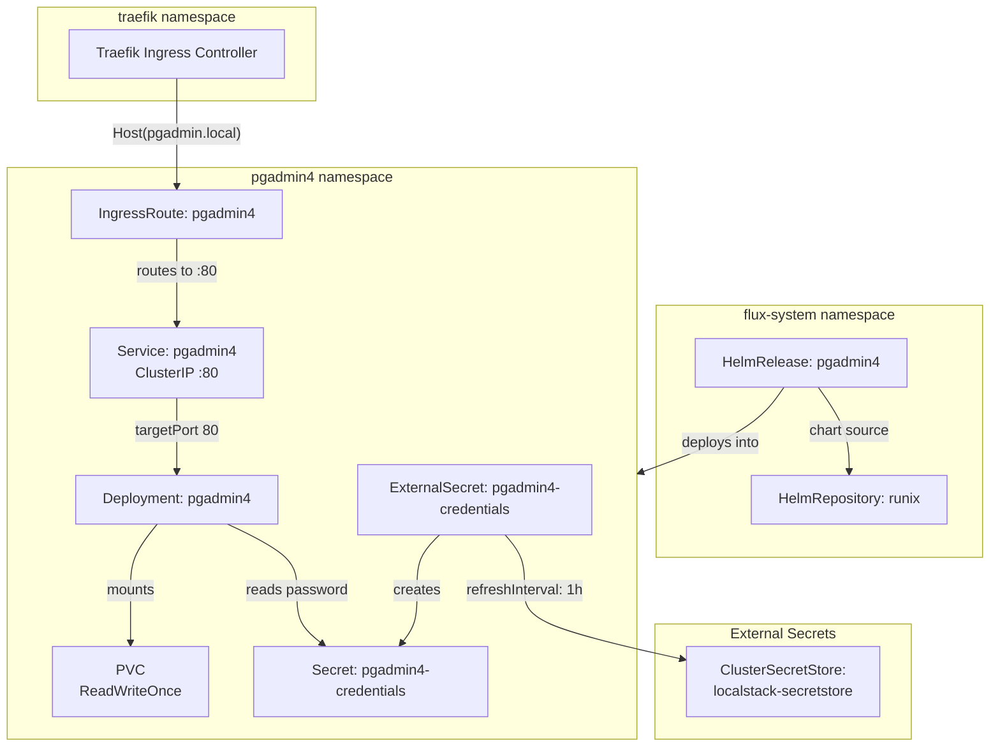

# pgAdmin4

[pgAdmin](https://www.pgadmin.org/) ([GitHub](https://github.com/pgadmin-org/pgadmin4)) is the open-source administration and development platform for PostgreSQL. Written in Python (Flask backend) with a JavaScript frontend, it provides a full-featured web interface for database management — query execution, schema visualization, server monitoring, backup/restore orchestration, and user/role administration. What distinguishes it from lighter alternatives (Adminer, phpPgAdmin): pgAdmin4 is the official PostgreSQL community tool, supporting every PostgreSQL feature including advanced types, extensions, logical replication configuration, and explain-plan visualization.

pgAdmin4 operates as a stateful web application. It maintains its own SQLite metadata database and session state on a persistent volume, storing saved server connections, query history, and user preferences. The application runs as a non-root process (UID 5050) and exposes a standard HTTP interface suitable for reverse-proxy deployment.

## Overview

| Property | Value |
|---|---|
| **Namespace** | `pgadmin4` |
| **Type** | HelmRelease (chart: `pgadmin4` v1.30.0) |
| **Layer** | Database UI services |
| **Chart** | [`pgadmin4`](https://helm.runix.net) v1.30.0 |
| **Status** | Enabled |
| **Source** | [`apps/base/pgadmin4/`](https://github.com/JiwooL0920/flux-infra/tree/develop/apps/base/pgadmin4/) |

## Dependencies

### Upstream — required before pgAdmin4 starts

| Service | Reason | Status |
|---|---|---|
| `external-secrets-config` | Flux `dependsOn` | Active |
| `postgresql-cluster` | Flux `dependsOn` | Active |

### Downstream — services that depend on pgAdmin4

_No known downstream Flux dependencies._

## Purpose

pgAdmin4 serves as the visual administration interface for the platform's CNPG-managed PostgreSQL cluster. It provides operators with direct SQL access, schema inspection, and monitoring without requiring `kubectl exec` or port-forwarding — accessible via browser at `pgadmin.local` through the Traefik ingress layer.

In this deployment, pgAdmin4 is pre-configured with admin credentials sourced from the external secrets pipeline. Operators connect to the CNPG PostgreSQL cluster post-deployment through pgAdmin's server registration UI, which persists connection details across pod restarts via the attached persistent volume.

## Features

| Feature | Detail |
|---|---|
| **External secret integration for admin credentials** | Admin password is injected from LocalStack via ClusterSecretStore, avoiding plaintext credentials in Git; email is set statically in Helm values as the chart only supports password extraction from secrets. |
| **Traefik IngressRoute with dual ingress** | Exposed via both a standard Kubernetes Ingress resource (pgadmin4.local) and a Traefik-native IngressRoute CRD (pgadmin.local) on the web entrypoint. |
| **Persistent session and configuration storage** | A ReadWriteOnce PVC stores pgAdmin's internal SQLite database, saved server connections, query history, and user preferences — surviving pod restarts without re-configuration. |
| **Non-root security context** | Container runs as UID/GID 5050 with runAsNonRoot enforced, matching the upstream pgAdmin4 container's expected filesystem ownership. |
| **Flux health gating on PostgreSQL readiness** | Flux healthChecks verify the CNPG PostgreSQL Cluster resource is healthy before marking pgAdmin4 as successfully reconciled, preventing a running UI with no available database backend. |

## Architecture

### pgAdmin4 Deployment Topology

## Configuration

All values sourced from [`base/services/environment.env`](https://github.com/JiwooL0920/flux-infra/blob/develop/base/services/environment.env)
(base); per-environment overrides in [`clusters/stages/dev/.../environment.env`](https://github.com/JiwooL0920/flux-infra/blob/develop/clusters/stages/dev/clusters/services-amer/environment.env).

| Parameter | Dev | Prod |
|---|---|---|
| `PGADMIN4_CHART_VERSION` | `1.30.0` | `1.30.0` |
| `PGADMIN4_CPU_LIMIT` | `200m` | `1000m` |
| `PGADMIN4_CPU_REQUEST` | `200m` | `200m` |
| `PGADMIN4_MEMORY_LIMIT` | `256Mi` | `1Gi` |
| `PGADMIN4_MEMORY_REQUEST` | `256Mi` | `512Mi` |
| `PGADMIN4_STORAGE_SIZE` | `1Gi` | `5Gi` |

## Operations

<!-- TODO: Add operations in service-insights/pgadmin4.yaml → operations field -->

## Related

- [`apps/base/pgadmin4/`](https://github.com/JiwooL0920/flux-infra/tree/develop/apps/base/pgadmin4/) — Kubernetes manifests
- [`base/services/pgadmin4.yaml`](https://github.com/JiwooL0920/flux-infra/blob/develop/base/services/pgadmin4.yaml) — Flux Kustomization
- [`base/services/environment.env`](https://github.com/JiwooL0920/flux-infra/blob/develop/base/services/environment.env) — environment variables

---
*Generated from [service-catalog.json](https://github.com/JiwooL0920/flux-infra/blob/develop/service-catalog.json) at commit `2d36e22` · catalog sha `4d088b0b3a67b4c4`*