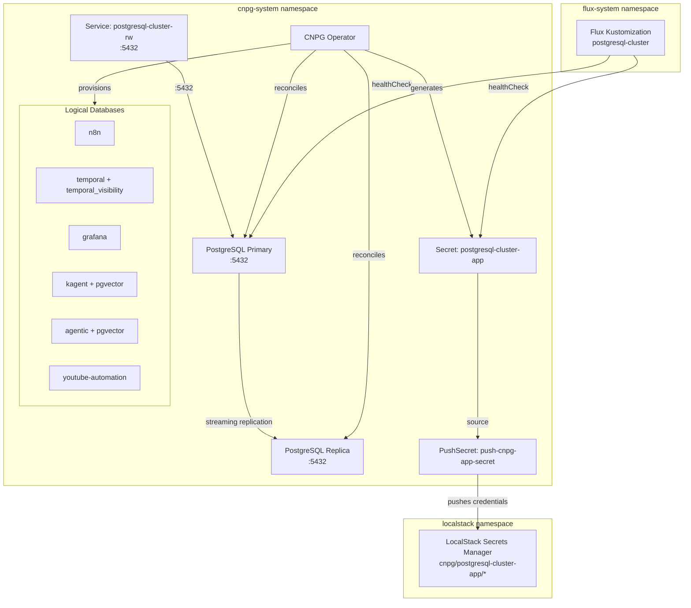
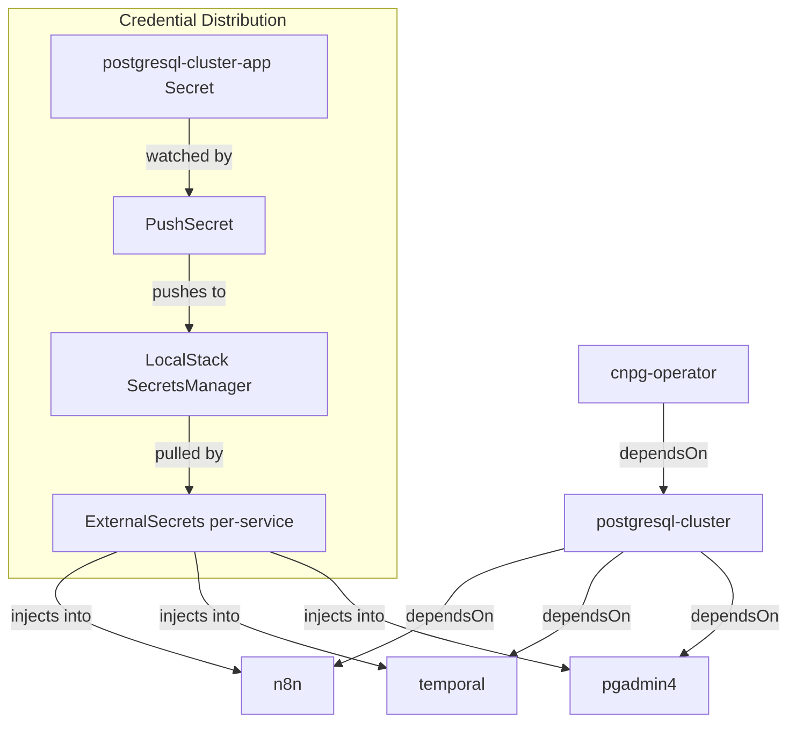

# PostgreSQL Cluster

[CloudNative-PG](https://cloudnative-pg.io) ([GitHub](https://github.com/cloudnative-pg/cloudnative-pg)) is a Kubernetes operator that manages the full lifecycle of PostgreSQL clusters — provisioning, high availability, automated failover, backup/restore, and rolling updates — using declarative Custom Resources. Unlike Helm-based PostgreSQL deployments (Bitnami, Zalando Postgres Operator), CNPG was designed Kubernetes-native from inception: it uses the operator pattern to reconcile cluster state, handles primary election via Kubernetes leader leases rather than external consensus systems, and integrates directly with the PodMonitor/ServiceMonitor APIs for observability.

PostgreSQL itself needs no introduction — it is the dominant open-source relational database. What matters here is the specific version (PostgreSQL 16) and the extension ecosystem: this cluster provisions `pgvector` on select databases, enabling vector similarity search for RAG and embedding workloads without requiring a separate vector database.

The cluster runs in `cnpg-system` namespace, managed entirely through Kubernetes CRDs. Database provisioning is declarative — each logical database is a `Database` custom resource that the operator reconciles, eliminating manual `CREATE DATABASE` commands and ensuring drift-free state.

## Overview

| Property | Value |
|---|---|
| **Namespace** | `postgresql-cluster` |
| **Type** | Kustomization |
| **Layer** | Database services |
| **Status** | Enabled |
| **Source** | [`apps/base/cloudnative-pg/`](https://github.com/JiwooL0920/flux-infra/tree/develop/apps/base/cloudnative-pg/) |

## Dependencies

### Upstream — required before PostgreSQL Cluster starts

| Service | Reason | Status |
|---|---|---|
| `cnpg-operator` | Flux `dependsOn` | Active |

### Downstream — services that depend on PostgreSQL Cluster

| Service | Dependency type | Reason |
|---|---|---|
| `n8n` | Flux `dependsOn` | Requires PostgreSQL Cluster |
| `temporal` | Flux `dependsOn` | Requires PostgreSQL Cluster |
| `pgadmin4` | Flux `dependsOn` | Requires PostgreSQL Cluster |

## Purpose

This is the platform's single shared relational data store. It hosts logical databases for six services: n8n (workflow state), Temporal (durable execution + visibility), Grafana (dashboard/user state), kagent (agent memory with vector embeddings), agentic-ai (RAG platform embeddings), and youtube-automation (pipeline state).

The cluster serves as the persistence layer that all stateful application services depend on. By consolidating into one CNPG-managed cluster, the platform gets a single backup domain, a single failover topology, and a single set of credentials to distribute — while each service gets logical isolation through separate databases with independent schemas.

**Why a single shared CNPG cluster over per-service instances:** This is a solo-developer platform where operational simplicity dominates. Six independent PostgreSQL clusters would mean six backup schedules, six failover domains, six resource reservations — all for workloads that individually consume single-digit megabytes of WAL per hour. The shared cluster trades blast-radius isolation for a dramatically simpler operational surface. If any single service later needs independent scaling or isolation, CNPG makes it trivial to spin up a dedicated cluster without disrupting the shared one.

**Why CNPG over Zalando Postgres Operator or Helm charts:** CNPG's `Database` CRD enables declarative database provisioning as Kubernetes resources — adding a database is a one-file manifest, not a Helm values change or init script. Its integration with Flux health checks (the `Cluster` resource reports ready/not-ready status that Flux can gate on) makes it naturally composable in a GitOps dependency graph.


## Features

| Feature | Detail |
|---|---|
| **Declarative database provisioning** | Each logical database is a `Database` custom resource in `apps/base/cloudnative-pg/databases/`. The CNPG operator reconciles these into actual PostgreSQL databases with specified owners and extensions — no imperative SQL or init containers required. |
| **pgvector extension management** | The `agentic-ai` and `kagent` databases declare `extensions: [{name: vector, ensure: present}]`, causing the operator to install and maintain the pgvector extension automatically. This enables vector similarity search for RAG and embedding workloads without a separate vector database. |
| **Credential distribution via PushSecret** | A PushSecret resource watches the CNPG-generated `postgresql-cluster-app` secret and pushes individual fields (username, password, host, port, dbname, uri, jdbc-uri) to LocalStack's secret store under `cnpg/postgresql-cluster-app/*`. Downstream services pull credentials via ExternalSecrets without direct namespace coupling. |
| **Simplified service topology** | Read-only (`ro`) and read (`r`) services are explicitly disabled via `managed.services.disabledDefaultServices`. Only the read-write (`rw`) service is exposed, reducing DNS entries and eliminating read/write split complexity that is unnecessary at this scale. |
| **Streaming replication with WAL archiving** | WAL level is set to `replica` with 10 replication slots and 10 WAL senders configured, enabling synchronous streaming replication between primary and replicas. This provides the foundation for automatic failover managed by the CNPG operator. |
| **Prometheus PodMonitor integration** | The cluster has `monitoring.enablePodMonitor: true`, which causes the operator to create PodMonitor resources that kube-prometheus-stack scrapes for PostgreSQL-specific metrics (connections, transactions, replication lag, buffer cache hit ratio). |
| **Flux health-gated deployment** | The Flux Kustomization declares health checks on both the `Cluster` resource and the `postgresql-cluster-app` Secret. Downstream services (n8n, temporal, pgadmin4) cannot begin reconciliation until the cluster reports healthy AND credentials are available — preventing connection failures during initial bootstrap. |

## Architecture

### Cluster Topology & Credential Flow



### Dependency Chain & Downstream Access




## Configuration

All values sourced from [`base/services/environment.env`](https://github.com/JiwooL0920/flux-infra/blob/develop/base/services/environment.env)
(base); per-environment overrides in [`clusters/stages/dev/.../environment.env`](https://github.com/JiwooL0920/flux-infra/blob/develop/clusters/stages/dev/clusters/services-amer/environment.env).

| Parameter | Dev | Prod |
|---|---|---|
| `POSTGRESQL_BACKUP_RETENTION` | `7` | `30` |
| `POSTGRESQL_CPU_LIMIT` | `1000m` | `4000m` |
| `POSTGRESQL_CPU_REQUEST` | `1000m` | `1000m` |
| `POSTGRESQL_EFFECTIVE_CACHE_SIZE` | `512MB` | `3GB` |
| `POSTGRESQL_INSTANCES` | `1` | `3` |
| `POSTGRESQL_MAX_CONNECTIONS` | `100` | `500` |
| `POSTGRESQL_MEMORY_LIMIT` | `1Gi` | `4Gi` |
| `POSTGRESQL_MEMORY_REQUEST` | `1Gi` | `2Gi` |
| `POSTGRESQL_SHARED_BUFFERS` | `128MB` | `1GB` |
| `POSTGRESQL_STORAGE_SIZE` | `10Gi` | `100Gi` |


## Operations

### Cluster stuck in initializing state

**Symptoms:** `kubectl get cluster -n cnpg-system` shows `postgresql-cluster` phase as `Setting up primary` or `Creating replica` for more than 15 minutes. Flux Kustomization times out with `health check failed after 15m0s: Cluster cnpg-system/postgresql-cluster not ready`.

```bash
kubectl get cluster postgresql-cluster -n cnpg-system -o yaml | grep -A5 'status:'
kubectl get pods -n cnpg-system -l cnpg.io/cluster=postgresql-cluster
kubectl logs -n cnpg-system -l cnpg.io/cluster=postgresql-cluster --tail=100
kubectl describe pod -n cnpg-system -l cnpg.io/cluster=postgresql-cluster,cnpg.io/instanceRole=primary
kubectl get events -n cnpg-system --sort-by='.lastTimestamp' --field-selector reason!=Pulled | tail -20
```
**See also:** docs/adr/004-single-shared-postgresql-cluster.md

---

### PushSecret failing to sync credentials

**Symptoms:** Downstream services fail to start with authentication errors. `kubectl get pushsecret -n cnpg-system` shows `push-cnpg-app-secret` with status `SyncFailed` or `SecretNotFound`. ExternalSecrets in downstream namespaces report missing keys under `cnpg/postgresql-cluster-app/`.

```bash
kubectl get pushsecret push-cnpg-app-secret -n cnpg-system -o yaml
kubectl get secret postgresql-cluster-app -n cnpg-system -o jsonpath='{.data}' | jq 'keys'
kubectl get clustersecretstore localstack-secretstore -o yaml | grep -A10 'status:'
kubectl logs -n cnpg-system -l app.kubernetes.io/name=external-secrets --tail=50
kubectl get events -n cnpg-system --field-selector involvedObject.name=push-cnpg-app-secret
```
**See also:** docs/adr/005-localstack-external-secrets.md

---

### Database CR not creating logical database

**Symptoms:** Application reports `FATAL: database "X" does not exist` on connection. `kubectl get databases -n cnpg-system` shows the Database resource but its status conditions indicate failure or pending state.

```bash
kubectl get databases -n cnpg-system
kubectl describe database <db-name> -n cnpg-system
kubectl exec -it postgresql-cluster-1 -n cnpg-system -- psql -U postgres -c '\l'
kubectl logs -n cnpg-system -l cnpg.io/cluster=postgresql-cluster,cnpg.io/instanceRole=primary | grep -i "database"
kubectl get cluster postgresql-cluster -n cnpg-system -o jsonpath='{.status.phase}'
```

---

### Connection pool exhaustion

**Symptoms:** Applications log `FATAL: too many connections for role "app"` or `remaining connection slots are reserved for non-replication superuser connections`. Pod restarts increase across n8n, Temporal, and other consumers.

```bash
kubectl exec -it postgresql-cluster-1 -n cnpg-system -- psql -U postgres -c "SELECT datname, count(*) FROM pg_stat_activity GROUP BY datname ORDER BY count DESC;"
kubectl exec -it postgresql-cluster-1 -n cnpg-system -- psql -U postgres -c "SELECT state, count(*) FROM pg_stat_activity WHERE usename='app' GROUP BY state;"
kubectl exec -it postgresql-cluster-1 -n cnpg-system -- psql -U postgres -c "SHOW max_connections;"
kubectl exec -it postgresql-cluster-1 -n cnpg-system -- psql -U postgres -c "SELECT pid, datname, state, query_start, query FROM pg_stat_activity WHERE state='idle in transaction' ORDER BY query_start LIMIT 10;"
```

---

### Primary pod OOMKilled

**Symptoms:** `kubectl get pods -n cnpg-system` shows primary pod in `OOMKilled` or `CrashLoopBackOff` state. CNPG operator triggers failover, promoting a replica. Cluster may oscillate if the workload exceeds memory limits on all instances.

```bash
kubectl get pods -n cnpg-system -l cnpg.io/cluster=postgresql-cluster -o wide
kubectl describe pod postgresql-cluster-1 -n cnpg-system | grep -A5 'Last State'
kubectl top pods -n cnpg-system -l cnpg.io/cluster=postgresql-cluster
kubectl exec -it postgresql-cluster-1 -n cnpg-system -- psql -U postgres -c "SELECT pg_size_pretty(sum(pg_database_size(datname))) as total_size FROM pg_database;"
kubectl get events -n cnpg-system --field-selector reason=OOMKilling --sort-by='.lastTimestamp'
kubectl get cluster postgresql-cluster -n cnpg-system -o jsonpath='{.status.currentPrimary}'
```
**See also:** docs/adr/004-single-shared-postgresql-cluster.md

---

### Replication lag or replica not catching up

**Symptoms:** PodMonitor metrics show increasing `cnpg_pg_replication_lag` or `pg_stat_replication` shows replicas falling behind. Read queries (if re-enabled) return stale data. CNPG cluster status shows unhealthy replicas.

```bash
kubectl get cluster postgresql-cluster -n cnpg-system -o jsonpath='{.status.instances}' | jq .
kubectl exec -it postgresql-cluster-1 -n cnpg-system -- psql -U postgres -c "SELECT application_name, state, sent_lsn, write_lsn, flush_lsn, replay_lsn, write_lag, flush_lag, replay_lag FROM pg_stat_replication;"
kubectl exec -it postgresql-cluster-1 -n cnpg-system -- psql -U postgres -c "SELECT slot_name, active, restart_lsn, confirmed_flush_lsn FROM pg_replication_slots;"
kubectl logs -n cnpg-system postgresql-cluster-2 --tail=50 | grep -i "wal\|replication\|recovery"
kubectl top pods -n cnpg-system -l cnpg.io/cluster=postgresql-cluster
```

---


## Related


- [`apps/base/cloudnative-pg/`](https://github.com/JiwooL0920/flux-infra/tree/develop/apps/base/cloudnative-pg/) — Kubernetes manifests
- [`base/services/postgresql-cluster.yaml`](https://github.com/JiwooL0920/flux-infra/blob/develop/base/services/postgresql-cluster.yaml) — Flux Kustomization
- [`base/services/environment.env`](https://github.com/JiwooL0920/flux-infra/blob/develop/base/services/environment.env) — environment variables

---
*Generated from [service-catalog.json](https://github.com/JiwooL0920/flux-infra/blob/develop/service-catalog.json) at commit `20dba34` · catalog sha `9be0573fcf582c2a`*