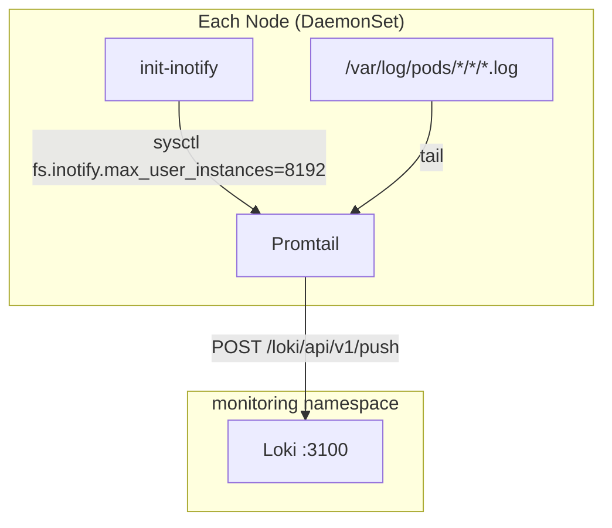

I detect **implementation** intent - explicit "Write the documentation" request with all context provided. Straightforward writing task with clear exemplar and manifest source of truth. Executing directly.

# Promtail

Log shipping agent that collects container logs from every node and pushes them to Loki.

## Overview

| Property | Value |
|----------|-------|
| **Namespace** | `monitoring` |
| **Type** | HelmRelease (DaemonSet) |
| **Layer** | Logging (Layer 2) |
| **Dependencies** | Loki |
| **Access** | Port 3101 (HTTP metrics) |

## Purpose

Promtail runs as a DaemonSet on every node in the cluster, tailing container log files and shipping them to Loki. It extracts Kubernetes metadata (namespace, pod, container) from file paths using pipeline stages, enabling structured log queries in Grafana without relying on the Kubernetes API for label discovery.

## Features

- **DaemonSet deployment** — Runs on all nodes including control-plane via tolerations
- **CRI log parsing** — Handles container runtime interface log format
- **Path-based label extraction** — Regex pipeline derives namespace/pod/container from `/var/log/pods/` paths
- **Inotify tuning** — Init container raises `fs.inotify.max_user_instances` to 8192 for high pod counts
- **Prometheus metrics** — Self-scrape annotations on port 3101
- **Position tracking** — Resumes from last read offset after restarts

## Architecture



## Connection

### Promtail HTTP API

```bash
# Port forward to Promtail HTTP server
kubectl port-forward -n monitoring ds/promtail 3101:3101

# Check targets
curl http://localhost:3101/targets

# Check readiness
curl http://localhost:3101/ready
```

### Application Configuration

Applications do not connect to Promtail directly. Promtail discovers logs by watching the filesystem. To ensure your pod's logs are collected:

1. Write logs to stdout/stderr (collected automatically)
2. Logs appear in Loki with labels: `namespace`, `pod`, `container`

```yaml
# Query logs in Grafana/LogCLI
{namespace="my-app", container="api"} |= "error"
```

## Pipeline

Promtail processes logs through these stages:

| Stage | Purpose |
|-------|---------|
| `cri` | Parse CRI log format (timestamp, stream, flags, message) |
| `regex` | Extract `namespace`, `pod`, `container` from file path |
| `labels` | Promote extracted fields to Loki labels |
| `labeldrop` | Remove `filename` label to reduce cardinality |

Log path pattern: `/var/log/pods/<namespace>_<pod>_<uid>/<container>/<n>.log`

## Environment Configuration

| Setting | Dev | Prod |
|---------|-----|------|
| Replicas | 1 per node (DaemonSet) | 1 per node (DaemonSet) |
| CPU request | `${PROMTAIL_CPU_REQUEST}` | `${PROMTAIL_CPU_REQUEST}` |
| CPU limit | `${PROMTAIL_CPU_LIMIT}` | `${PROMTAIL_CPU_LIMIT}` |
| Memory request | `${PROMTAIL_MEMORY_REQUEST}` | `${PROMTAIL_MEMORY_REQUEST}` |
| Memory limit | `${PROMTAIL_MEMORY_LIMIT}` | `${PROMTAIL_MEMORY_LIMIT}` |

Resource values are injected from `cluster-vars` ConfigMap via Flux `postBuild.substituteFrom`.

## Verification

```bash
# Check DaemonSet is running on all nodes
kubectl get ds promtail -n monitoring

# Check all Promtail pods are Ready
kubectl get pods -n monitoring -l app.kubernetes.io/name=promtail -o wide

# Verify logs are reaching Loki
kubectl logs -n monitoring -l app.kubernetes.io/name=promtail --tail=20

# Confirm positions file is being written
kubectl exec -n monitoring ds/promtail -- cat /run/promtail/positions.yaml
```

## Troubleshooting

### Logs not appearing in Loki

```bash
# Verify Promtail can reach Loki
kubectl exec -n monitoring ds/promtail -- wget -qO- http://monitoring-loki:3100/ready

# Check for push errors in Promtail logs
kubectl logs -n monitoring -l app.kubernetes.io/name=promtail | grep -i "error\|429\|500"

# Confirm target pods exist and paths are correct
kubectl exec -n monitoring ds/promtail -- ls /var/log/pods/
```

### Too many open files

The init container should set `fs.inotify.max_user_instances=8192`. If the error persists:

```bash
# Verify init container ran successfully
kubectl describe ds promtail -n monitoring | grep -A5 init-inotify

# Check current inotify limit on the node
kubectl exec -n monitoring ds/promtail -- cat /proc/sys/fs/inotify/max_user_instances
```

### High memory usage

1. Check log volume — high-throughput pods produce backpressure
2. Verify positions file isn't stale (restart may re-read old logs)
3. Increase memory limit in `cluster-vars` ConfigMap if sustained

```bash
# Check memory usage
kubectl top pods -n monitoring -l app.kubernetes.io/name=promtail

# Check backlog by comparing positions vs current log size
kubectl exec -n monitoring ds/promtail -- cat /run/promtail/positions.yaml
```

## Related

- [Loki](loki.md) — Log storage backend
- [Kube-Prometheus-Stack](kube-prometheus-stack.md) — Grafana for querying logs
