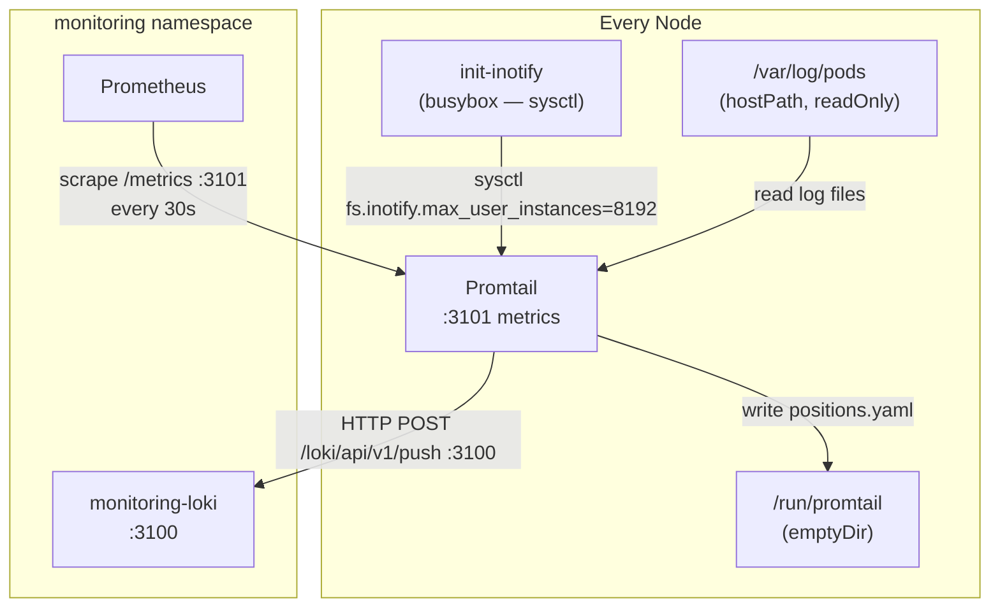
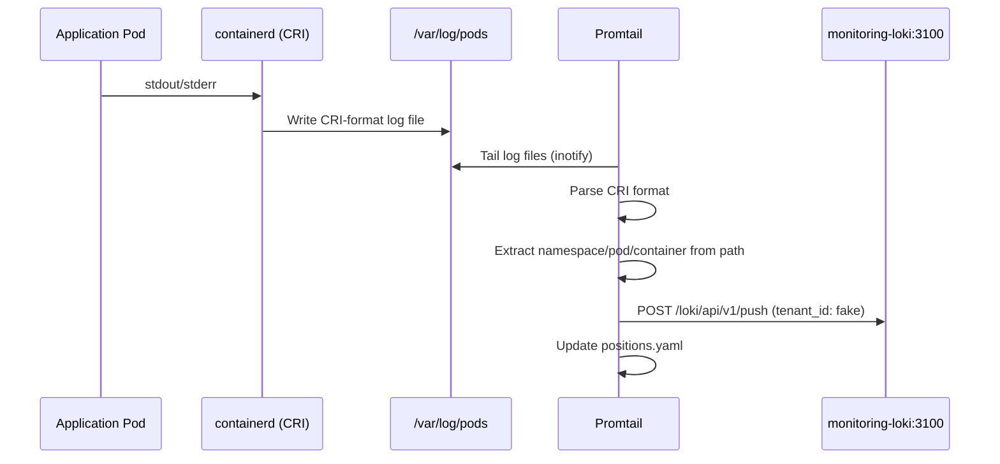

# Promtail

[Promtail](https://grafana.com/docs/loki/latest/send-data/promtail/) ([GitHub](https://github.com/grafana/loki/tree/main/clients/pkg/promtail)) is the log collection agent purpose-built for Grafana Loki. Unlike general-purpose log shippers (Fluentd, Filebeat, Vector) that serialize logs into structured formats and speak multiple output protocols, Promtail is laser-focused on one job: tailing log files on a node, attaching Kubernetes metadata labels, and pushing them to Loki's HTTP ingest API in its native format. This tight coupling to Loki's label-indexed storage model means Promtail produces exactly the label set Loki expects — no intermediate transformation layer, no schema negotiation.

What distinguishes Promtail from other agents in a Loki-centric stack: it understands the CRI log format natively, can parse the kubelet's pod log directory structure to extract namespace/pod/container without relying on the Kubernetes API, and maintains a positions file to survive restarts without re-reading entire log files. It operates as a pull-based file tailer rather than requiring applications to push logs — meaning it captures output from any container regardless of whether that container is instrumented.

In stacks that also run OpenTelemetry Collector (as this one does), Promtail and OTel Collector are complementary rather than redundant: OTel Collector receives application-emitted OTLP log signals, while Promtail handles the node-level filesystem scrape of stdout/stderr that the kubelet writes to disk.

## Overview

| Property | Value |
|---|---|
| **Namespace** | `monitoring` |
| **Type** | HelmRelease (chart: `promtail` v6.17.0) |
| **Layer** | Logging stack services |
| **Status** | Enabled |
| **Source** | [`apps/base/promtail/`](https://github.com/JiwooL0920/flux-infra/tree/develop/apps/base/promtail/) |

## Dependencies

### Upstream — required before Promtail starts

| Service | Reason | Status |
|---|---|---|
| `loki` | Flux `dependsOn` | Active |

### Downstream — services that depend on Promtail

_No known downstream Flux dependencies._

## Purpose

Promtail is the node-level log scraper that ensures every container's stdout/stderr reaches Loki without requiring application-side instrumentation. It runs as a DaemonSet on all nodes — including control-plane — tailing the kubelet's pod log directory and enriching each line with namespace, pod, and container labels extracted directly from the filesystem path. This provides baseline log visibility for every workload in the cluster, independent of whether that workload emits structured OTLP telemetry.

**Why Promtail over Fluent Bit or Vector:** Promtail's native understanding of Loki's label model eliminates the impedance mismatch that general-purpose shippers introduce. Fluent Bit or Vector would require explicit output plugin configuration, label mapping rules, and tenant header injection — all of which Promtail handles implicitly. The trade-off is single-backend lock-in (Promtail only speaks Loki), but since this platform already commits to the Grafana observability stack and uses OTel Collector for multi-backend routing of application telemetry, Promtail's simplicity for the node-scrape use case outweighs flexibility concerns.

**Why not rely solely on OTel Collector for logs:** OTel Collector's filelog receiver could replace Promtail in theory, but it requires explicit file path configuration, manual label extraction rules, and doesn't understand Loki's push API natively (it exports via `otlphttp/loki`). Promtail's single-purpose design means fewer configuration failure modes for the critical path of "every pod's logs reach Loki."


## Features

| Feature | Detail |
|---|---|
| **DaemonSet on all nodes including control-plane** | Tolerates `node-role.kubernetes.io/control-plane:NoSchedule`, ensuring control-plane component logs (etcd, kube-apiserver, scheduler) are collected alongside workload logs. |
| **CRI log parsing with filesystem-based label extraction** | Uses the `cri` pipeline stage to parse containerd's log format, then applies a regex against the resolved filename path (`/var/log/pods/<namespace>_<pod>_<uid>/<container>/<n>.log`) to extract `namespace`, `pod`, and `container` labels without querying the Kubernetes API. |
| **Inotify limit tuning via privileged init container** | An init container runs `sysctl -w fs.inotify.max_user_instances=8192` before Promtail starts, preventing "too many open files" errors on nodes with high pod density where each log file requires an inotify watch. |
| **Position tracking for crash-resilient log tailing** | Maintains a positions file at `/run/promtail/positions.yaml` (on an emptyDir volume) to track read offsets per log file, allowing Promtail to resume from where it left off after pod restarts without re-shipping already-ingested lines. |
| **Hardened container security context** | Runs with `readOnlyRootFilesystem: true`, `allowPrivilegeEscalation: false`, and drops all Linux capabilities. Log directories are mounted read-only; only the positions emptyDir is writable. |
| **ServiceMonitor for self-monitoring** | Exposes metrics on port 3101 with a ServiceMonitor (30s interval, `prometheus: kube-prometheus` label selector), enabling Prometheus to scrape Promtail's own operational metrics (bytes read, lines processed, push failures). |
| **Single-tenant Loki push** | Configured with `tenant_id: fake` for single-tenant mode, pushing to `http://monitoring-loki:3100/loki/api/v1/push`. This matches Loki's `auth_enabled: false` configuration where all logs share a single tenant namespace. |

## Architecture

### Promtail DaemonSet Topology



### Log Collection Flow




## Configuration

All values sourced from [`base/services/environment.env`](https://github.com/JiwooL0920/flux-infra/blob/develop/base/services/environment.env)
(base); per-environment overrides in [`clusters/stages/dev/.../environment.env`](https://github.com/JiwooL0920/flux-infra/blob/develop/clusters/stages/dev/clusters/services-amer/environment.env).

| Parameter | Dev | Prod |
|---|---|---|
| `PROMTAIL_CHART_VERSION` | `6.17.0` | `6.17.0` |
| `PROMTAIL_CPU_LIMIT` | `100m` | `500m` |
| `PROMTAIL_CPU_REQUEST` | `100m` | `100m` |
| `PROMTAIL_MEMORY_LIMIT` | `128Mi` | `512Mi` |
| `PROMTAIL_MEMORY_REQUEST` | `128Mi` | `256Mi` |


## Operations

### Promtail cannot reach Loki

**Symptoms:** Promtail logs show repeated `msg="error sending batch" status=503` or connection refused errors. Grafana shows log gaps for all namespaces. Promtail metrics show `promtail_sent_entries_total` stalled while `promtail_targets_active_total` remains normal.

```bash
kubectl -n monitoring get pods -l app.kubernetes.io/name=promtail -o wide
kubectl -n monitoring logs ds/promtail --tail=50 | grep -i 'error\|retry\|connection'
kubectl -n monitoring run curl-test --rm -it --image=curlimages/curl -- curl -s -o /dev/null -w '%{http_code}' http://monitoring-loki:3100/ready
kubectl -n flux-system get kustomization loki -o jsonpath='{.status.conditions[*].message}'
kubectl -n monitoring get pods -l app.kubernetes.io/name=loki -o jsonpath='{.items[*].status.phase}'
```
---

### Inotify limit exhaustion despite init container

**Symptoms:** Promtail logs show `too many open files` or `inotify_add_watch: no space left on device`. New pod logs are not being collected while existing tails continue working. The init container completed successfully but the node has other inotify consumers.

```bash
kubectl -n monitoring get pods -l app.kubernetes.io/name=promtail -o wide
kubectl -n monitoring logs ds/promtail -c init-inotify
kubectl -n monitoring debug $(kubectl -n monitoring get pod -l app.kubernetes.io/name=promtail --field-selector spec.nodeName=$(kubectl get nodes -o jsonpath='{.items[0].metadata.name}') -o name | head -1) --image=busybox -- cat /proc/sys/fs/inotify/max_user_instances
kubectl -n monitoring exec ds/promtail -- cat /run/promtail/positions.yaml | wc -l
```
---

### Positions file reset causing log re-ingestion

**Symptoms:** Loki shows duplicate log entries after a node drain or pod eviction. `promtail_read_bytes_total` spikes without a corresponding increase in application log output. Positions file shows all entries starting from byte offset 0.

```bash
kubectl -n monitoring exec ds/promtail -- cat /run/promtail/positions.yaml
kubectl -n monitoring get pods -l app.kubernetes.io/name=promtail -o jsonpath='{.items[*].status.containerStatuses[*].restartCount}'
kubectl -n monitoring get events --field-selector involvedObject.kind=DaemonSet,involvedObject.name=promtail --sort-by=.lastTimestamp
kubectl -n monitoring describe pod -l app.kubernetes.io/name=promtail | grep -A5 'Last State'
```
---

### Labels not extracted — logs appear without namespace/pod metadata

**Symptoms:** Loki queries filtering by `{namespace="..."}` return no results, but `{job="pod-logs"}` shows entries. Promtail metrics show `promtail_custom_regex_errors_total` incrementing. Log lines in Loki only have `job` and `__path__` labels.

```bash
kubectl -n monitoring exec ds/promtail -- cat /run/promtail/positions.yaml | head -20
kubectl -n monitoring logs ds/promtail --tail=100 | grep -i 'regex\|pipeline\|label'
kubectl -n monitoring exec ds/promtail -- ls /var/log/pods/ | head -10
kubectl -n monitoring exec ds/promtail -- promtail --dry-run --config.file=/etc/promtail/promtail.yaml 2>&1 | head -30
```
---

### DaemonSet not scheduled on new node

**Symptoms:** A newly joined node has no Promtail pod. `kubectl get ds promtail -n monitoring` shows DESIRED count lower than total node count, or a pod stuck in Pending.

```bash
kubectl -n monitoring get ds promtail -o wide
kubectl get nodes -o custom-columns=NAME:.metadata.name,TAINTS:.spec.taints
kubectl -n monitoring describe ds promtail | grep -A10 'Tolerations'
kubectl -n monitoring get pods -l app.kubernetes.io/name=promtail -o wide --sort-by=.spec.nodeName
kubectl -n monitoring describe pod $(kubectl -n monitoring get pods -l app.kubernetes.io/name=promtail --field-selector status.phase!=Running -o name 2>/dev/null | head -1) 2>/dev/null | grep -A5 Events
```
---

### High memory usage causing OOMKill

**Symptoms:** Promtail pods restarting with `OOMKilled` exit reason. `kubectl top pod` shows memory approaching the configured limit. Node has high pod count or pods producing extremely verbose logs.

```bash
kubectl -n monitoring top pods -l app.kubernetes.io/name=promtail --sort-by=memory
kubectl -n monitoring get pods -l app.kubernetes.io/name=promtail -o jsonpath='{range .items[*]}{.metadata.name} restarts={.status.containerStatuses[0].restartCount} reason={.status.containerStatuses[0].lastState.terminated.reason}{"\n"}{end}'
kubectl -n monitoring exec ds/promtail -- cat /run/promtail/positions.yaml | wc -l
kubectl -n monitoring port-forward ds/promtail 3101:3101 &
curl -s localhost:3101/metrics | grep promtail_targets_active_total
curl -s localhost:3101/metrics | grep process_resident_memory_bytes
```
**See also:** docs/adr/010-opentelemetry-collector.md
---


## Related


- [`apps/base/promtail/`](https://github.com/JiwooL0920/flux-infra/tree/develop/apps/base/promtail/) — Kubernetes manifests
- [`base/services/promtail.yaml`](https://github.com/JiwooL0920/flux-infra/blob/develop/base/services/promtail.yaml) — Flux Kustomization
- [`base/services/environment.env`](https://github.com/JiwooL0920/flux-infra/blob/develop/base/services/environment.env) — environment variables

---
*Generated from [service-catalog.json](https://github.com/JiwooL0920/flux-infra/blob/develop/service-catalog.json) at commit `2d36e22` · catalog sha `4d088b0b3a67b4c4`*