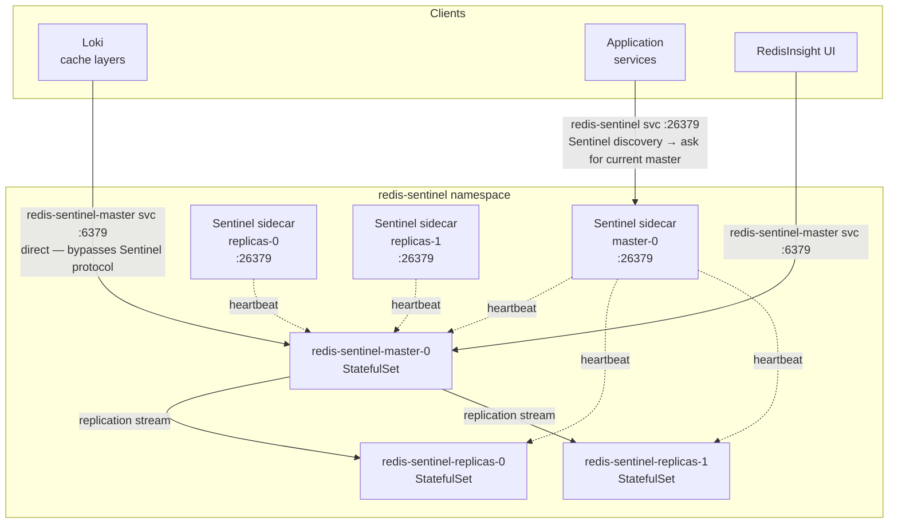
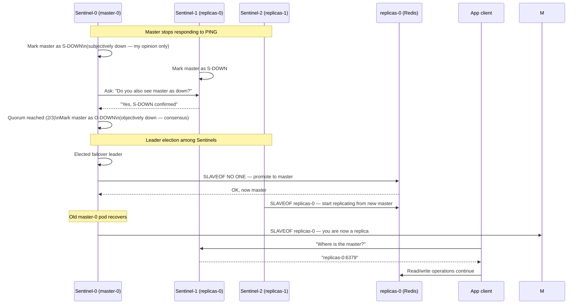

# Redis Sentinel

[Redis](https://redis.io) ([GitHub](https://github.com/redis/redis)) is an open-source, in-memory data structure store. Unlike traditional databases that persist to disk first, Redis operates entirely in memory with optional persistence, delivering sub-millisecond latency at any scale. What distinguishes it from other caching solutions (Memcached, Varnish, Hazelcast): it supports rich data structures (strings, hashes, lists, sets, sorted sets, streams), native pub/sub, Lua scripting, and atomic operations — making it useful well beyond simple key-value caching.

**Redis Sentinel** is Redis's built-in high availability layer. It runs as a separate process alongside Redis nodes, continuously monitors master/replica health, and performs automatic leader election and failover without any external orchestrator. This is deployed in master-replica mode with Sentinel-managed automatic failover.

## Overview

| Property | Value |
|---|---|
| **Namespace** | `redis-sentinel` |
| **Type** | HelmRelease (chart: `redis` v20.7.0) |
| **Layer** | Database services |
| **Chart** | [`redis`](oci://registry-1.docker.io/bitnamicharts) v20.7.0 |
| **Status** | Enabled |
| **Source** | [`apps/base/redis-sentinel/`](https://github.com/JiwooL0920/flux-infra/tree/develop/apps/base/redis-sentinel/) |

## Dependencies

### Upstream — required before Redis Sentinel starts

| Service | Reason | Status |
|---|---|---|
| `external-secrets-config` | Flux `dependsOn` | **Effectively inactive** — `auth.enabled: false` in the HelmRelease and [`externalsecret.yaml`](https://github.com/JiwooL0920/flux-infra/blob/develop/apps/base/redis-sentinel/externalsecret.yaml) is excluded from [`apps/base/redis-sentinel/kustomization.yaml`](https://github.com/JiwooL0920/flux-infra/blob/develop/apps/base/redis-sentinel/kustomization.yaml), so no password is synced or used. The `redis-password` health check in the Flux Kustomization is a stale leftover and should be removed if auth remains disabled. |

### Downstream — services that depend on Redis Sentinel

| Service | Dependency type | Reason |
|---|---|---|
| `argocd` | Flux `dependsOn` | Requires Redis Sentinel |
| `redisinsight` | Flux dependsOn | UI has no value without a running Redis instance |

> kagent and Loki are not Flux-wired to redis-sentinel because they degrade gracefully without it (kagent falls back to direct A2A dispatch; Loki skips cache). Hard `dependsOn` would block their entire deployment on a Redis outage.


## Purpose

Redis Sentinel is the platform's shared in-memory data layer. It runs in replication mode with co-located Sentinel sidecars that continuously monitor master health and trigger automatic promotion of a replica when the master fails — keeping write-path downtime in the 15–30 second range rather than requiring human intervention.

**Why in-cluster Sentinel over a managed service (e.g. AWS ElastiCache):** Managed Redis is operationally simpler, but it hides the Sentinel protocol behind a proprietary failover mechanism. Running Sentinel in-cluster gives full control over quorum configuration, per-database selection, eviction policy, persistence tuning, and — critically — lets clients use the Sentinel discovery protocol directly, which is required for correct failover behavior in most Redis client libraries. The trade-off is self-managed operations and disaster recovery.

### Consumers

Each service uses a dedicated database index to avoid key collisions. New consumers should claim the next unused index.

| Service | DB | Usage pattern | Connection method | Notes |
|---|---|---|---|---|
| **kagent alertmanager-hook** | 4 | Writes `incident:events` stream when Alertmanager fires a critical alert | Sentinel :26379 | Producer side of incident queue |
| **kagent stream-dispatcher** | 4 | Consumes `incident:events` stream, consumer group `dispatch-group`; KEDA scales replicas on pending entry count | Sentinel :26379 | KEDA uses `redis-sentinel-streams` scaler, not `redis-streams` |
| **Loki** | — | Multi-layer cache (query results, chunks, index, write deduplication) | Direct master :6379 | Cache currently disabled in this cluster config. When enabled, must bypass Sentinel due to missing `SentinelPassword` in Loki's go-redis wrapper — see [ADR-002](https://github.com/JiwooL0920/flux-infra/blob/develop/docs/adr/002-loki-redis-direct-connection.md) |

## Features

| Feature | Detail |
|---|---|
| **Replication topology** | 1 master + N read replicas; reads can be distributed across replicas to reduce master load |
| **Sentinel quorum** | Co-located Sentinel sidecars ping every node on a short interval; failover only fires when a quorum independently declares the master down (two-phase: subjectively down → objectively down), preventing split-brain false positives |
| **Automatic master reconfiguration** | After failover, the old master rejoins as a replica of the newly elected master; no manual intervention needed |
| **Two-layer HA strategy** | Sentinel covers instance-level failures (pod crash, OOMKill); RDB snapshots cover catastrophic failures (all pods lost, node failure) |
| **RDB snapshots** | Periodic persistence (`save 10800 1`, every 3 h if ≥1 key changed) with gzip compression and checksum validation; binary format is significantly more compact than AOF |
| **AOF disabled** | Redis is a cache, not a source of truth; data regenerates from the underlying databases on miss. AOF's per-write disk I/O (10 000× slower than memory) is an unnecessary cost for this workload |
| **LRU eviction** | `allkeys-lru` policy with configurable `maxmemory` ceiling; cache self-manages under memory pressure without requiring TTL on every key |
| **Authentication** | Disabled (`auth.enabled: false`). To re-enable, add [`externalsecret.yaml`](https://github.com/JiwooL0920/flux-infra/blob/develop/apps/base/redis-sentinel/externalsecret.yaml) back to [`apps/base/redis-sentinel/kustomization.yaml`](https://github.com/JiwooL0920/flux-infra/blob/develop/apps/base/redis-sentinel/kustomization.yaml) and set `auth.enabled: true` |
| **Prometheus metrics** | Optional `redis_exporter` sidecar + ServiceMonitor; toggled via `REDIS_METRICS_ENABLED` |
| **Soft pod anti-affinity** | Replicas prefer different nodes without hard-failing on single-node dev clusters |

## Architecture

### Steady-state topology



### Failover sequence




## Configuration

All values sourced from [`base/services/environment.env`](https://github.com/JiwooL0920/flux-infra/blob/develop/base/services/environment.env)
(base); per-environment overrides in [`clusters/stages/dev/.../environment.env`](https://github.com/JiwooL0920/flux-infra/blob/develop/clusters/stages/dev/clusters/services-amer/environment.env).

| Parameter | Dev | Prod |
|---|---|---|
| `REDIS_CHART_VERSION` | `20.7.0` | `20.7.0` |
| `REDIS_MASTER_CPU_LIMIT` | `250m` | `1000m` |
| `REDIS_MASTER_CPU_REQUEST` | `250m` | `200m` |
| `REDIS_MASTER_MEMORY_LIMIT` | `2Gi` | `1Gi` |
| `REDIS_MASTER_MEMORY_REQUEST` | `2Gi` | `512Mi` |
| `REDIS_MAXMEMORY` | `1800mb` | `900mb` |
| `REDIS_METRICS_ENABLED` | `false` | `true` |
| `REDIS_REPLICA_COUNT` | `1` | `2` |
| `REDIS_REPLICA_CPU_LIMIT` | `250m` | `1000m` |
| `REDIS_REPLICA_CPU_REQUEST` | `250m` | `200m` |
| `REDIS_REPLICA_MEMORY_LIMIT` | `2Gi` | `1Gi` |
| `REDIS_REPLICA_MEMORY_REQUEST` | `2Gi` | `512Mi` |
| `REDIS_SENTINEL_CPU_LIM` | `200m` | `500m` |
| `REDIS_SENTINEL_CPU_REQ` | `50m` | `100m` |
| `REDIS_SENTINEL_DOWN_AFTER_MILLISECONDS` | `30000` | `30000` |
| `REDIS_SENTINEL_FAILOVER_TIMEOUT` | `180000` | `180000` |
| `REDIS_SENTINEL_MEM_LIM` | `128Mi` | `256Mi` |
| `REDIS_SENTINEL_MEM_REQ` | `64Mi` | `128Mi` |
| `REDIS_SENTINEL_PARALLEL_SYNCS` | `1` | `1` |
| `REDIS_STORAGE_SIZE` | `8Gi` | `16Gi` |

## Access

### In-cluster connection strings

```
# Via Sentinel (recommended for app clients — handles failover automatically)
redis-sentinel.redis-sentinel.svc.cluster.local:26379
masterSet: mymaster

# Via master service (direct — used by Loki; bypasses Sentinel protocol)
redis-sentinel-master.redis-sentinel.svc.cluster.local:6379
```

> Use the `:26379` Sentinel port for any client that speaks the Redis Sentinel protocol.
> Use `:6379` direct only when the client cannot authenticate to the Sentinel port
> (e.g. Loki — see [ADR-002](https://github.com/JiwooL0920/flux-infra/blob/develop/docs/adr/002-loki-redis-direct-connection.md)).

### RedisInsight UI

Browse and query Redis from a browser at `http://redis.local` (requires `make setup-dns`).
Connect RedisInsight to `redis-sentinel-master.redis-sentinel.svc.cluster.local:6379`.

### Port-forward (alternative)

```bash
kubectl port-forward -n redis-sentinel svc/redis-sentinel-master 6379:6379
# Then connect any Redis client to localhost:6379
```

## Operations

### Verification

```bash
# Flux Kustomization health
flux get kustomization redis-sentinel

# StatefulSet readiness
kubectl get statefulset -n redis-sentinel
# Expected:
#   redis-sentinel-master    1/1
#   redis-sentinel-replicas  2/2

# Pod status
kubectl get pods -n redis-sentinel

# Confirm Sentinel knows the master
kubectl exec -n redis-sentinel redis-sentinel-master-0 -c redis-sentinel \
  -- redis-cli -p 26379 sentinel masters
# Expected: name=mymaster, status=ok, num-slaves=2

# Ping the master
kubectl exec -n redis-sentinel redis-sentinel-master-0 -c redis \
  -- redis-cli ping
# Expected: PONG

# ExternalSecret synced
kubectl get externalsecret -n redis-sentinel redis-password
# Expected: READY   True
```

### Redis CLI

**Open an interactive shell on the master**

```bash
kubectl exec -it -n redis-sentinel redis-sentinel-master-0 -c redis -- redis-cli
```

**Common commands**

```bash
# List all keys (use SCAN in prod — KEYS blocks on large datasets)
SCAN 0 MATCH * COUNT 100

# Inspect a key
TYPE <key>
TTL <key>
GET <key>          # string
HGETALL <key>      # hash
XLEN <key>         # stream length

# Check server info
INFO server
INFO replication   # shows role, connected_slaves, master_replid
INFO memory        # used_memory_human, maxmemory

# Monitor live commands (exit with Ctrl+C)
MONITOR

# Count all keys across all DBs
INFO keyspace

# Select a specific database
SELECT 4           # kagent stream DB

# Delete a single key
DEL <key>

# Check stream contents (incident queue)
XRANGE incident:events - + COUNT 10
XINFO GROUPS incident:events
XINFO CONSUMERS incident:events dispatch-group
```

### Common Operations

**Force Flux reconciliation**

```bash
flux reconcile kustomization redis-sentinel --with-source
```

**Restart all Redis pods (rolling)**

```bash
kubectl rollout restart statefulset -n redis-sentinel
```

**Trigger manual Sentinel failover**

Test HA without killing master:

```bash
kubectl exec -n redis-sentinel redis-sentinel-master-0 -c redis-sentinel \
  -- redis-cli -p 26379 sentinel failover mymaster
```

**Check memory usage**

```bash
kubectl exec -n redis-sentinel redis-sentinel-master-0 -c redis \
  -- redis-cli info memory | grep used_memory_human
```

**Check replication lag on a replica**

```bash
kubectl exec -n redis-sentinel redis-sentinel-replicas-0 -c redis \
  -- redis-cli info replication | grep -E "master_sync|master_last_io"
```

**Flush all keys (⚠ non-reversible — dev only)**

```bash
kubectl exec -n redis-sentinel redis-sentinel-master-0 -c redis \
  -- redis-cli flushall
```

**Re-sync ExternalSecret (if password secret drifts)**

```bash
kubectl annotate externalsecret redis-password -n redis-sentinel \
  force-sync=$(date +%s) --overwrite
```


### Troubleshooting

#### Sentinel reports no master / `+sdown master`

**Cause:** Master pod restarted and Sentinel has not yet completed leader election, or quorum is not met because fewer than 2 Sentinel sidecars are running.

**Resolution:**

1. Check master pod: `kubectl get pods -n redis-sentinel -l app.kubernetes.io/component=master`
2. Check events: `kubectl describe pod -n redis-sentinel redis-sentinel-master-0`
3. If pod is `Pending`, check PVC: `kubectl get pvc -n redis-sentinel`
4. Election completes after `downAfterMilliseconds` (30 s) + `failoverTimeout` (up to 3 min). Watch Sentinel logs:
```bash
kubectl logs -n redis-sentinel redis-sentinel-master-0 -c redis-sentinel -f
```
Look for `+odown` (objective down declared), then `+elected-leader`, then `+promoted-slave`.


---

#### Loki cache errors: `NOAUTH Authentication required`

**Cause:** Loki's go-redis wrapper omits the `SentinelPassword` field, so it cannot authenticate to the Sentinel port (26379).

**Resolution:**

Loki must target the master service directly on `:6379`, not via Sentinel discovery:

```yaml
# Loki HelmRelease values — correct connection config
storage_config:
  redis:
    endpoint: redis-sentinel-master.redis-sentinel.svc.cluster.local:6379
```

Do **not** use `:26379` in Loki config.

**See also:** [ADR-002](https://github.com/JiwooL0920/flux-infra/blob/develop/docs/adr/)

---

#### Stale or missing cache data after Redis was down for an extended period

**Cause:** Redis persistence is RDB-only with a 3-hour snapshot interval (`save 10800 1`). When pods restart, Redis replays the last `dump.rdb` from the PVC. Any data written in the window between the last snapshot and the crash is lost. For a cache this is expected, but callers need to handle it correctly.

**Resolution:**

- Verify applications treat every cache miss as a valid code path and re-populate from the
  source of truth (database, upstream API) on miss. The cache should never be the last copy
  of authoritative data.
- If Redis was down for longer than the snapshot interval (3 h), assume the cache is fully
  cold and expect a period of elevated backend load while it warms up.
- If a downstream service appears to serve stale data after recovery, flush its specific key
  namespace rather than the entire cache:

```bash
# Example: flush all keys matching a pattern (SCAN-based, avoids KEYS on large datasets)
kubectl exec -n redis-sentinel redis-sentinel-master-0 -c redis -- \
  redis-cli --scan --pattern "your:key:prefix:*" | \
  xargs kubectl exec -n redis-sentinel redis-sentinel-master-0 -c redis -- redis-cli del
```


---

#### `WRONGTYPE` or stale key errors immediately after failover

**Cause:** Brief replication lag — a replica promoted to master may be missing the last few writes from the old master if it died mid-replication cycle (`parallel-syncs: 1` limits concurrent resync, reducing but not eliminating this window).

**Resolution:**

This is expected behavior for an eventually-consistent cache tier. Confirm the application
handles cache misses gracefully (populate from source of truth on miss). If the data
absolutely cannot be stale, it belongs in PostgreSQL, not the cache.


---


## Related

- [RedisInsight — browser UI for Redis (http://redis.local)](https://jiwool0920.github.io/projects/flux-infra/components/redisinsight/)
- [Loki — uses Redis as multi-layer cache; see direct-connection workaround](https://jiwool0920.github.io/projects/flux-infra/components/loki/)
- [ADR-002: Loki Redis Direct Connection](https://github.com/JiwooL0920/flux-infra/blob/develop/docs/adr/002-loki-redis-direct-connection.md)
- [apps/base/redis-sentinel/ — Kubernetes manifests](https://github.com/JiwooL0920/flux-infra/tree/develop/apps/base/redis-sentinel)
- [base/services/redis-sentinel.yaml — Flux Kustomization with dependsOn](https://github.com/JiwooL0920/flux-infra/blob/develop/base/services/redis-sentinel.yaml)
- [base/services/environment.env — all REDIS_* tuning variables](https://github.com/JiwooL0920/flux-infra/blob/develop/base/services/environment.env)

- [`apps/base/redis-sentinel/`](https://github.com/JiwooL0920/flux-infra/tree/develop/apps/base/redis-sentinel/) — Kubernetes manifests
- [`base/services/redis-sentinel.yaml`](https://github.com/JiwooL0920/flux-infra/blob/develop/base/services/redis-sentinel.yaml) — Flux Kustomization
- [`base/services/environment.env`](https://github.com/JiwooL0920/flux-infra/blob/develop/base/services/environment.env) — environment variables

---
*Generated from [service-catalog.json](https://github.com/JiwooL0920/flux-infra/blob/develop/service-catalog.json) at commit `30fcc2e` · catalog sha `bbff61e079f91214`*