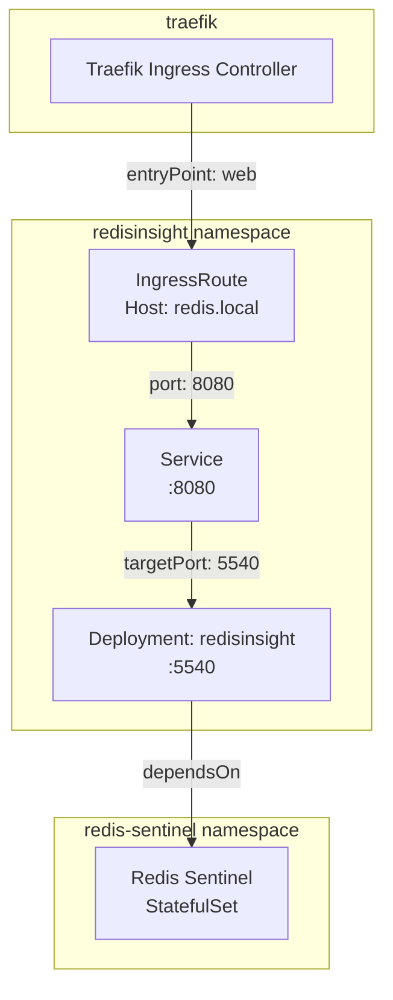

# RedisInsight

[RedisInsight](https://redis.io/insight/) ([GitHub](https://github.com/RedisInsight/RedisInsight)) is Redis's official graphical management tool. It provides a browser-based interface for inspecting data structures, profiling queries, monitoring memory usage, and managing cluster topologies — without requiring direct CLI access to Redis nodes.

Unlike lightweight alternatives (Redis Commander, phpRedisAdmin), RedisInsight is maintained by the Redis team and natively understands Sentinel topologies, cluster sharding, and Redis Streams. It ships as a single container with an embedded database for persisting connection profiles and query history, requiring no external dependencies beyond the Redis instances it manages.

## Overview

| Property | Value |
|---|---|
| **Namespace** | `redisinsight` |
| **Type** | Deployment |
| **Layer** | Database UI services |
| **Status** | Enabled |
| **Source** | [`apps/base/redisinsight/`](https://github.com/JiwooL0920/fleet-infra/tree/develop/apps/base/redisinsight/) |

## Dependencies

### Upstream — required before RedisInsight starts

| Service | Reason | Status |
|---|---|---|
| `redis-sentinel` | Flux `dependsOn` | Active |

### Downstream — services that depend on RedisInsight

_No known downstream Flux dependencies._

## Purpose

RedisInsight provides the platform's operator-facing Redis management interface. It connects to the Redis Sentinel deployment to give engineers visual access to key inspection, slow-log analysis, memory profiling, and stream monitoring — operations that would otherwise require `redis-cli` access into the cluster.

Exposed at `redis.local` via Traefik, it serves as the day-two operations tool for debugging cache behavior, verifying pub/sub channel activity, and inspecting consumer group lag on Redis Streams workloads.

## Features

| Feature | Detail |
|---|---|
| **Health-gated startup** | Flux healthChecks verify both the upstream redis-sentinel StatefulSet and the RedisInsight Deployment are healthy before declaring reconciliation success |
| **HTTP health probes** | Liveness and readiness probes hit the root path on the application port, with staggered initial delays to accommodate cold-start database initialization |
| **Traefik ingress routing** | IngressRoute exposes the UI on a dedicated virtual host via the web entrypoint, keeping it accessible without port-forwarding |
| **Service port remapping** | ClusterIP Service maps the external-facing port to the container's native application port, decoupling internal container layout from service discovery |
| **Dedicated namespace isolation** | Runs in its own namespace with matching labels, enabling per-service network policies and RBAC scoping |

## Architecture

### Request routing and dependency topology

## Configuration

All values sourced from [`base/services/environment.env`](https://github.com/JiwooL0920/fleet-infra/blob/develop/base/services/environment.env)
(base); per-environment overrides in [`clusters/stages/dev/.../environment.env`](https://github.com/JiwooL0920/fleet-infra/blob/develop/clusters/stages/dev/clusters/services-amer/environment.env).

| Parameter | Dev | Prod |
|---|---|---|
| `REDISINSIGHT_CPU_LIMIT` | `100m` | `500m` |
| `REDISINSIGHT_CPU_REQUEST` | `100m` | `100m` |
| `REDISINSIGHT_MEMORY_LIMIT` | `128Mi` | `512Mi` |
| `REDISINSIGHT_MEMORY_REQUEST` | `128Mi` | `256Mi` |
| `REDISINSIGHT_STORAGE_SIZE` | `500Mi` | `2Gi` |

## Operations

<!-- TODO: Add operations in service-insights/redisinsight.yaml → operations field -->

## Related

- [`apps/base/redisinsight/`](https://github.com/JiwooL0920/fleet-infra/tree/develop/apps/base/redisinsight/) — Kubernetes manifests
- [`base/services/redisinsight.yaml`](https://github.com/JiwooL0920/fleet-infra/blob/develop/base/services/redisinsight.yaml) — Flux Kustomization
- [`base/services/environment.env`](https://github.com/JiwooL0920/fleet-infra/blob/develop/base/services/environment.env) — environment variables

---
*Generated from [service-catalog.json](https://github.com/JiwooL0920/fleet-infra/blob/develop/service-catalog.json) at commit `09eeed6` · catalog sha `4d088b0b3a67b4c4`*