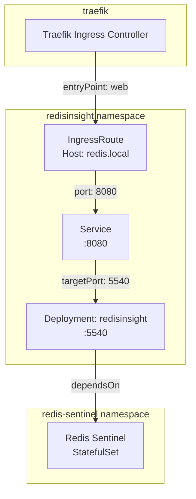

# RedisInsight

[RedisInsight](https://redis.io/insight/) ([GitHub](https://github.com/RedisInsight/RedisInsight)) is Redis's official graphical management tool. It provides a browser-based interface for inspecting data structures, profiling queries, monitoring memory usage, and managing cluster topologies — without requiring direct CLI access to Redis nodes.

Unlike lightweight alternatives (Redis Commander, phpRedisAdmin), RedisInsight is maintained by the Redis team and natively understands Sentinel topologies, cluster sharding, and Redis Streams. It ships as a single container with an embedded database for persisting connection profiles and query history, requiring no external dependencies beyond the Redis instances it manages.

## Overview

| Property | Value |
|---|---|
| **Namespace** | `redisinsight` |
| **Type** | Deployment |
| **Layer** | Database UI services |
| **Status** | Enabled |
| **Source** | [`apps/base/redisinsight/`](https://github.com/JiwooL0920/flux-infra/tree/develop/apps/base/redisinsight/) |

## Dependencies

### Upstream — required before RedisInsight starts

| Service | Reason | Status |
|---|---|---|
| `redis-sentinel` | Flux `dependsOn` | Active |

### Downstream — services that depend on RedisInsight

_No known downstream Flux dependencies._

## Purpose

RedisInsight provides the platform's operator-facing Redis management interface. It connects to the Redis Sentinel deployment to give engineers visual access to key inspection, slow-log analysis, memory profiling, and stream monitoring — operations that would otherwise require `redis-cli` access into the cluster.

Exposed at `redis.local` via Traefik, it serves as the day-two operations tool for debugging cache behavior, verifying pub/sub channel activity, and inspecting consumer group lag on Redis Streams workloads.


## Features

| Feature | Detail |
|---|---|
| **Health-gated startup** | Flux healthChecks verify both the upstream redis-sentinel StatefulSet and the RedisInsight Deployment are healthy before declaring reconciliation success |
| **HTTP health probes** | Liveness and readiness probes hit the root path on the application port, with staggered initial delays to accommodate cold-start database initialization |
| **Traefik ingress routing** | IngressRoute exposes the UI on a dedicated virtual host via the web entrypoint, keeping it accessible without port-forwarding |
| **Service port remapping** | ClusterIP Service maps the external-facing port to the container's native application port, decoupling internal container layout from service discovery |
| **Dedicated namespace isolation** | Runs in its own namespace with matching labels, enabling per-service network policies and RBAC scoping |

## Architecture

### Request routing and dependency topology




## Configuration

All values sourced from [`base/services/environment.env`](https://github.com/JiwooL0920/flux-infra/blob/develop/base/services/environment.env)
(base); per-environment overrides in [`clusters/stages/dev/.../environment.env`](https://github.com/JiwooL0920/flux-infra/blob/develop/clusters/stages/dev/clusters/services-amer/environment.env).

| Parameter | Dev | Prod |
|---|---|---|
| `REDISINSIGHT_CPU_LIMIT` | `100m` | `500m` |
| `REDISINSIGHT_CPU_REQUEST` | `100m` | `100m` |
| `REDISINSIGHT_MEMORY_LIMIT` | `128Mi` | `512Mi` |
| `REDISINSIGHT_MEMORY_REQUEST` | `128Mi` | `256Mi` |
| `REDISINSIGHT_STORAGE_SIZE` | `500Mi` | `2Gi` |


## Operations

### Pod failing readiness probe on startup

**Symptoms:** Pod stuck in `0/1 Running` state. Events show `Readiness probe failed: Get "http://10.x.x.x:5540/": dial tcp connection refused`. Service receives no traffic.

```bash
kubectl describe pod -l app=redisinsight -n redisinsight | grep -A5 "Conditions"
kubectl logs -l app=redisinsight -n redisinsight --tail=50
kubectl get events -n redisinsight --sort-by=.lastTimestamp | tail -20
kubectl get deployment redisinsight -n redisinsight -o jsonpath='{.spec.template.spec.containers[0].resources}'
```

---

### RedisInsight UI unreachable via redis.local

**Symptoms:** Browser returns 404 or connection timeout when accessing `http://redis.local`. Pod and Service are healthy. Traefik access logs show no matching route.

```bash
kubectl get ingressroute redisinsight -n redisinsight -o yaml
kubectl get endpoints redisinsight -n redisinsight
kubectl logs -l app.kubernetes.io/name=traefik -n traefik --tail=30 | grep redis
kubectl port-forward svc/redisinsight 8080:8080 -n redisinsight
curl -s -o /dev/null -w '%{http_code}' http://localhost:8080/
```

---

### Cannot connect to Redis from RedisInsight UI

**Symptoms:** RedisInsight UI loads but adding a Redis connection fails with "Error: connect ECONNREFUSED" or "NOAUTH Authentication required". Database list remains empty.

```bash
kubectl exec -it deploy/redisinsight -n redisinsight -- wget -qO- http://localhost:5540/api/databases || true
kubectl get statefulset redis-sentinel-node -n redis-sentinel
kubectl exec -it redis-sentinel-node-0 -n redis-sentinel -c sentinel -- redis-cli -p 26379 sentinel masters
kubectl exec -it redis-sentinel-node-0 -n redis-sentinel -c redis -- redis-cli -p 6379 ping
```

---

### Flux Kustomization stuck due to healthCheck failure

**Symptoms:** `flux get kustomization redisinsight` shows `Health check failed` or `dependency 'flux-system/redis-sentinel' is not ready`. Deployment never reconciles.

```bash
flux get kustomization redisinsight
flux get kustomization redis-sentinel
kubectl get statefulset redis-sentinel-node -n redis-sentinel -o jsonpath='{.status.readyReplicas}'
kubectl get deployment redisinsight -n redisinsight -o jsonpath='{.status.conditions[?(@.type=="Available")].status}'
flux reconcile kustomization redisinsight --with-source
```
**See also:** docs/adr/001-fine-grained-service-dependencies.md

---

### OOMKilled during heavy query visualization

**Symptoms:** Pod restarts with `reason: OOMKilled` in events. `kubectl top pod` shows memory spike before restart. Last container exit code 137.

```bash
kubectl get events -n redisinsight --field-selector reason=OOMKilling --sort-by=.lastTimestamp
kubectl top pod -l app=redisinsight -n redisinsight
kubectl get deployment redisinsight -n redisinsight -o jsonpath='{.spec.template.spec.containers[0].resources.limits.memory}'
kubectl logs -l app=redisinsight -n redisinsight --previous --tail=30
```

---


## Related


- [`apps/base/redisinsight/`](https://github.com/JiwooL0920/flux-infra/tree/develop/apps/base/redisinsight/) — Kubernetes manifests
- [`base/services/redisinsight.yaml`](https://github.com/JiwooL0920/flux-infra/blob/develop/base/services/redisinsight.yaml) — Flux Kustomization
- [`base/services/environment.env`](https://github.com/JiwooL0920/flux-infra/blob/develop/base/services/environment.env) — environment variables

---
*Generated from [service-catalog.json](https://github.com/JiwooL0920/flux-infra/blob/develop/service-catalog.json) at commit `72f0a19` · catalog sha `d34fd29d8c92c579`*