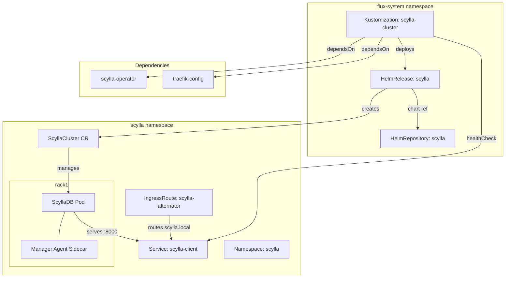
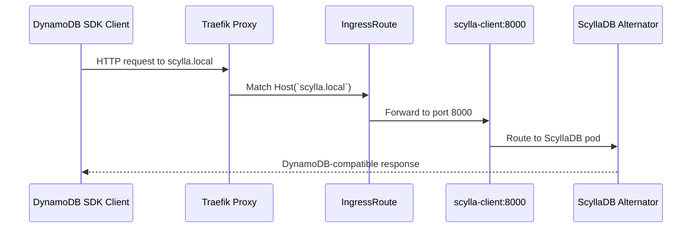

# ScyllaDB Cluster

[ScyllaDB](https://www.scylladb.com/) ([GitHub](https://github.com/scylladb/scylladb)) is a high-performance NoSQL database written in C++ as a drop-in replacement for Apache Cassandra. It achieves significantly lower tail latencies by implementing a shard-per-core architecture atop the Seastar framework — each CPU core owns its memory, network connections, and disk I/O independently, eliminating cross-core coordination and garbage collection pauses that plague JVM-based databases.

What distinguishes ScyllaDB from other wide-column stores (Cassandra, HBase, DynamoDB): it provides wire-compatible APIs for both CQL (Cassandra Query Language) and **Alternator** (Amazon DynamoDB), allowing applications to use battle-tested client SDKs without vendor lock-in. The shard-per-core design delivers predictable P99 latencies under load — a property that JVM-based alternatives struggle with due to stop-the-world GC events.

The ScyllaDB Operator manages the full lifecycle of ScyllaCluster custom resources on Kubernetes — handling rack-aware placement, rolling upgrades, scaling, and repair scheduling — while the Manager Agent sidecar on each node coordinates backup and repair operations.

## Overview

| Property | Value |
|---|---|
| **Namespace** | `scylla` |
| **Type** | HelmRelease (chart: `scylla` v1.12.0) |
| **Layer** | Database services |
| **Status** | Enabled |
| **Source** | [`apps/base/scylla/`](https://github.com/JiwooL0920/flux-infra/tree/develop/apps/base/scylla/) |

## Dependencies

### Upstream — required before ScyllaDB Cluster starts

| Service | Reason | Status |
|---|---|---|
| `scylla-operator` | Flux `dependsOn` | Active |
| `traefik-config` | Flux `dependsOn` | Active |

### Downstream — services that depend on ScyllaDB Cluster

_No known downstream Flux dependencies._

## Purpose

ScyllaDB serves as the platform's persistent storage layer for chat history and conversational state, exposed exclusively through its Alternator (DynamoDB-compatible) API on port 8000. Applications interact with it using standard AWS DynamoDB SDKs pointed at the in-cluster endpoint, gaining DynamoDB's data model (partition keys, sort keys, conditional writes) without external cloud dependency or per-request billing.

The cluster runs in developer mode with relaxed resource requirements suitable for a Kind-based homelab, trading production-grade performance guarantees for reduced memory and CPU footprint.

**Why ScyllaDB Alternator over actual DynamoDB or a simpler KV store:** The workload requires DynamoDB's table model (partition + sort key access patterns, conditional expressions) for chat history queries — but running against AWS DynamoDB from a local cluster adds latency, cost, and external dependency. ScyllaDB's Alternator provides the same wire protocol locally. Compared to running Cassandra for CQL access, ScyllaDB delivers lower tail latencies with less memory overhead — relevant even in a single-node dev topology where resource budgets are tight.

**Why not PostgreSQL (already in-cluster):** Chat message streams are append-heavy, partition-scoped reads with no cross-partition joins — a textbook wide-column workload. Modeling this in PostgreSQL would require explicit partitioning and sacrifice the natural time-series ordering that sort keys provide for free.

## Features

| Feature | Detail |
|---|---|
| **Alternator (DynamoDB-compatible API)** | Enabled with `only_rmw_uses_lwt` write isolation — read-modify-write operations use Paxos lightweight transactions while simple writes bypass consensus for throughput |
| **Developer mode** | Relaxes production safeguards (memory locking, CPU pinning, I/O scheduler requirements) to run on non-dedicated Kind nodes without XFS or dedicated disks |
| **Manager Agent sidecar** | Co-located agent container on each ScyllaDB node enables centralized repair scheduling and backup coordination through the Scylla Manager control plane |
| **Traefik ingress routing** | IngressRoute exposes Alternator API externally at `scylla.local` on the web entrypoint, routing to the `scylla-client` headless service on port 8000 |
| **Flux health gating** | Kustomization declares a healthCheck on the `scylla-client` Service — downstream dependents will not reconcile until the ScyllaDB client endpoint is serving |

## Architecture

### ScyllaDB Cluster Deployment Topology

### Alternator Request Flow

## Configuration

All values sourced from [`base/services/environment.env`](https://github.com/JiwooL0920/flux-infra/blob/develop/base/services/environment.env)
(base); per-environment overrides in [`clusters/stages/dev/.../environment.env`](https://github.com/JiwooL0920/flux-infra/blob/develop/clusters/stages/dev/clusters/services-amer/environment.env).

| Parameter | Dev | Prod |
|---|---|---|
| `SCYLLA_AGENT_TAG` | `3.2.6` | `3.2.6` |
| `SCYLLA_CHART_VERSION` | `1.12.0` | `1.12.0` |
| `SCYLLA_CPU_LIMIT` | `1000m` | `1000m` |
| `SCYLLA_CPU_REQUEST` | `500m` | `500m` |
| `SCYLLA_DEVELOPER_MODE` | `true` | `true` |
| `SCYLLA_IMAGE_TAG` | `5.4.0` | `5.4.0` |
| `SCYLLA_MANAGER_CHART_VERSION` | `1.12.0` | `1.12.0` |
| `SCYLLA_MANAGER_CPU_LIMIT` | `500m` | `500m` |
| `SCYLLA_MANAGER_CPU_REQUEST` | `100m` | `100m` |
| `SCYLLA_MANAGER_MEMORY_LIMIT` | `512Mi` | `512Mi` |
| `SCYLLA_MANAGER_MEMORY_REQUEST` | `256Mi` | `256Mi` |
| `SCYLLA_MEMORY_LIMIT` | `2Gi` | `2Gi` |
| `SCYLLA_MEMORY_REQUEST` | `1Gi` | `1Gi` |
| `SCYLLA_OPERATOR_CHART_VERSION` | `1.12.0` | `1.12.0` |
| `SCYLLA_OPERATOR_CPU_LIMIT` | `500m` | `500m` |
| `SCYLLA_OPERATOR_CPU_REQUEST` | `100m` | `100m` |
| `SCYLLA_OPERATOR_MEMORY_LIMIT` | `512Mi` | `512Mi` |
| `SCYLLA_OPERATOR_MEMORY_REQUEST` | `256Mi` | `256Mi` |
| `SCYLLA_RACK_MEMBERS` | `1` | `1` |
| `SCYLLA_STORAGE_SIZE` | `10Gi` | `10Gi` |

## Operations

<!-- TODO: Add operations in service-insights/scylla-cluster.yaml → operations field -->

## Related

- [`apps/base/scylla/`](https://github.com/JiwooL0920/flux-infra/tree/develop/apps/base/scylla/) — Kubernetes manifests
- [`base/services/scylla-cluster.yaml`](https://github.com/JiwooL0920/flux-infra/blob/develop/base/services/scylla-cluster.yaml) — Flux Kustomization
- [`base/services/environment.env`](https://github.com/JiwooL0920/flux-infra/blob/develop/base/services/environment.env) — environment variables

---
*Generated from [service-catalog.json](https://github.com/JiwooL0920/flux-infra/blob/develop/service-catalog.json) at commit `2d36e22` · catalog sha `4d088b0b3a67b4c4`*