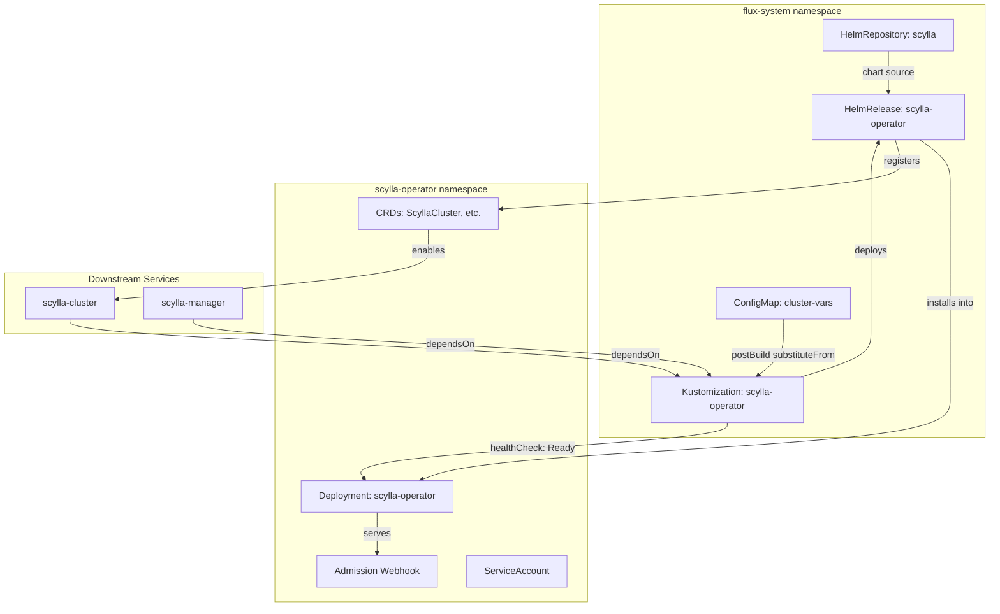

# Scylla Operator

[ScyllaDB Operator](https://github.com/scylladb/scylla-operator) is a Kubernetes operator that automates the deployment, scaling, and lifecycle management of ScyllaDB clusters. It extends the Kubernetes API with Custom Resource Definitions (ScyllaCluster, ScyllaDBMonitoring, etc.) and continuously reconciles desired state against actual cluster topology — handling node join/decommission, rolling upgrades, and rack-aware placement without manual intervention.

What distinguishes the Scylla Operator from generic Helm-based database deployments: it encodes ScyllaDB's operational semantics directly into the controller logic. It understands shard-per-core architecture, DPDK networking requirements, and the specific ordering constraints of ScyllaDB topology changes (e.g., never decommissioning two nodes from the same rack simultaneously). This domain knowledge eliminates entire classes of operator error that would otherwise require deep ScyllaDB expertise to avoid.

The operator also manages admission webhooks that validate ScyllaCluster specifications before they reach the API server, preventing invalid configurations (undersized instances, impossible rack topologies, incompatible version transitions) from ever being persisted to etcd.

## Overview

| Property | Value |
|---|---|
| **Namespace** | `scylla-operator` |
| **Type** | HelmRelease (chart: `scylla-operator` v1.12.0) |
| **Layer** | Foundation services |
| **Chart** | [`scylla-operator`](https://scylla-operator-charts.storage.googleapis.com/stable) v1.12.0 |
| **Status** | Enabled |
| **Source** | [`apps/base/scylla-operator/`](https://github.com/JiwooL0920/flux-infra/tree/develop/apps/base/scylla-operator/) |

## Dependencies

### Upstream — required before Scylla Operator starts

_No upstream Flux dependencies — starts immediately._

### Downstream — services that depend on Scylla Operator

| Service | Dependency type | Reason |
|---|---|---|
| `scylla-cluster` | Flux `dependsOn` | Requires Scylla Operator |
| `scylla-manager` | Flux `dependsOn` | Requires Scylla Operator |

## Purpose

Scylla Operator is the foundation-layer controller that enables all ScyllaDB workloads in this platform. It installs the CRDs, webhook validators, and reconciliation controllers that downstream services (`scylla-cluster`, `scylla-manager`) depend on. Without this operator running and healthy, no ScyllaDB cluster can be provisioned or managed.

It sits at the base of the Scylla dependency chain with no upstream dependencies of its own — Flux deploys it immediately on reconciliation, and downstream Kustomizations wait for its health check (the operator Deployment reaching Ready) before attempting to create ScyllaCluster resources.


## Features

| Feature | Detail |
|---|---|
| **Admission webhooks with self-signed certificates** | Webhook validation is enabled with operator-managed self-signed TLS certificates, rejecting invalid ScyllaCluster specs before persistence without requiring an external cert-manager dependency. |
| **Leader election** | Multi-replica leader election is enabled, allowing the operator to run with redundancy while ensuring only one instance actively reconciles at a time. |
| **Install remediation with retries** | Both install and upgrade paths are configured with 3 retry attempts and a 10-minute timeout, accommodating CRD registration latency and webhook readiness races. |
| **Health-gated downstream rollout** | The Flux Kustomization declares a healthCheck on the operator Deployment, blocking all downstream ScyllaDB services until the controller is fully available. |
| **Variable-substituted resource limits** | CPU and memory requests/limits are injected via postBuild substitution from cluster-vars ConfigMap, enabling per-environment tuning without manifest duplication. |

## Architecture

### Scylla Operator Deployment Topology




## Configuration

All values sourced from [`base/services/environment.env`](https://github.com/JiwooL0920/flux-infra/blob/develop/base/services/environment.env)
(base); per-environment overrides in [`clusters/stages/dev/.../environment.env`](https://github.com/JiwooL0920/flux-infra/blob/develop/clusters/stages/dev/clusters/services-amer/environment.env).

| Parameter | Dev | Prod |
|---|---|---|
| `SCYLLA_OPERATOR_CHART_VERSION` | `1.12.0` | `1.12.0` |
| `SCYLLA_OPERATOR_CPU_LIMIT` | `500m` | `500m` |
| `SCYLLA_OPERATOR_CPU_REQUEST` | `100m` | `100m` |
| `SCYLLA_OPERATOR_MEMORY_LIMIT` | `512Mi` | `512Mi` |
| `SCYLLA_OPERATOR_MEMORY_REQUEST` | `256Mi` | `256Mi` |


## Operations

### Webhook TLS certificate not provisioned

**Symptoms:** ScyllaCluster creates/updates rejected with `connection refused` or `x509: certificate signed by unknown authority`. The operator pod is running but webhook calls fail. Alert: `KubeWebhookCertExpirySoon` or Flux `HelmRelease` stuck at `upgrade retries exhausted`.

```bash
kubectl get validatingwebhookconfigurations -l app.kubernetes.io/instance=scylla-operator -o yaml | grep -A5 caBundle
kubectl get secrets -n scylla-operator -l app.kubernetes.io/component=webhook --show-labels
kubectl logs -n scylla-operator deploy/scylla-operator --since=10m | grep -i 'webhook\|cert\|tls'
kubectl delete secret -n scylla-operator -l app.kubernetes.io/component=webhook
kubectl rollout restart deployment/scylla-operator -n scylla-operator
kubectl wait --for=condition=Ready pod -l app.kubernetes.io/name=scylla-operator -n scylla-operator --timeout=120s
```

---

### CRD installation failure blocking downstream services

**Symptoms:** `scylla-cluster` and `scylla-manager` Kustomizations report `CustomResourceDefinition scyllaclusters.scylla.scylladb.com not found`. The scylla-operator HelmRelease shows `install retries exhausted` or `upgrade retries exhausted` in `kubectl get helmrelease -n flux-system scylla-operator`.

```bash
kubectl get helmrelease scylla-operator -n flux-system -o jsonpath='{.status.conditions[*].message}'
kubectl get crds | grep scylla
kubectl get events -n flux-system --field-selector involvedObject.name=scylla-operator --sort-by='.lastTimestamp' | tail -20
flux suspend helmrelease scylla-operator -n flux-system
flux resume helmrelease scylla-operator -n flux-system
kubectl wait --for=condition=Ready helmrelease/scylla-operator -n flux-system --timeout=600s
```

---

### Leader election lease stuck after pod eviction

**Symptoms:** Operator pod is Running but no reconciliation occurs. Logs show `failed to acquire lease scylla-operator/scylla-operator-leader-election` or `leader election lost`. ScyllaCluster resources show stale `.status.conditions` timestamps.

```bash
kubectl get lease -n scylla-operator -o wide
kubectl get lease scylla-operator-leader-election -n scylla-operator -o jsonpath='{.spec.holderIdentity}'
kubectl get pods -n scylla-operator -o wide
kubectl logs -n scylla-operator deploy/scylla-operator | grep -i 'leader\|lease\|election'
kubectl delete lease scylla-operator-leader-election -n scylla-operator
kubectl rollout restart deployment/scylla-operator -n scylla-operator
```

---

### HelmRelease reconciliation timeout

**Symptoms:** `flux get helmrelease scylla-operator -n flux-system` shows `reconciliation failed` with timeout. Helm history shows a pending-upgrade or pending-install state. Downstream Kustomizations are blocked.

```bash
kubectl get helmrelease scylla-operator -n flux-system -o yaml | grep -A10 'status:'
helm history scylla-operator -n scylla-operator --max 5
helm status scylla-operator -n scylla-operator
kubectl get pods -n scylla-operator -l app.kubernetes.io/name=scylla-operator -o wide
flux suspend helmrelease scylla-operator -n flux-system && helm rollback scylla-operator -n scylla-operator
flux resume helmrelease scylla-operator -n flux-system
```

---

### Operator OOMKilled under high CRD watch load

**Symptoms:** Pod restarts with `OOMKilled` reason visible in `kubectl describe pod -n scylla-operator`. Prometheus alert `KubePodCrashLooping` fires. During restarts, ScyllaCluster reconciliation pauses.

```bash
kubectl get pods -n scylla-operator -o jsonpath='{.items[*].status.containerStatuses[*].lastState.terminated.reason}'
kubectl top pod -n scylla-operator
kubectl describe pod -n scylla-operator -l app.kubernetes.io/name=scylla-operator | grep -A3 'Last State'
kubectl get configmap cluster-vars -n flux-system -o jsonpath='{.data.SCYLLA_OPERATOR_MEMORY_LIMIT}'
kubectl logs -n scylla-operator deploy/scylla-operator --previous | tail -50
```

---


## Related


- [`apps/base/scylla-operator/`](https://github.com/JiwooL0920/flux-infra/tree/develop/apps/base/scylla-operator/) — Kubernetes manifests
- [`base/services/scylla-operator.yaml`](https://github.com/JiwooL0920/flux-infra/blob/develop/base/services/scylla-operator.yaml) — Flux Kustomization
- [`base/services/environment.env`](https://github.com/JiwooL0920/flux-infra/blob/develop/base/services/environment.env) — environment variables

---
*Generated from [service-catalog.json](https://github.com/JiwooL0920/flux-infra/blob/develop/service-catalog.json) at commit `198a018` · catalog sha `13ff1d9ca5d91ec4`*