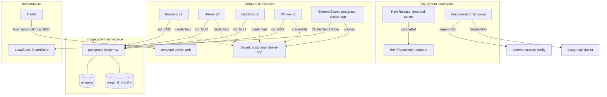
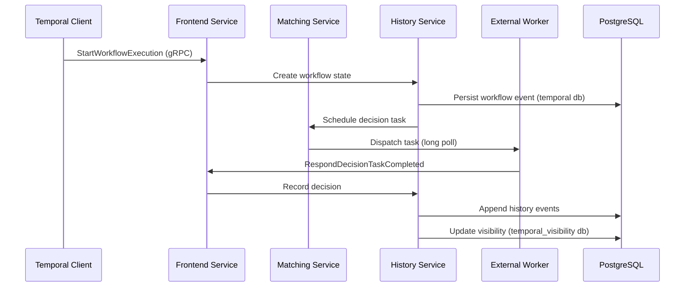

# Temporal

[Temporal](https://temporal.io) ([GitHub](https://github.com/temporalio/temporal)) is a durable execution platform that guarantees workflow completion regardless of infrastructure failures. Unlike traditional job queues or state machines that lose progress on crash, Temporal persists every workflow state transition to a database — enabling automatic retry, resumption from the exact point of failure, and indefinite workflow lifetimes (minutes to months). What distinguishes it from alternatives like Airflow, Step Functions, or Celery: Temporal workflows are written in general-purpose code (Go, Java, TypeScript, Python) rather than DAGs or JSON state machines, with the runtime transparently handling retries, timeouts, compensation, and distributed transactions.

The architecture separates concerns across four server roles: **Frontend** (API gateway, rate limiting, routing), **History** (workflow state machine execution, event sourcing), **Matching** (task queue dispatch, worker polling), and **Worker** (internal system workflows — archival, replication, batch operations). Each role scales independently and communicates via gRPC. Persistence is pluggable — Cassandra, MySQL, or PostgreSQL for the execution store, with a separate visibility store enabling complex workflow queries.

Temporal's durability model is built on event sourcing: every workflow decision and activity result is appended to an immutable history log in the persistence layer. On recovery, the server replays this history to reconstruct exact workflow state without re-executing side effects. This makes Temporal suitable for orchestrating multi-service sagas, long-running human-in-the-loop processes, and scheduled batch pipelines where partial progress must never be lost.

## Overview

| Property | Value |
|---|---|
| **Namespace** | `temporal` |
| **Type** | HelmRelease (chart: `temporal` v0.51.0) |
| **Layer** | Application services |
| **Chart** | [`temporal`](https://go.temporal.io/helm-charts) v0.51.0 |
| **Status** | Enabled |
| **Source** | [`apps/base/temporal/`](https://github.com/JiwooL0920/flux-infra/tree/develop/apps/base/temporal/) |

## Dependencies

### Upstream — required before Temporal starts

| Service | Reason | Status |
|---|---|---|
| `external-secrets-config` | Flux `dependsOn` | Active |
| `postgresql-cluster` | Flux `dependsOn` | Active |

### Downstream — services that depend on Temporal

_No known downstream Flux dependencies._

## Purpose

Temporal serves as the platform's durable workflow orchestration engine — the coordination layer that manages multi-step, failure-prone processes across other services. Rather than building ad-hoc retry logic, state tracking, and failure recovery into each application, services delegate complex orchestration to Temporal and implement only the business logic as stateless activity handlers.

Concrete workloads include: multi-service data pipelines that must complete atomically, scheduled batch processing with checkpoint/resume semantics, and long-running automation workflows that survive pod restarts and node failures. Temporal replaces what would otherwise be fragile cron jobs with state scattered across Redis keys and database flags.

**Why Temporal over simpler alternatives:** Celery/BullMQ handle task queues well but lack workflow-level state, compensation logic, and cross-service saga support. Airflow is DAG-oriented and Python-only, poorly suited to general-purpose orchestration with dynamic branching. AWS Step Functions are vendor-locked and JSON-defined. Temporal uniquely combines: code-native workflow definitions, automatic retry with exponential backoff at both activity and workflow level, built-in versioning for zero-downtime workflow evolution, and a visibility layer for operational querying of running workflows.

**Why self-hosted over Temporal Cloud:** Local-first development on Colima/Kind requires the full server stack accessible without internet. Self-hosting also enables tight integration with the shared PostgreSQL cluster (ADR-004) and future KEDA-based worker autoscaling (ADR-011) using task queue depth as the scaling signal.


## Features

| Feature | Detail |
|---|---|
| **PostgreSQL-backed dual-store persistence** | Both the execution store (`temporal` database) and visibility store (`temporal_visibility` database) use the `postgres12_pgx` driver against the shared CNPG cluster, with Cassandra and Elasticsearch explicitly disabled. |
| **Four-role server topology** | Frontend, History, Matching, and Worker roles each run as separate replica sets within the same HelmRelease, enabling independent scaling per role. |
| **Automatic schema migration** | Schema `setupDatabase` and `updateDatabase` are enabled while `createDatabase` is disabled — Temporal auto-migrates its schema on upgrade but expects databases to be pre-provisioned by CNPG. |
| **ExternalSecret credential injection** | PostgreSQL credentials are pulled from LocalStack via ClusterSecretStore into a Kubernetes Secret with `cnpg.io/reload` label, enabling automatic credential rotation propagation. |
| **Web UI with Traefik ingress** | Temporal Web UI is exposed at `temporal.local` via Traefik IngressRoute on port 8080, providing workflow visibility, namespace management, and execution inspection. |
| **Blob retention policy** | Server runs with `--blobsRetentionDays=7`, limiting internal blob storage growth for completed workflow data. |
| **Default namespace with 3-day retention** | A `default` Temporal namespace is auto-created with 3-day closed workflow retention, balancing query visibility against storage growth. |
| **Monitoring stack disabled** | All bundled Prometheus, Grafana, and ServiceMonitor resources are disabled in favor of the platform-wide kube-prometheus-stack deployment. |

## Architecture

### Temporal Deployment Topology



### Temporal Request Flow




## Configuration

All values sourced from [`base/services/environment.env`](https://github.com/JiwooL0920/flux-infra/blob/develop/base/services/environment.env)
(base); per-environment overrides in [`clusters/stages/dev/.../environment.env`](https://github.com/JiwooL0920/flux-infra/blob/develop/clusters/stages/dev/clusters/services-amer/environment.env).

| Parameter | Dev | Prod |
|---|---|---|
| `TEMPORAL_CHART_VERSION` | `0.51.0` | `0.51.0` |
| `TEMPORAL_DB_NAME` | `temporal` | `temporal` |
| `TEMPORAL_SERVER_CPU_LIMIT` | `1000m` | `4000m` |
| `TEMPORAL_SERVER_CPU_REQUEST` | `1000m` | `1000m` |
| `TEMPORAL_SERVER_MEMORY_LIMIT` | `1Gi` | `4Gi` |
| `TEMPORAL_SERVER_MEMORY_REQUEST` | `1Gi` | `2Gi` |
| `TEMPORAL_STORAGE_SIZE` | `5Gi` | `20Gi` |
| `TEMPORAL_VISIBILITY_DB_NAME` | `temporal_visibility` | `temporal_visibility` |
| `TEMPORAL_WEB_CPU_LIMIT` | `250m` | `1000m` |
| `TEMPORAL_WEB_CPU_REQUEST` | `250m` | `200m` |
| `TEMPORAL_WEB_MEMORY_LIMIT` | `256Mi` | `1Gi` |
| `TEMPORAL_WEB_MEMORY_REQUEST` | `256Mi` | `512Mi` |


## Operations

### Schema migration job fails on upgrade

**Symptoms:** HelmRelease stuck in `upgrade retries exhausted` state. Schema init-container or Job shows `Error: failed to execute statement` or `pq: relation already exists`. Temporal server pods never start because Helm upgrade never completes.

```bash
kubectl get helmrelease temporal-server -n flux-system -o jsonpath='{.status.conditions[*].message}'
kubectl get jobs -n temporal -l app.kubernetes.io/component=schema --sort-by=.metadata.creationTimestamp
kubectl logs job/$(kubectl get jobs -n temporal -l app.kubernetes.io/component=schema -o jsonpath='{.items[-1].metadata.name}') -n temporal
kubectl exec -it postgresql-cluster-1 -n cnpg-system -- psql -U app -d temporal -c "SELECT * FROM schema_version ORDER BY version_id DESC LIMIT 5;"
kubectl exec -it postgresql-cluster-1 -n cnpg-system -- psql -U app -d temporal_visibility -c "SELECT * FROM schema_version ORDER BY version_id DESC LIMIT 5;"
# If schema is corrupted, manually mark version and retry:
flux suspend helmrelease temporal-server -n flux-system
kubectl delete jobs -n temporal -l app.kubernetes.io/component=schema
flux resume helmrelease temporal-server -n flux-system
```
**See also:** docs/adr/004-single-shared-postgresql-cluster.md

---

### Frontend pods unable to connect to PostgreSQL

**Symptoms:** Temporal frontend pods in CrashLoopBackOff with logs showing `failed to initialize system namespace` or `unable to establish connection to SQL database`. ExternalSecret may show `SecretSyncedError` condition.

```bash
kubectl get externalsecret postgresql-cluster-app -n temporal -o jsonpath='{.status.conditions[*]}' | jq .
kubectl get secret postgresql-cluster-app -n temporal -o jsonpath='{.data.host}' | base64 -d
kubectl get secret postgresql-cluster-app -n temporal -o jsonpath='{.data.password}' | base64 -d | head -c5; echo '...'
kubectl run pg-check --rm -it --image=postgres:16 -n temporal -- psql postgresql://app@postgresql-cluster-rw.cnpg-system.svc.cluster.local:5432/temporal -c 'SELECT 1;'
kubectl logs deployment/temporal-server-frontend -n temporal --tail=50 | grep -i 'persistence\|connection\|sql'
kubectl get cluster postgresql-cluster -n cnpg-system -o jsonpath='{.status.phase}'
```
**See also:** docs/adr/004-single-shared-postgresql-cluster.md

---

### History service OOMKilled under workflow load

**Symptoms:** History pods restarting with `OOMKilled` exit reason. `kubectl top pods -n temporal` shows history pods approaching memory limits. Workflow tasks timing out or returning `RESOURCE_EXHAUSTED` errors to workers.

```bash
kubectl get pods -n temporal -l app.kubernetes.io/component=history -o wide
kubectl describe pod -n temporal -l app.kubernetes.io/component=history | grep -A5 'Last State\|Limits\|Requests'
kubectl top pods -n temporal -l app.kubernetes.io/component=history
kubectl logs -n temporal -l app.kubernetes.io/component=history --previous --tail=100 | grep -i 'memory\|oom\|cache'
# Check workflow history event counts (large histories consume history service memory):
kubectl exec -it postgresql-cluster-1 -n cnpg-system -- psql -U app -d temporal -c "SELECT workflow_id, COUNT(*) as event_count FROM executions GROUP BY workflow_id ORDER BY event_count DESC LIMIT 10;"
```

---

### ExternalSecret not syncing credentials

**Symptoms:** Secret `postgresql-cluster-app` missing or stale in the `temporal` namespace. ExternalSecret status shows `SecretSyncedError` or `ready: false`. Temporal pods fail to authenticate to PostgreSQL.

```bash
kubectl get externalsecret postgresql-cluster-app -n temporal
kubectl describe externalsecret postgresql-cluster-app -n temporal | grep -A10 'Status:'
kubectl get clustersecretstore localstack-secretstore -o jsonpath='{.status.conditions[*]}' | jq .
kubectl logs -n external-secrets deployment/external-secrets --tail=50 | grep -i 'temporal\|postgresql-cluster-app'
# Verify secret exists in LocalStack:
kubectl exec -n localstack deployment/localstack -- awslocal secretsmanager get-secret-value --secret-id cnpg/postgresql-cluster-app/username --query SecretString --output text
# Force resync:
kubectl annotate externalsecret postgresql-cluster-app -n temporal force-sync=$(date +%s) --overwrite
```

---

### Temporal Web UI unreachable via IngressRoute

**Symptoms:** Browsing `http://temporal.local` returns 404 or connection refused. Other IngressRoutes on the same Traefik instance work correctly. Temporal server pods are running and healthy.

```bash
kubectl get ingressroute temporal-web -n temporal -o yaml | grep -A10 'routes:'
kubectl get svc temporal-server-web -n temporal
kubectl get endpoints temporal-server-web -n temporal
kubectl port-forward svc/temporal-server-web -n temporal 8080:8080 &
curl -s -o /dev/null -w '%{http_code}' http://localhost:8080
# If port-forward works but IngressRoute doesn't, check Traefik routing:
kubectl logs -n traefik deployment/traefik --tail=100 | grep -i 'temporal'
```

---

### Task queue backlog growing with no workers processing

**Symptoms:** Temporal Web UI shows increasing pending task count on task queues. Worker pods are running but not polling. Application workers report `context deadline exceeded` or `server is not accepting new requests`.

```bash
kubectl get pods -n temporal -l app.kubernetes.io/component=matching
kubectl logs -n temporal -l app.kubernetes.io/component=matching --tail=50 | grep -i 'error\|queue\|dispatch'
kubectl logs -n temporal -l app.kubernetes.io/component=frontend --tail=50 | grep -i 'rate\|limit\|reject'
# Check if frontend is reachable from within the cluster:
kubectl run grpc-check --rm -it --image=fullstorydev/grpcurl -n temporal -- -plaintext temporal-server-frontend.temporal.svc.cluster.local:7233 temporal.api.workflowservice.v1.WorkflowService/GetSystemInfo
# Verify matching service can reach history:
kubectl logs -n temporal -l app.kubernetes.io/component=matching --tail=100 | grep -i 'history\|unavailable\|connection'
```

---


## Related


- [`apps/base/temporal/`](https://github.com/JiwooL0920/flux-infra/tree/develop/apps/base/temporal/) — Kubernetes manifests
- [`base/services/temporal.yaml`](https://github.com/JiwooL0920/flux-infra/blob/develop/base/services/temporal.yaml) — Flux Kustomization
- [`base/services/environment.env`](https://github.com/JiwooL0920/flux-infra/blob/develop/base/services/environment.env) — environment variables

---
*Generated from [service-catalog.json](https://github.com/JiwooL0920/flux-infra/blob/develop/service-catalog.json) at commit `b34ec5b` · catalog sha `3ae810da5633a72b`*