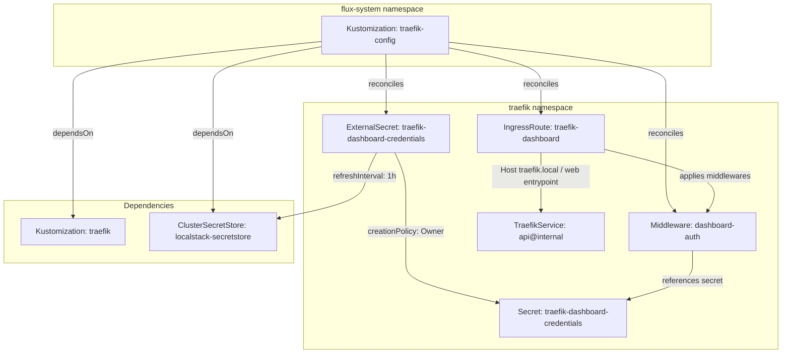
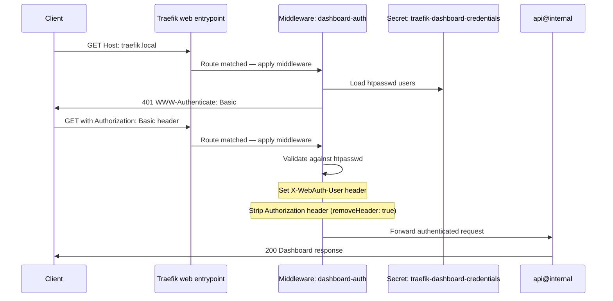

# Traefik Config

Traefik Config is a post-install configuration layer that provisions the routing rules, authentication middleware, and credential management required to securely expose Traefik's built-in dashboard. It is separated from the Traefik Helm deployment itself to enforce a clean dependency boundary: the reverse proxy must be fully operational — with its CRDs registered and admission webhooks ready — before any IngressRoutes or Middlewares are submitted to the API server.

This pattern of splitting operator installation from its configuration is a deliberate GitOps design choice. Traefik's custom resource definitions (IngressRoute, Middleware) only become available after the Helm chart reconciles. By isolating post-install configuration into its own Flux Kustomization with explicit `dependsOn`, the platform avoids race conditions where CRD-based resources are applied before the API server can validate them — a common failure mode in monolithic Flux deployments.

## Overview

| Property | Value |
|---|---|
| **Namespace** | `traefik-config` |
| **Type** | Kustomization |
| **Layer** | Foundation services |
| **Status** | Enabled |
| **Source** | [`apps/base/traefik-config/`](https://github.com/JiwooL0920/fleet-infra/tree/develop/apps/base/traefik-config/) |

## Dependencies

### Upstream — required before Traefik Config starts

| Service | Reason | Status |
|---|---|---|
| `traefik` | Flux `dependsOn` | Active |
| `external-secrets-config` | Flux `dependsOn` | Active |

### Downstream — services that depend on Traefik Config

| Service | Dependency type | Reason |
|---|---|---|
| `jaeger` | Flux `dependsOn` | Requires Traefik Config |
| `scylla-cluster` | Flux `dependsOn` | Requires Traefik Config |

## Purpose

Traefik Config secures and exposes the Traefik dashboard behind basic authentication with credentials managed entirely through ExternalSecrets. Rather than embedding htpasswd strings in Git or relying on manual secret creation, it pulls pre-hashed credentials from LocalStack's secret store on a 1-hour refresh cycle. This gives operators real-time visibility into routing topology, middleware chains, entrypoint health, and service discovery state without exposing an unauthenticated admin interface to the cluster network.

It also serves as the foundation dependency for downstream services (Jaeger, Scylla cluster) that require Traefik's middleware and routing primitives to be present before their own IngressRoutes can reference them.

**Why a separate Kustomization rather than bundling config in the Traefik Helm values:** Helm values can configure the dashboard and middlewares, but doing so couples credential management to chart upgrades and makes the ExternalSecrets integration awkward (Helm values don't natively support ExternalSecret-driven secrets). Separating configuration into native Traefik CRDs gives full control over the credential lifecycle, allows independent reconciliation intervals, and means dashboard auth can be updated without triggering a Helm release — which would restart Traefik pods and briefly disrupt all proxied traffic.

## Features

| Feature | Detail |
|---|---|
| **ExternalSecrets-managed basic auth credentials** | Pulls htpasswd-formatted credentials from LocalStack via ClusterSecretStore with 1-hour refresh interval, eliminating secrets from Git entirely |
| **BasicAuth middleware with header injection** | Authenticates dashboard requests and injects X-WebAuth-User header for audit traceability, stripping the original Authorization header before forwarding to upstream |
| **IngressRoute dashboard exposure** | Routes Host(`traefik.local`) on the web entrypoint to Traefik's internal API service with the authentication middleware chain applied |
| **Post-build variable substitution** | Supports cluster-vars ConfigMap substitution for environment-specific overrides without duplicating manifests across stages |

## Architecture

### Dashboard Authentication Topology

### Dashboard Request Authentication Flow

## Configuration

All values sourced from [`base/services/environment.env`](https://github.com/JiwooL0920/fleet-infra/blob/develop/base/services/environment.env)
(base); per-environment overrides in [`clusters/stages/dev/.../environment.env`](https://github.com/JiwooL0920/fleet-infra/blob/develop/clusters/stages/dev/clusters/services-amer/environment.env).

_No environment-specific configuration variables for this service._

## Operations

<!-- TODO: Add operations in service-insights/traefik-config.yaml → operations field -->

## Related

- [`apps/base/traefik-config/`](https://github.com/JiwooL0920/fleet-infra/tree/develop/apps/base/traefik-config/) — Kubernetes manifests
- [`base/services/traefik-config.yaml`](https://github.com/JiwooL0920/fleet-infra/blob/develop/base/services/traefik-config.yaml) — Flux Kustomization
- [`base/services/environment.env`](https://github.com/JiwooL0920/fleet-infra/blob/develop/base/services/environment.env) — environment variables

---
*Generated from [service-catalog.json](https://github.com/JiwooL0920/fleet-infra/blob/develop/service-catalog.json) at commit `2d36e22` · catalog sha `4d088b0b3a67b4c4`*