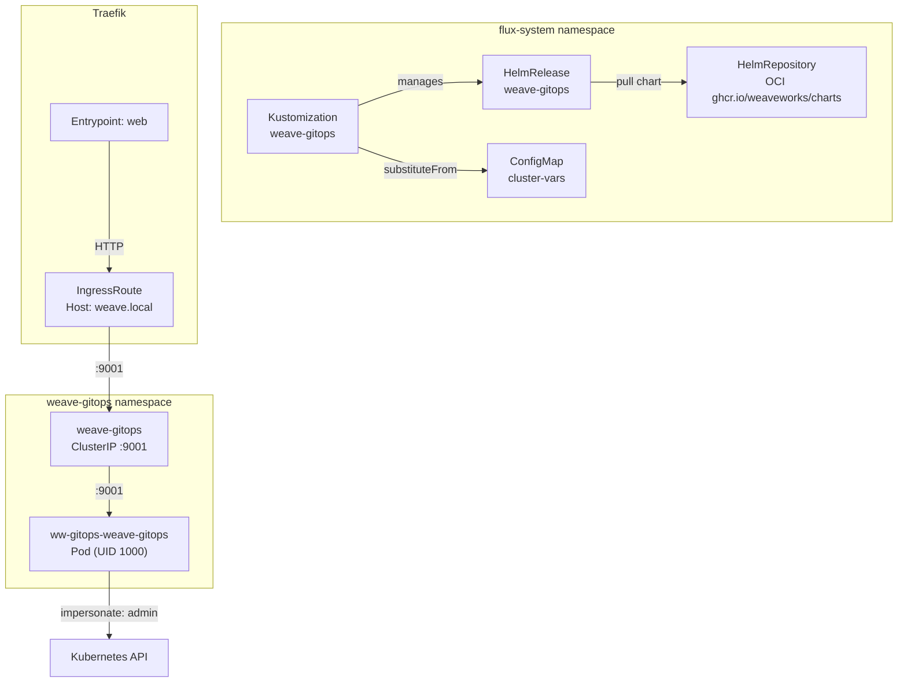

# Weave GitOps

[Weave GitOps](https://github.com/weaveworks/weave-gitops) is a lightweight web dashboard purpose-built for Flux CD clusters. Unlike general-purpose Kubernetes dashboards (Lens, Rancher, the Kubernetes Dashboard), Weave GitOps understands the Flux resource model natively — it renders HelmReleases, Kustomizations, GitRepositories, and their reconciliation status as first-class objects rather than opaque custom resources.

The UI operates in read-only mode against the cluster, surfacing Flux reconciliation state, dependency graphs, and event timelines without requiring direct `kubectl` access. It authenticates users via a local admin account and uses Kubernetes RBAC impersonation to scope API access, meaning the dashboard itself holds elevated privileges but delegates authorization decisions to the cluster's native RBAC layer.

## Overview

| Property | Value |
|---|---|
| **Namespace** | `weave-gitops` |
| **Type** | HelmRelease (chart: `weave-gitops` v4.0.36) |
| **Layer** | Foundation services |
| **Chart** | [`weave-gitops`](oci://ghcr.io/weaveworks/charts) v4.0.36 |
| **Status** | Enabled |
| **Source** | [`apps/base/weave-gitops/`](https://github.com/JiwooL0920/flux-infra/tree/develop/apps/base/weave-gitops/) |

## Dependencies

### Upstream — required before Weave GitOps starts

_No upstream Flux dependencies — starts immediately._

### Downstream — services that depend on Weave GitOps

_No known downstream Flux dependencies._

## Purpose

Weave GitOps provides a visual reconciliation monitor for the platform's 25-service Flux deployment. When a service fails to reconcile — chart pull timeout, variable substitution error, health check deadline exceeded — the dashboard surfaces the failure context (events, conditions, source status) without requiring CLI access to the cluster. This is the primary observability path for GitOps deployment state, complementing Prometheus metrics with human-readable Flux object inspection.


## Features

| Feature | Detail |
|---|---|
| **Local admin authentication** | Bcrypt-hashed admin credential baked into the HelmRelease values, providing immediate access without external identity provider dependencies. |
| **RBAC impersonation** | The service account impersonates the "admin" user for API calls, decoupling dashboard permissions from the service account's own privileges and enabling future multi-tenancy via additional impersonation subjects. |
| **Security-hardened pod** | Read-only root filesystem, all capabilities dropped, non-root execution (UID 1000/GID 2000), and pod-level fsGroup — minimizing attack surface for a network-exposed UI. |
| **Traefik IngressRoute exposure** | Exposed via Traefik IngressRoute on Host(`weave.local`) routing to the ClusterIP service on port 9001, using the `web` entrypoint (HTTP). |
| **Prometheus metrics** | Metrics endpoint enabled, exposing request latency, reconciliation polling stats, and Go runtime metrics for the dashboard process. |
| **Flux-aware health checking** | The parent Kustomization health-checks the `ww-gitops-weave-gitops` Deployment directly, blocking downstream dependents until the dashboard is serving. |
| **Install/upgrade remediation** | Both install and upgrade phases configured with 3 retries, preventing transient Helm failures from leaving the release in a failed state. |

## Architecture

### Deployment Topology




## Configuration

All values sourced from [`base/services/environment.env`](https://github.com/JiwooL0920/flux-infra/blob/develop/base/services/environment.env)
(base); per-environment overrides in [`clusters/stages/dev/.../environment.env`](https://github.com/JiwooL0920/flux-infra/blob/develop/clusters/stages/dev/clusters/services-amer/environment.env).

| Parameter | Dev | Prod |
|---|---|---|
| `WEAVE_GITOPS_CHART_VERSION` | `4.0.36` | `4.0.36` |
| `WEAVE_GITOPS_CPU_LIMIT` | `100m` | `500m` |
| `WEAVE_GITOPS_CPU_REQUEST` | `100m` | `100m` |
| `WEAVE_GITOPS_MEMORY_LIMIT` | `128Mi` | `512Mi` |
| `WEAVE_GITOPS_MEMORY_REQUEST` | `128Mi` | `256Mi` |


## Operations

### HelmRelease stuck in upgrade — chart pull failure

**Symptoms:** `kubectl get helmrelease weave-gitops -n flux-system` shows `upgrade retries exhausted`. Events show `failed to pull chart: oci://ghcr.io/weaveworks/charts/weave-gitops` with authentication or network errors. Dashboard remains on previous version.

```bash
kubectl describe helmrelease weave-gitops -n flux-system | grep -A5 'Status:'
kubectl get helmrepository weave-gitops -n flux-system -o yaml | grep -A10 'status:'
kubectl logs -n flux-system deploy/helm-controller --since=10m | grep weave-gitops
flux reconcile source helm weave-gitops
flux reconcile helmrelease weave-gitops
```

---

### Dashboard unreachable via IngressRoute

**Symptoms:** Browser shows 404 or connection refused when accessing `http://weave.local`. Other IngressRoutes (e.g. other services) work normally.

```bash
kubectl get ingressroute weave-gitops -n weave-gitops -o yaml
kubectl get svc -n weave-gitops
kubectl get endpoints -n weave-gitops
kubectl port-forward -n weave-gitops svc/weave-gitops 9001:9001
curl -s http://localhost:9001 | head -20
kubectl logs -n traefik deploy/traefik --since=5m | grep weave
```

---

### Pod CrashLoopBackOff — RBAC or permission denied

**Symptoms:** `kubectl get pods -n weave-gitops` shows CrashLoopBackOff. Pod logs contain `cannot impersonate resource` or `forbidden: User "system:serviceaccount:weave-gitops:..." cannot create resource "subjectaccessreviews"`.

```bash
kubectl logs -n weave-gitops deploy/ww-gitops-weave-gitops --previous
kubectl get clusterrolebinding | grep weave
kubectl get clusterrole | grep weave
kubectl auth can-i impersonate users --as=system:serviceaccount:weave-gitops:ww-gitops-weave-gitops
kubectl describe clusterrole ww-gitops-weave-gitops | grep -A5 impersonate
```

---

### Authentication failure — admin login rejected

**Symptoms:** Dashboard loads but login with `admin` / expected password returns "Invalid credentials". No pod crashes — purely an application-level auth rejection.

```bash
kubectl get secret -n flux-system cluster-vars -o yaml | grep WEAVE
kubectl get helmrelease weave-gitops -n flux-system -o jsonpath='{.spec.values.adminUser}'
kubectl exec -n weave-gitops deploy/ww-gitops-weave-gitops -- env | grep -i admin
htpasswd -nbBC 5 admin 'your-password' | cut -d: -f2
```

---

### Kustomization health check timeout

**Symptoms:** `flux get kustomizations weave-gitops` shows `Health check failed after 3m0s` despite the HelmRelease reporting as ready. The Deployment `ww-gitops-weave-gitops` exists but readiness probe is failing.

```bash
kubectl get deploy ww-gitops-weave-gitops -n weave-gitops -o yaml | grep -A10 readinessProbe
kubectl describe deploy ww-gitops-weave-gitops -n weave-gitops | grep -A5 Conditions
kubectl get events -n weave-gitops --sort-by=.lastTimestamp | tail -20
kubectl top pod -n weave-gitops
flux reconcile kustomization weave-gitops
```
**See also:** docs/adr/001-fine-grained-service-dependencies.md

---


## Related


- [`apps/base/weave-gitops/`](https://github.com/JiwooL0920/flux-infra/tree/develop/apps/base/weave-gitops/) — Kubernetes manifests
- [`base/services/weave-gitops.yaml`](https://github.com/JiwooL0920/flux-infra/blob/develop/base/services/weave-gitops.yaml) — Flux Kustomization
- [`base/services/environment.env`](https://github.com/JiwooL0920/flux-infra/blob/develop/base/services/environment.env) — environment variables

---
*Generated from [service-catalog.json](https://github.com/JiwooL0920/flux-infra/blob/develop/service-catalog.json) at commit `255ed07` · catalog sha `e8611a61080e81c8`*