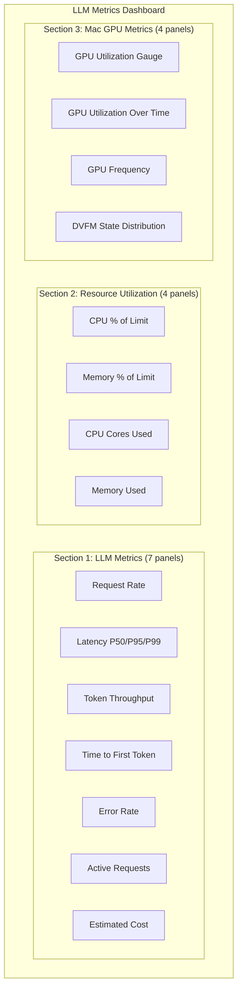

# Dashboards

Detailed documentation for all Grafana dashboards managed in this repository.

## LLM Metrics Dashboard

A comprehensive monitoring dashboard for AI/LLM workloads, tracking request performance, token throughput, error rates, resource utilization, and GPU metrics across the agentic-ai platform.

| Property | Value |
|----------|-------|
| **UID** | `llm-metrics` |
| **Title** | LLM Metrics Dashboard |
| **Tags** | `llm`, `ai`, `performance` |
| **Datasource** | Prometheus |
| **Default Time Range** | Last 1 hour |
| **Auto-Refresh** | 30 seconds |
| **Namespace** | `monitoring` (CRD), queries scoped to `agentic-ai` |

### Dashboard Layout



---

### LLM Metrics

Core performance metrics for LLM inference operations.

| Panel | Visualization | Query Summary | Unit |
|-------|--------------|---------------|------|
| **LLM Request Rate** | Timeseries | `rate(llm_requests_total[5m])` | req/s |
| **LLM Latency P50/P95/P99** | Timeseries | `histogram_quantile(0.5/0.95/0.99, rate(llm_request_duration_seconds_bucket[5m]))` | seconds |
| **Token Throughput** | Timeseries | `rate(llm_tokens_input_total[5m])` + `rate(llm_tokens_output_total[5m])` | tokens/s |
| **Time to First Token** | Timeseries | `histogram_quantile(0.5/0.95/0.99, rate(llm_time_to_first_token_seconds_bucket[5m]))` | seconds |
| **LLM Error Rate** | Timeseries | `rate(llm_errors_total[5m])` | errors/s |
| **Active Requests** | Gauge | `llm_active_requests` | count (0-100) |
| **Estimated Cost** | Stat | `rate(llm_cost_dollars_total[1h]) * 3600` | $/hr |

!!! info "Latency Percentiles"
    The latency panel displays three series (P50, P95, P99) on the same chart, providing a complete view of request duration distribution. P99 is the most important for SLA monitoring.

!!! tip "Time to First Token (TTFT)"
    TTFT measures the delay between sending a request and receiving the first token back — critical for perceived responsiveness in streaming chat applications.

---

### Resource Utilization

Container-level resource metrics for the agentic-ai namespace, showing both percentage-of-limit and absolute values.

| Panel | Visualization | Query Summary | Unit |
|-------|--------------|---------------|------|
| **CPU Usage (% of Limit)** | Timeseries | `rate(container_cpu_usage_seconds_total{namespace="agentic-ai"}[5m]) / container_spec_cpu_quota * container_spec_cpu_period * 100` | percent |
| **Memory Usage (% of Limit)** | Timeseries | `container_memory_working_set_bytes{namespace="agentic-ai"} / container_spec_memory_limit_bytes * 100` | percent |
| **CPU Cores Used** | Timeseries | `rate(container_cpu_usage_seconds_total{namespace="agentic-ai"}[5m])` | cores |
| **Memory Used** | Timeseries | `container_memory_working_set_bytes{namespace="agentic-ai"}` | bytes |

!!! warning "Resource Limits Required"
    The percentage panels require that resource limits are set on the agentic-ai pods. Without limits, the denominator is zero and panels will show no data.

---

### Mac GPU Metrics

Hardware GPU metrics for local Mac development, monitoring Apple Silicon GPU performance via custom exporters.

| Panel | Visualization | Query Summary | Unit | Notes |
|-------|--------------|---------------|------|-------|
| **GPU Utilization** | Gauge | `mac_gpu_utilization_percent` | percent | Thresholds: green < 60%, yellow < 80%, red >= 80% |
| **GPU Utilization Over Time** | Timeseries | `mac_gpu_utilization_percent` | percent | Historical trend view |
| **GPU Frequency** | Timeseries | `mac_gpu_frequency_mhz` | MHz | Current GPU clock speed |
| **DVFM State Distribution** | Pie Chart | `mac_gpu_dvfm_states` by `state` | — | Dynamic Voltage and Frequency Management states |

!!! note "Mac GPU Metrics"
    These panels require a custom Prometheus exporter that collects Apple Silicon GPU metrics. They are only relevant when running Ollama on Mac hardware.

---

### Metrics Reference

Complete reference for all custom Prometheus metrics used by the LLM Metrics Dashboard.

#### LLM Metrics

| Metric | Type | Description |
|--------|------|-------------|
| `llm_requests_total` | Counter | Total number of LLM inference requests |
| `llm_request_duration_seconds_bucket` | Histogram | LLM request duration distribution (for percentile calculations) |
| `llm_tokens_input_total` | Counter | Total input tokens processed |
| `llm_tokens_output_total` | Counter | Total output tokens generated |
| `llm_time_to_first_token_seconds_bucket` | Histogram | Time to first token distribution |
| `llm_errors_total` | Counter | Total LLM inference errors |
| `llm_active_requests` | Gauge | Currently active/in-flight LLM requests |
| `llm_cost_dollars_total` | Counter | Estimated cumulative cost in dollars |

#### Mac GPU Metrics

| Metric | Type | Description |
|--------|------|-------------|
| `mac_gpu_utilization_percent` | Gauge | Current GPU utilization percentage (0-100) |
| `mac_gpu_frequency_mhz` | Gauge | Current GPU clock frequency in MHz |
| `mac_gpu_dvfm_states` | Gauge | DVFM state distribution (labeled by `state`) |

#### Standard Container Metrics

| Metric | Type | Source |
|--------|------|--------|
| `container_cpu_usage_seconds_total` | Counter | cAdvisor (kube-prometheus-stack) |
| `container_memory_working_set_bytes` | Gauge | cAdvisor (kube-prometheus-stack) |
| `container_spec_cpu_quota` | Gauge | cAdvisor (container CPU limit) |
| `container_spec_cpu_period` | Gauge | cAdvisor (CPU scheduling period) |
| `container_spec_memory_limit_bytes` | Gauge | cAdvisor (container memory limit) |

---

## Adding New Dashboards

### Step-by-Step Guide

1. **Design the dashboard** in the Grafana UI (use the fleet-infra Grafana instance)

2. **Export the JSON** from Grafana: Dashboard Settings → JSON Model → Copy

3. **Create the dashboard directory** under the appropriate project folder:

    ```bash
    mkdir -p infra/dashboards/<project-name>/
    ```

4. **Save the JSON** as a reference file:

    ```bash
    # Optional: save raw JSON for reference
    cp exported-dashboard.json infra/dashboards/<project-name>/<dashboard-name>.json
    ```

5. **Create the GrafanaDashboard CRD** manifest:

    ```yaml
    apiVersion: grafana.integreatly.org/v1beta1
    kind: GrafanaDashboard
    metadata:
      name: <dashboard-name>
      namespace: monitoring
    spec:
      instanceSelector:
        matchLabels:
          dashboards: grafana
      folder: <folder-name>
      json: >
        <paste-dashboard-json-here>
    ```

6. **Create a GrafanaFolder** (if needed for a new project):

    ```yaml
    apiVersion: grafana.integreatly.org/v1beta1
    kind: GrafanaFolder
    metadata:
      name: <folder-name>
      namespace: monitoring
    spec:
      instanceSelector:
        matchLabels:
          dashboards: grafana
    ```

7. **Add to kustomization.yaml**:

    ```yaml
    resources:
      - folder.yaml
      - dashboards/<project-name>/dashboard.yaml
    ```

8. **Commit and push** — Flux CD will sync the changes automatically

### Dashboard Best Practices

!!! success "Use Consistent Datasource References"
    Always use `"datasource": {"type": "prometheus", "uid": "prometheus"}` to reference the Prometheus datasource. Avoid hardcoding datasource names that may differ across environments.

!!! info "Meaningful UIDs"
    Assign readable UIDs to dashboards (e.g., `llm-metrics` instead of auto-generated UUIDs). This makes URLs predictable and bookmarkable.

!!! tip "Folder Organization"
    Group dashboards by project using GrafanaFolder CRDs. Each project gets its own folder in Grafana (e.g., `agentic-ai/`), keeping the dashboard list organized.

!!! warning "JSON Size Limits"
    Large dashboard JSON embedded in CRDs can hit etcd size limits. For very complex dashboards (50+ panels), consider using `url` or `configMapRef` instead of inline `json`.
