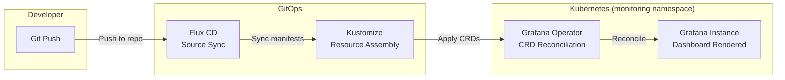
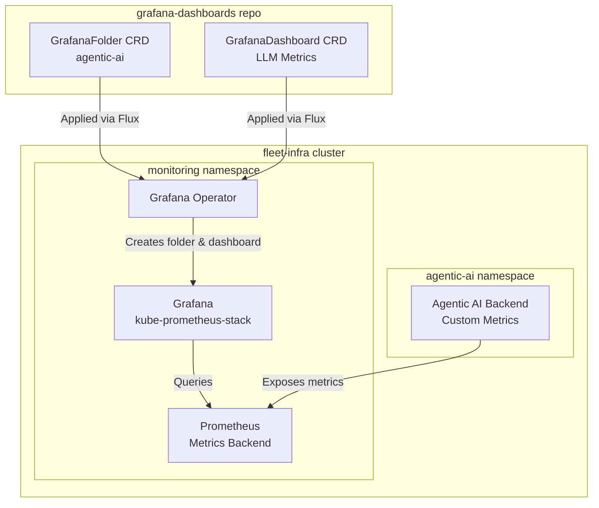

# Grafana Dashboards

GitOps-managed observability dashboards deployed via **Grafana Operator CRDs** with Kustomize, providing real-time monitoring for AI workloads and infrastructure.

## Overview

Grafana Dashboards is a dedicated repository for managing Grafana dashboards as code using **Grafana Operator Custom Resource Definitions** (GrafanaFolder, GrafanaDashboard). Dashboards are defined as Kubernetes CRDs with embedded JSON, deployed via Kustomize into the `monitoring` namespace, and automatically reconciled by the Grafana Operator running in the [fleet-infra](../fleet-infra/index.md) cluster.

This GitOps approach ensures dashboards are version-controlled, reviewable, and automatically synced to Grafana without manual UI configuration.

### Key Features

| Feature | Description |
|---------|-------------|
| **GitOps Managed** | Dashboards defined as code, deployed via Flux CD sync |
| **Grafana Operator CRDs** | Native Kubernetes resources (GrafanaFolder, GrafanaDashboard) — not file provisioning |
| **Fleet-Infra Integration** | Targets the Grafana instance managed by kube-prometheus-stack |
| **Folder Organization** | Dashboards organized into GrafanaFolder resources by project |
| **Auto-Refresh** | Dashboards configured with live refresh intervals (30s default) |
| **Kustomize Deployment** | Composable resource management with Kustomize overlays |

### Technology Stack

| Category | Technologies |
|----------|--------------|
| **Dashboard Engine** | Grafana (via Grafana Operator) |
| **CRD Types** | GrafanaFolder, GrafanaDashboard |
| **Deployment** | Kustomize, Flux CD |
| **Monitoring Backend** | Prometheus (kube-prometheus-stack) |
| **Platform** | Kubernetes (fleet-infra cluster) |
| **Namespace** | `monitoring` |

## Quick Links

- [Dashboards](dashboards.md) - Detailed documentation for all dashboards and panels

## Repository Structure

```
grafana-dashboards/
└── infra/
    ├── kustomization.yaml                  # Resource list: folder.yaml + dashboards
    ├── folder.yaml                         # GrafanaFolder CRD (agentic-ai folder)
    └── dashboards/
        └── agentic-ai/
            ├── dashboard.yaml              # GrafanaDashboard CRD with embedded JSON
            └── llm-metrics.json            # Dashboard JSON source
```

## Dashboard Summary

| Dashboard | Panels | Datasource | Folder | Tags |
|-----------|--------|------------|--------|------|
| [LLM Metrics Dashboard](dashboards.md#llm-metrics-dashboard) | 14 | Prometheus | agentic-ai | `llm`, `ai`, `performance` |

## Deployment Flow



## Integration with Fleet Infrastructure

The dashboards target the Grafana instance deployed by fleet-infra's kube-prometheus-stack. The Grafana Operator watches for CRDs matching the instance selector label `dashboards: grafana`.



## CRD Instance Selector

All dashboard CRDs use the following instance selector to target the correct Grafana deployment:

```yaml
instanceSelector:
  matchLabels:
    dashboards: grafana
```

This label matches the Grafana instance deployed by kube-prometheus-stack in fleet-infra.

## Source Code

[:octicons-mark-github-16: View on GitHub](https://github.com/JiwooL0920/grafana-dashboards){ .md-button }
