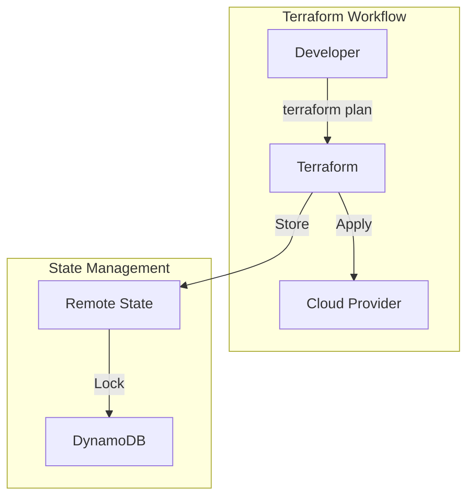

# Architecture

## Infrastructure Overview

## Design Principles

1. **Module Composition** - Small, focused modules composed together
2. **Environment Parity** - Same modules across dev/staging/prod
3. **Immutable Infrastructure** - Replace, don't modify

## State Management

| Environment | Backend | Lock |
|-------------|---------|------|
| Development | S3 | DynamoDB |
| Staging | S3 | DynamoDB |
| Production | S3 | DynamoDB |
