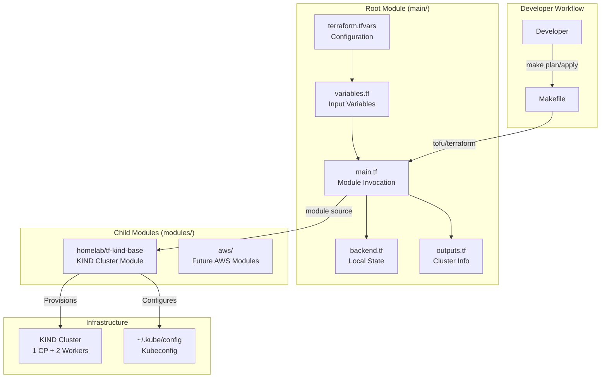
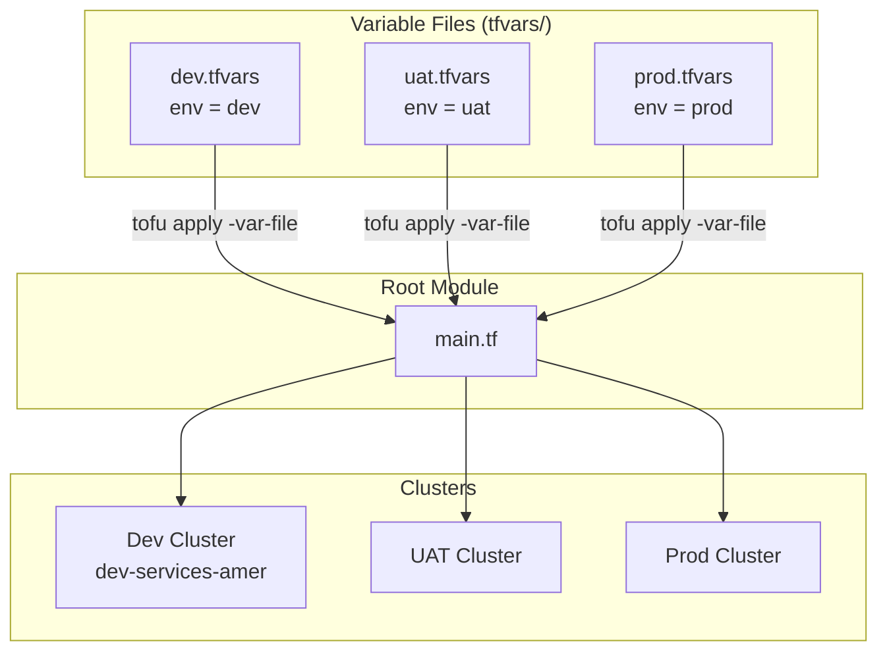
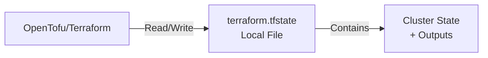
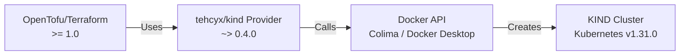
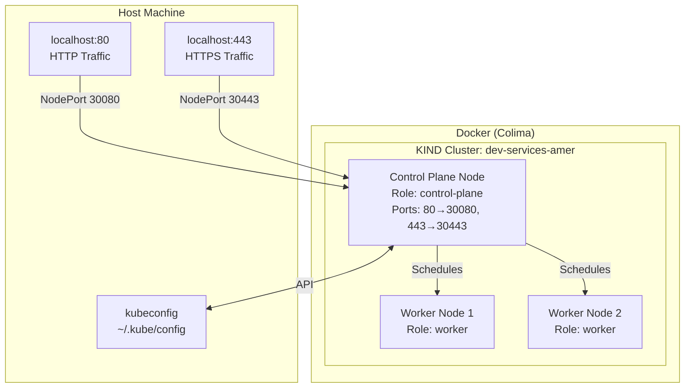

# Architecture

## High-Level Overview

The terraform-infra project uses a two-tier module architecture: a **root module** (`main/`) that invokes **reusable child modules** (`modules/`) to provision infrastructure.



## Module Composition

The project follows a **root-module-calls-child-module** pattern, keeping the root module thin and delegating all resource creation to reusable modules.

```mermaid
flowchart LR
    subgraph "main/"
        ROOT[main.tf]
    end

    subgraph "modules/homelab/"
        KIND_MOD[tf-kind-base/]
    end

    subgraph "modules/aws/"
        AWS_MOD[Future Modules]
    end

    ROOT -->|"module \"homelab-kind\""| KIND_MOD
    ROOT -.->|"module \"aws-*\" (future)"| AWS_MOD
```

### Root Module (`main/`)

The root module serves as the **entry point** and **configuration layer**:

| File | Responsibility |
|------|----------------|
| `main.tf` | Invokes `homelab/tf-kind-base` module with variables |
| `variables.tf` | Defines all input variables with types and descriptions |
| `outputs.tf` | Exposes cluster name, endpoint, kubeconfig, context, and Flux bootstrap command |
| `backend.tf` | Configures local state backend |
| `versions.tf` | Pins `tehcyx/kind` provider to `~> 0.4.0` |

### Child Module (`homelab/tf-kind-base`)

The KIND base module handles all **cluster resource creation**:

- Constructs the node image from version input (`kindest/node:v1.31.0`)
- Creates a 3-node KIND cluster (1 control-plane + 2 workers)
- Configures port mappings for Traefik ingress (80/443)
- Applies node labels for workload scheduling
- Merges common tags with cluster-specific metadata
- Outputs cluster connection details and certificates

## Multi-Environment Strategy

The project supports multiple environments through per-environment variable files:



| Environment | Variable File | Cluster Name | Kubernetes Version |
|-------------|---------------|--------------|-------------------|
| Development | `tfvars/dev.tfvars` | `dev-services-amer` | v1.31.0 |
| UAT | `tfvars/uat.tfvars` | Configurable | v1.31.0 |
| Production | `tfvars/prod.tfvars` | Configurable | v1.31.0 |

**Alternative**: OpenTofu/Terraform workspaces can also be used for environment isolation:

```bash
tofu workspace new staging
tofu workspace select staging
tofu apply
```

## State Management



| Setting | Value |
|---------|-------|
| **Backend** | Local (`terraform.tfstate` in `main/`) |
| **Locking** | File-system level (single user) |
| **State File** | Gitignored (`.tfstate` in `.gitignore`) |

!!! info "Local State by Design"
    Local state is intentional for a personal homelab. For team collaboration, the backend can be switched to S3 + DynamoDB with a simple `backend.tf` change.

## Provider Architecture



| Component | Version Constraint | Purpose |
|-----------|--------------------|---------|
| OpenTofu/Terraform | `>= 1.0` | IaC execution engine |
| tehcyx/kind provider | `~> 0.4.0` | KIND cluster resource management |
| KIND | Latest | Kubernetes-in-Docker cluster tool |
| Docker | Required | Container runtime for KIND nodes |

## Cluster Architecture



## Design Decisions

!!! success "Module-Based vs Monolithic"
    Separating the KIND cluster into a reusable module (`modules/homelab/tf-kind-base`) enables:
    
    - **Reusability** across different root configurations
    - **Testability** of the module in isolation
    - **Extensibility** via the `modules/aws/` placeholder for future cloud resources

!!! info "Why KIND over Minikube?"
    - Multi-node clusters (production-like topology)
    - Native Docker integration (no VM overhead)
    - Configurable port mappings for ingress
    - Faster cluster creation (~2-3 minutes)
    - Better FluxCD compatibility

!!! tip "OpenTofu over Terraform"
    The Makefile auto-detects `tofu` or `terraform`, preferring OpenTofu:
    
    - Open-source fork with community governance
    - Fully compatible with existing Terraform providers
    - No licensing restrictions for commercial use

!!! info "Local State vs Remote State"
    Local state is chosen for simplicity in a single-developer homelab:
    
    - No S3 bucket or DynamoDB table to manage
    - No credential configuration required
    - State file is gitignored for safety
    - Easily upgradeable to remote backend when needed

## Directory Layout Philosophy

```
terraform-infra/
├── main/           # WHAT to deploy (configuration + variables)
├── modules/        # HOW to deploy (reusable resource definitions)
│   ├── homelab/    # Local/homelab infrastructure
│   └── aws/        # Cloud infrastructure (future)
└── scripts/        # Automation helpers (future)
```

| Directory | Analogy | Changes When |
|-----------|---------|-------------|
| `main/` | "The order" | Environment config changes |
| `modules/` | "The recipe" | Infrastructure patterns change |
| `scripts/` | "The shortcuts" | Workflow automation changes |
