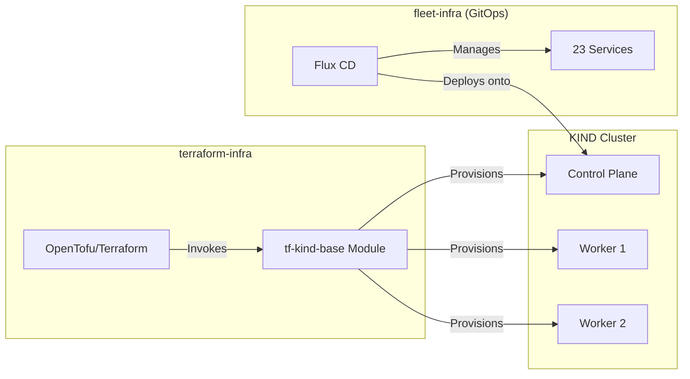

# Terraform Infrastructure

Infrastructure as Code platform provisioning **multi-node Kubernetes clusters** with OpenTofu/Terraform, designed for FluxCD GitOps deployments on local development environments.

## Overview

Terraform Infrastructure provides a modular, automated approach to provisioning KIND (Kubernetes in Docker) clusters for the homelab platform. It serves as the foundation layer that creates the Kubernetes cluster which [fleet-infra](../fleet-infra/index.md) then deploys services onto via GitOps.

### Key Features

| Feature | Description |
|---------|-------------|
| **Module-Based Architecture** | Reusable, composable Terraform modules under `modules/` |
| **Multi-Node Clusters** | 3-node KIND cluster (1 control-plane + 2 workers) |
| **FluxCD Integration** | Pre-configured port mappings and context for GitOps bootstrap |
| **Multi-Environment Support** | Per-environment tfvars (dev, uat, prod) with workspace support |
| **OpenTofu/Terraform Compatible** | Auto-detects and works with either tool |
| **Makefile Automation** | Single-command cluster lifecycle management |

### Technology Stack

| Category | Technologies |
|----------|--------------|
| **IaC Tool** | OpenTofu / Terraform (>= 1.0) |
| **Provider** | [tehcyx/kind](https://registry.terraform.io/providers/tehcyx/kind/latest/docs) (~> 0.4.0) |
| **Container Runtime** | Colima / Docker Desktop |
| **Kubernetes** | KIND (Kubernetes in Docker) v1.31.0 |
| **Automation** | GNU Make |

## Quick Links

- [Architecture](architecture.md) - Module composition, state management, and environment strategy
- [Modules](modules.md) - Detailed documentation for all Terraform modules
- [Runbooks](runbooks.md) - Setup, operations, and troubleshooting guides

## Repository Structure

```
terraform-infra/
├── Makefile                        # Automation commands (init, plan, apply, destroy)
├── README.md                       # Project documentation
│
├── main/                           # Root module (entry point)
│   ├── backend.tf                  # State backend configuration (local)
│   ├── main.tf                     # Module invocation
│   ├── variables.tf                # Input variable definitions
│   ├── outputs.tf                  # Output values
│   ├── versions.tf                 # Provider version constraints
│   ├── terraform.tfvars.example    # Example configuration
│   ├── terraform.tfvars            # Your configuration (gitignored)
│   └── tfvars/                     # Per-environment variable files
│       ├── dev.tfvars
│       ├── uat.tfvars
│       └── prod.tfvars
│
├── modules/                        # Reusable modules
│   ├── homelab/
│   │   └── tf-kind-base/           # KIND cluster provisioning
│   │       ├── main.tf             # Cluster resource definition
│   │       ├── variables.tf        # Module inputs
│   │       ├── outputs.tf          # Module outputs
│   │       └── versions.tf         # Provider requirements
│   └── aws/                        # Future AWS modules (placeholder)
│
└── scripts/                        # Helper scripts (placeholder)
```

## What Gets Created

The configuration provisions a production-like local Kubernetes cluster:

### Cluster Specifications

| Component | Value | Purpose |
|-----------|-------|---------|
| **Cluster Name** | `dev-services-amer` | Matches FluxCD configuration path |
| **Kubernetes Version** | v1.31.0 | Configurable via `kind_release_version` |
| **Control Plane Nodes** | 1 | Manages cluster state |
| **Worker Nodes** | 2 | Run application workloads |

### Network Configuration

| Port Mapping | Purpose |
|--------------|---------|
| `80 → 30080` | HTTP traffic for Traefik ingress |
| `443 → 30443` | HTTPS traffic for Traefik ingress |

### Cluster Features

| Feature | Description |
|---------|-------------|
| **Node Labels** | `node-role` and `env` labels for workload scheduling |
| **FluxCD Ready** | Naming convention matches fleet-infra cluster paths |
| **Traefik Compatible** | NodePort mappings for ingress controller |
| **Kubeconfig** | Auto-configured at `~/.kube/config` |

## Integration with Fleet Infrastructure



## Quick Start

```bash
# 1. Install prerequisites
brew install colima kubectl kind opentofu

# 2. Start container runtime
colima start --cpu 8 --memory 16 --disk 80

# 3. Initialize and create cluster
make init
make apply

# 4. Verify
make cluster-info
```

See [Runbooks](runbooks.md) for detailed setup instructions.

## Source Code

[:octicons-mark-github-16: View on GitHub](https://github.com/JiwooL0920/terraform-infra){ .md-button }
