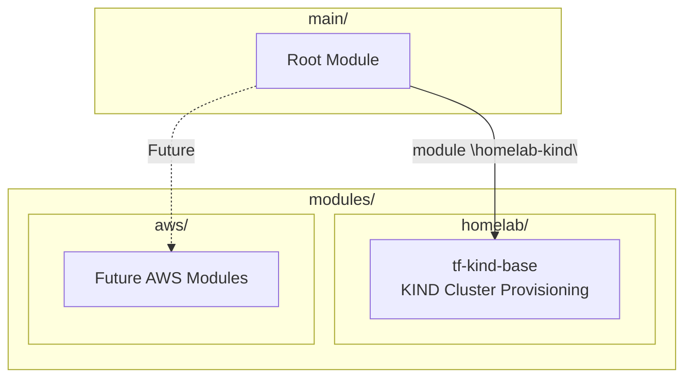
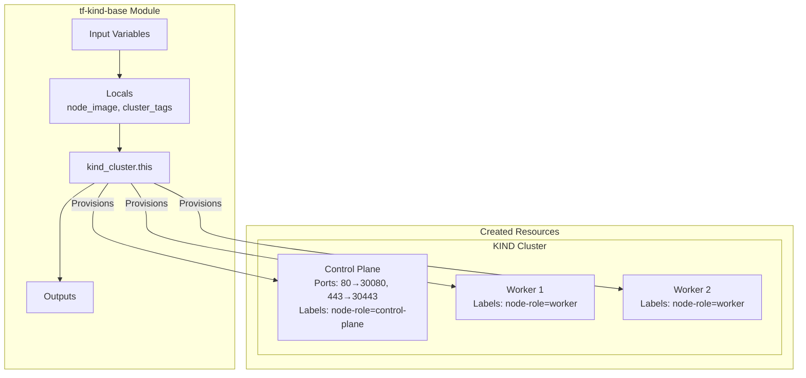

# Modules

This section documents all Terraform modules in the terraform-infra project.

## Module Inventory



| Module | Path | Status | Purpose |
|--------|------|--------|---------|
| [tf-kind-base](#tf-kind-base) | `modules/homelab/tf-kind-base/` | Active | KIND cluster provisioning |
| [aws/](#aws-modules-planned) | `modules/aws/` | Planned | Cloud infrastructure modules |

---

## tf-kind-base

Provisions a multi-node KIND (Kubernetes in Docker) cluster with port mappings for ingress and node labels for workload scheduling.

### Overview

| Property | Value |
|----------|-------|
| **Path** | `modules/homelab/tf-kind-base/` |
| **Provider** | `tehcyx/kind` (~> 0.4.0) |
| **Resources Created** | 1 (`kind_cluster`) |
| **Terraform Version** | >= 1.0 |

### Purpose

This module creates a production-like local Kubernetes cluster designed for:

- FluxCD GitOps deployments (cluster name matches fleet-infra paths)
- Traefik ingress (port mappings from host 80/443 to NodePorts)
- Multi-node testing (1 control-plane + 2 workers)
- Development and POC workloads

### Architecture



### Input Variables

| Variable | Type | Required | Default | Description |
|----------|------|----------|---------|-------------|
| `kind_cluster_name` | `string` | No | `"dev-services-amer"` | Name of the KIND cluster |
| `kind_release_version` | `string` | No | `"v1.31.0"` | Kubernetes version for KIND nodes (e.g., `v1.31.0`) |
| `cluster_type` | `string` | Yes | - | Type/role of cluster (`services`, `apps`, `deployments`) |
| `env` | `string` | Yes | - | Environment (`dev`, `uat`, `prod`) |
| `target_region` | `string` | Yes | - | Target region for resource tagging |
| `common_tags` | `map(string)` | No | `{}` | Common tags applied to resources for metadata/organization |

### Outputs

| Output | Type | Sensitive | Description |
|--------|------|-----------|-------------|
| `cluster_name` | `string` | No | Name of the KIND cluster |
| `cluster_id` | `string` | No | ID of the KIND cluster resource |
| `endpoint` | `string` | No | Kubernetes API server endpoint |
| `kubeconfig_path` | `string` | No | Path to the kubeconfig file (`~/.kube/config`) |
| `kubectl_context` | `string` | No | kubectl context name (`kind-<cluster_name>`) |
| `cluster_info` | `object` | No | Summary object: name, endpoint, node_image, environment, cluster_type |
| `client_certificate` | `string` | **Yes** | Client certificate for cluster authentication |
| `client_key` | `string` | **Yes** | Client key for cluster authentication |
| `cluster_ca_certificate` | `string` | **Yes** | Cluster CA certificate |

### Locals

The module computes two local values:

```hcl
locals {
  # Constructs node image: "kindest/node:v1.31.0"
  node_image = "kindest/node:${var.kind_release_version}"

  # Merges common_tags with cluster-specific metadata
  cluster_tags = merge(var.common_tags, {
    cluster_name = var.kind_cluster_name
    cluster_type = var.cluster_type
    environment  = var.env
    region       = var.target_region
    managed_by   = "terraform"
  })
}
```

### Resource Configuration

The `kind_cluster` resource creates:

**Control Plane Node:**

- Role: `control-plane`
- Port mapping: Host `80` → Container `30080` (HTTP/Traefik)
- Port mapping: Host `443` → Container `30443` (HTTPS/Traefik)
- Labels: `node-role=control-plane`, `env=<environment>`

**Worker Nodes (x2):**

- Role: `worker`
- Labels: `node-role=worker`, `env=<environment>`

**Cluster Settings:**

- `wait_for_ready = true` — Blocks until all nodes are healthy
- `kubeconfig_path = ~/.kube/config` — Auto-configures kubectl
- KIND API version: `kind.x-k8s.io/v1alpha4`

### Usage Example

```hcl
module "homelab-kind" {
  source               = "../modules/homelab/tf-kind-base"
  cluster_type         = "services"
  kind_release_version = "v1.31.0"
  kind_cluster_name    = "dev-services-amer"
  target_region        = "us-west-1"
  env                  = "dev"
  common_tags = {
    Application_ID = "homelab"
    Environment    = "DEV"
    Created_by     = "terraform"
    Contact        = "jiwool0920@gmail.com"
  }
}
```

### Customization

#### Change Kubernetes Version

```hcl
kind_release_version = "v1.32.0"
```

!!! warning "Version Change = Cluster Recreate"
    Changing the Kubernetes version forces KIND to destroy and recreate the cluster. All deployed workloads will be lost.

#### Change Cluster Name

```hcl
kind_cluster_name = "staging-services-amer"
```

!!! info "FluxCD Path Alignment"
    If changing the cluster name, update the corresponding Flux bootstrap path in fleet-infra to match.

---

## Root Module Outputs

The root module (`main/`) exposes these outputs from the KIND module plus a convenience output:

| Output | Description |
|--------|-------------|
| `cluster_name` | KIND cluster name |
| `cluster_endpoint` | Kubernetes API endpoint |
| `kubeconfig_path` | Path to kubeconfig file |
| `kubectl_context` | kubectl context name |
| `cluster_info` | Cluster configuration summary |
| `flux_bootstrap_command` | Ready-to-use Flux bootstrap command |

The `flux_bootstrap_command` output provides the exact command to connect fleet-infra:

```bash
flux bootstrap github \
  --owner=<your-github-username> \
  --repository=fleet-infra \
  --branch=develop \
  --path=./clusters/stages/dev/clusters/services-amer \
  --personal
```

---

## AWS Modules (Planned)

The `modules/aws/` directory is reserved for future cloud infrastructure modules. Potential modules include:

| Planned Module | Purpose |
|----------------|---------|
| EKS cluster | Managed Kubernetes on AWS |
| VPC | Network infrastructure |
| S3/DynamoDB | Remote state backend resources |
| IAM | Service accounts and roles |

---

## Module Design Guidelines

### Input Variables

All modules follow these conventions:

- **Type annotations** on every variable
- **Description** for documentation generation
- **Defaults** where sensible (cluster name, version)
- **Required** for environment-specific values (env, cluster_type)

```hcl
variable "env" {
  type        = string
  description = "Environment (dev, uat, prod)"
}

variable "common_tags" {
  type        = map(string)
  description = "Common tags for resource organization"
  default     = {}
}
```

### Outputs

- **Description** on every output
- **Sensitive** flag on credentials (certificates, keys)
- **Summary objects** for convenient downstream consumption

```hcl
output "cluster_info" {
  description = "Summary of cluster configuration"
  value = {
    name         = kind_cluster.this.name
    endpoint     = kind_cluster.this.endpoint
    node_image   = local.node_image
    environment  = var.env
    cluster_type = var.cluster_type
  }
}
```

### Version Constraints

- Provider versions pinned with `~>` (pessimistic) for patch-level updates
- Terraform version requires `>= 1.0` for broad compatibility
